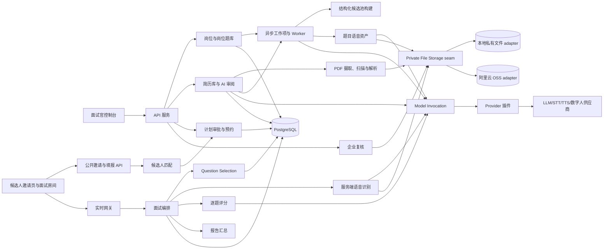
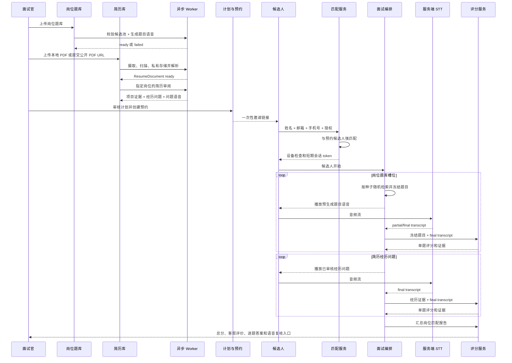

# 实时数字人面试系统架构

## 目标

系统围绕“岗位”组织招聘知识与面试执行，目标闭环如下：

1. 企业创建岗位，并为岗位维护一个或多个知识库式题库；题目入库后校验结构化字段、形成候选池并异步预生成读题语音。
2. 企业把候选人基本信息和 PDF 简历上传到组织级简历库；简历可来自浏览器本地文件或公开 HTTPS URL，但都要先进入系统私有存储，再由 AI 异步提取项目、职责、技能证据，并为指定岗位生成可审核的过往经历问题。
3. 面试官基于岗位、岗位题库、候选人简历审阅结果生成并批准面试计划，再创建预约和一次性邀请链接。
4. 候选人打开链接，填写姓名、邮箱、手机号码并完成隐私告知与授权；系统与预约绑定的简历库记录匹配后才允许进入设备检查。
5. 面试中，数字人在已批准计划和已冻结题目池内进行可审计的随机检索，播放预生成题目语音；服务端识别候选人回答并逐题评分，然后进入下一题。
6. 岗位题库问题结束后，数字人继续询问由简历项目经历生成的问题；面试结束后汇总岗位维度总分和客观匹配证据。
7. 企业可以查看每题题干、转写、评分证据和候选人原始语音，自行复核并作出最终招聘决定。

AI 输出用于辅助企业判断，不自动作出录用或淘汰决定。

## 用户角色

- 面试官：维护岗位题库、上传候选人与简历、审核简历问题、批准计划、预约面试、查看和复核报告。
- 候选人：通过一次性邀请链接完成身份匹配和授权，听数字人提问并用语音回答。
- 复核人：查看答案、原始语音、转写、评分证据和报告，必要时修正转写并触发重评。
- 管理员：管理组织、权限、供应商配置、语音、数据留存和审计策略。
- AI 协作者：根据本文档实现服务、接口、测试和后续能力。

## 总体架构

## 模块职责

| 模块 | 职责 | 设计要点 |
| --- | --- | --- |
| 面试官控制台 | 岗位、题库、简历、计划、预约和复核 | 后台工作台，不在前端复制业务规则 |
| 候选人邀请页 | 展示安全的预约摘要，收集姓名、邮箱、手机号码和授权 | 不暴露简历是否存在、标准答案或计划细节 |
| 候选人面试房间 | 麦克风检查、数字人展示、答题、网络与转写状态 | 生产评分只接受服务端 STT final |
| 岗位与岗位题库 | `JobPosition`、`KnowledgeBase`、题目、答案、标签、评分规则、导入导出 | MVP 中一个题库只属于一个岗位；只有构建完成的题库可用于计划 |
| 题库构建流水线 | 解析导入文件、校验答案/关键点/标签/难度、形成结构化候选池、异步生成题目语音 | 每项有独立状态、重试和失败原因；不在上传请求内调用模型 |
| 简历库 | 保存企业上传的候选人基本信息和不可变 `ResumeDocument` | 简历只接受 PDF；本地上传与 URL 导入形成相同资源和状态语义 |
| Resume Ingestion | 接收 multipart PDF 或拉取公开 HTTPS PDF，执行限流、哈希、类型校验、恶意文件扫描和解析 | URL 每次重定向都做 SSRF 防护；成功前文件处于隔离区，不直接交给 AI |
| Private File Storage | 统一保存、读取、签发受控访问和删除私有文件 | 深模块；本地开发使用文件系统 adapter，部署后通过配置切换阿里云 OSS adapter，业务 module 不感知厂商 SDK |
| Resume Review | 异步提取项目、职责、技能证据并生成经历问题 | 深模块；忽略受保护属性，不直接给录用结论，输出可编辑问题与证据来源 |
| 候选人匹配 | 把邀请填报与预约绑定的候选人记录匹配 | 使用规范化邮箱或手机号强匹配；姓名只作联合校验，禁止仅按姓名模糊匹配 |
| Interview Plan Assembly | 从岗位要求、岗位题库和简历审阅形成计划 | 产出抽题槽位、结构化 `QuestionCandidatePool`、经历问题、阶段顺序、权重和解释 |
| 计划审批与预约 | 批准计划，绑定岗位、候选人、题库、时间窗和邀请 | 计划、题库、简历审阅和语音资产未就绪时不得发出正式邀请 |
| Question Selection | 在计划冻结的结构化候选池中为题库槽位抽题 | 深模块；使用 SQL 过滤、会话随机种子、去重、覆盖和难度约束，保存选择事实并冻结题目快照；不依赖向量数据库 |
| InterviewSession 生命周期 | 接受领域命令，推进会话/轮次并形成持久事件 | REST、WebSocket、数字人和 worker 不得自行改状态 |
| 实时网关 | WebSocket/WebRTC 信令、音频分片和状态投影 | 不决定抽题、状态迁移或评分 |
| 服务端语音识别 | 将音频送入 `stt.streaming`，产出 partial/final；失败后可用 `stt.batch` 修复 | 浏览器识别只能开发预览，不得成为生产评分真相 |
| Model Invocation | 统一执行模型能力调用 | 吸收路由、凭证、schema、重试、回退、超时、断路器、审计和成本 |
| 逐题评分 | 使用冻结题目、服务端最终转写和岗位要求输出可解释评分 | 保存命中点、缺失点、证据、置信度与 revision |
| 报告与企业复核 | 汇总岗位维度、经历问题和风险提示，提供答案与音频复核 | 报告使用“匹配度/需复核”，最终决定由企业人员完成 |

## 核心业务流程

## 深模块与关键不变量

当前代码已有 `InterviewSessionLifecycle`、Interview Plan Assembly 和 Model Invocation 三个 seam。目标架构继续保持这些边界，并新增 Resume Review、Question Selection、Candidate Matching 和 Question Speech Build seam。

- `KnowledgeBase.job_position_id` 必填；计划选择的所有题库必须属于同一岗位。
- 上传题目后，结构化字段校验和题目语音异步完成。正式计划只能引用 `ready` 的题库版本，且每道活动题必须有完整评分依据和与计划语言/音色匹配的可用语音资产；服务端即时 TTS 只作为面试期间播放故障的受控降级。
- Resume Review 只读取预约候选人的授权简历版本，为指定岗位生成问题；生成问题由面试官审核后才能进入批准计划。
- `InterviewAppointment` 必须绑定已批准计划、候选人记录、岗位、题库版本和时间窗。候选人填报至少用邮箱或手机号与该记录精确匹配，不能通过查询接口枚举简历库。
- 随机抽题不是无约束随机。计划批准时冻结可选题目版本和抽题规则；会话保存随机种子、候选集合哈希、选择原因和题目快照，保证可审计且历史不受题库编辑影响。
- 一个轮次只有服务端 streaming/batch STT 的 authoritative final 可以形成 `CandidateAnswer`。partial 只用于界面显示；客户端文本和浏览器 final 不是领域输入。
- 每题评分完成或进入明确的可恢复失败态后才能推进；报告只能使用当前评分 revision 和冻结的岗位/计划快照。

## 推荐技术边界

- FastAPI：后台、公开邀请 REST API 和 WebSocket。
- PostgreSQL：岗位、结构化题库候选池、简历审阅结果、预约和面试聚合；MVP 不要求 pgvector 或独立向量数据库。
- Redis：短期会话、限流、分布式锁和流式转写协调，不作为领域真相来源。
- RQ/Celery/Arq：题库导入/校验、题目语音、简历解析、经历问题、批量补转写和报告任务。
- Private File Storage seam：统一管理原始简历、解析文本、题目语音、候选人回答音频和导出文件；本地开发使用私有文件系统 adapter，部署后可切换阿里云 OSS adapter。
- Pydantic：API、异步工作项和模型统一输入输出校验。
- 模型网关：统一管理 LLM、STT、TTS、数字人 provider 插件、路由、凭证和调用日志；Embedding 仅作为未来可选能力保留。

这些是推荐边界，不锁定具体厂商；替换实现时必须保持相同资源、状态、隐私和审计语义。

## 实时通信与语音

- WebSocket：会话状态、题目事件、partial/final 转写、评分进度和错误通知。
- WebRTC：生产候选人音频流和数字人媒体；MVP 可先用 WebSocket 发送 Opus/WebM 音频分片。
- 题目语音是可版本化资产，优先由题库构建流水线预生成；播放失败时按预约策略降级为服务端 TTS 或文字，不能让客户端自报已朗读。
- 候选人回答必须在服务端进入 `stt.streaming` 或以完整录音进入 `stt.batch`。流中断时保存音频，轮次保持 `transcribing`，由 `stt.batch` 修复后再评分。

## 数据流

1. 岗位与题库：创建岗位，上传题目、标准答案、关键点和 rubric。
2. 题库构建：校验技能、难度、题型、标准答案、关键点和 rubric，形成可用候选池并异步生成题目语音。
3. 简历入库：企业上传本地 PDF 或提交公开 HTTPS PDF URL；服务端流式摄取、校验、扫描并写入当前配置的私有文件 adapter，形成不可变 `ResumeDocument`。
4. 简历解析与审阅：从系统托管文件解析文本，脱敏后异步抽取项目、职责、技能证据，按岗位生成可审核经历问题并生成读题语音。
5. 计划与预约：形成题库抽题槽位和经历问题，人工批准后绑定候选人与时间窗并发出邀请。
6. 候选人填报：姓名、邮箱、手机号和授权与预约候选人匹配，公开 start 签发会话范围的 HMAC 候选人 token。
7. 动态抽题：用关系库字段在冻结候选池内按岗位、题库、状态、技能、难度和题型过滤，再按种子、覆盖和去重约束选题并保存快照。
8. 语音问答：播放题目语音，服务端识别回答；final 转写创建回答并触发单题评分。
9. 经历追问：岗位题库阶段完成后按已审核的简历经历问题继续问答与评分。
10. 报告与复核：汇总岗位维度、经历可信度与风险提示；企业回听音频、查看答案并可修正转写后重评。

## 安全与隐私

- 所有后台数据按 `organization_id` 隔离；公开邀请接口只返回安全摘要。
- 邀请 token 只保存哈希，必须短期、可撤销、一次性消费；填报错误使用统一响应，避免枚举候选人。
- 简历、手机号、邮箱、音频、转写和报告均为敏感数据；访问、下载、修正和导出必须审计。简历 URL 导入只允许受控 HTTP 客户端访问公开 HTTPS 资源，禁止私网、环回、链路本地、云元数据地址和携带 URL 凭证。
- 候选人填报前展示隐私告知、录音用途、AI 处理说明和留存期限，并保存同意版本与时间。
- Resume Review 和评分不使用性别、年龄、民族、婚育、照片等受保护或无关属性推断能力。
- 给供应商的数据按目的最小化；简历审阅、STT、评分使用不同 purpose 和脱敏策略。
- 企业复核音频使用短期签名 URL；默认禁止公开、跨组织分享和永久链接。

## 可靠性要求

- 题库校验/候选池构建、题目语音、简历审阅和经历问题语音均为可重试、幂等、可观察的持久工作项。
- 正式邀请和候选人开始前执行 readiness gate：计划已批准、题库版本可用、经历问题已审核、所需题目语音可用、服务端 STT 路由健康、时间窗有效。
- 实时会话从持久 `InterviewSession`、随机选择事实和生命周期事件恢复；刷新或断线不能重复抽题或跳过未评分答案。
- STT 失败先批量补转写，不得把浏览器 SpeechRecognition 或客户端文本当作最终答案；补转写仍失败时保持可恢复失败态并请求人工处理。
- 数字人视频失败可降级为已生成题目语音；题目语音失败可按策略降级服务端 TTS。
- 模型评分失败进入待重试队列，不阻塞已保存音频与转写；最终报告明确展示未评分或低置信度项目。

## 当前实现与环境验收边界

当前本地 MVP 已把新主链路接入同一事务型 Persistence seam 和 `InterviewSessionLifecycle`：

- `JobPosition -> KnowledgeBase -> Question` 边界、结构化字段校验、题库 readiness 和异步 `QuestionSpeechAsset` 工作项已实现；正式路径不调用 embedding。
- 企业简历库、脱敏 Resume Review、证据化 ExperienceQuestion 草稿、人工批准和批准后语音生成已实现；简历主入口只接受 PDF，支持 multipart 与公开 URL，同一 `ResumeIngestion` 流水线完成隔离、magic/MIME/大小校验、扫描、私有存储和解析。旧 `resume_text` API 已删除。
- 候选人专属计划以 execution v2 槽位、冻结 `QuestionCandidatePool` 和经历题快照为唯一执行表示；会话只能由预约创建。预约使用服务端告知与明确授权、哈希 token、强匹配、带 TTL 的准入事实、时间窗、原子消费和并发幂等 self-start。
- `QuestionSelection` 使用会话种子与 HMAC-SHA256 在批准候选池内稳定随机，选择事实与题目快照保存在会话聚合中；岗位题完成后生命周期进入 `resume_experience`。
- 音频回答会先进入 `transcribing`；独立 `stt-stream` WebSocket 通过 `ModelGateway.open_stream()` 接受二进制音频、校验有序 partial/final，并只把唯一服务端 final 交给评分；断流或缺失 final 时保存录音并走 `stt.batch` 修复。本地 mock 允许显式开发转写输入，生产配置禁止该输入。
- 企业复核 projection、五分钟签名音频访问、实际下载审计、append-only 转写修正、重评、报告 revision、JSON/CSV 导出和复核完成记录已实现。
- 后台 Bearer RBAC、候选人 token 窄接口与 allow-list 安全投影、Redis fail-closed 公开限流、HTTP 元数据审计、联系人/Provider 凭证加密、显式到期数据清理、Outbox 退避/dead-letter/监控/重放、数据库共享断路器、Redis 跨实例事件 adapter、心跳超时监控和抽题公平性分布评估已实现。
- PostgreSQL adapter 与 `migrations/001_postgresql_persistence.sql` 已实现，包含租户 RLS、预约单会话、选择槽位和 Outbox 幂等约束；Memory/SQLite 仍用于本地测试。

仓库内能力已完成本地验证，并已有 `openai_compatible`、`deepseek`、`zhipuai` 与 `dashscope` 的 LLM HTTP adapter，以及 OpenAI-compatible、智谱 GLM-TTS 与 DashScope 的 TTS 子集、统一路由和私有音频复制。Model Invocation 仍是单一 deep module：manifest 声明默认配置、按能力模型目录与选择模式，registry 负责校验和加载，OpenAI-compatible runtime 吸收共享 HTTP/鉴权/代理隔离/错误/结构化输出转换，智谱薄 adapter 只补充 GLM-TTS 的厂商约束，业务 module 不感知厂商差异。Provider 连接测试显式选择 capability/model，配置编辑以乐观版本和“空密钥不覆盖”语义更新。没有账号、凭据和服务端时仍不能把真实供应商标记为健康。真实 PostgreSQL/RLS 查询计划、Redis 多实例、阿里云 OSS、生产恶意文件扫描器、服务端 STT 及外部 LLM/TTS 音质/区域验收仍需部署联调。`INTERVIEWER_RUNTIME_ENV=production` 要求显式配置非 mock 且近期健康的模型路由、扫描器和生产密钥；缺 route 或健康事实时邀请/start 失败关闭。WebRTC 媒体与真实视频/口型同步仍是后续外部供应商集成项；当前稳定媒体链路是 WebSocket 音频，读题可降级到已生成 TTS/文字。旧向量题库、管理员直建/直接 start、客户端文本答案和运行时计划 `items` interface 已删除。

### 已验证的核心架构修复

深度审查确认的六个问题已通过代码、显式迁移、旧 interface 删除和自动化验收，细节见 [已知问题与修复设计](known-issues-and-remediation.md)。修复通过加深现有 module 完成：

- Interview Plan Assembly 独占计划编辑、校验、批准和执行物化规则，消除 `items`/`bank_slots` 双执行表示。
- Candidate Matching 和 Appointment admission 分别独占明确同意证据与 start 准入；时间由可注入 Clock 提供，准入、消费和唯一会话创建原子提交。
- Report 先物化 current evaluation 集合，再从该集合生成所有分数、证据和复核标记。
- Question Catalog 统一公开后台搜索与计划候选池查询；embedding 只能位于可删除的治理 projection/adapter 后。
- Candidate Session Projection 独占候选人 token 校验、字段最小化和当前轮次媒体范围，后台详情不再复用于候选人页面。

`PLAN-001`、`CONSENT-001`、`APPOINTMENT-001`、`REPORT-001`、`SEARCH-001` 和 `CANDIDATE-ACCESS-001` 的仓库验收已通过；生产化代码证据与外部环境待验收项统一登记在 [已知问题与修复设计](known-issues-and-remediation.md)。

## 向量数据库决策

正式面试主链路不使用向量数据库。面试官已经把题目放入明确岗位题库，题目又有技能、难度、题型、状态和 rubric；Question Selection 只需在批准计划冻结的题目 ID/version 集合上做结构化过滤和可审计随机抽样。

答案评分也不需要向量相似度。评分 module 把冻结题干、标准答案、关键点、rubric、岗位要求和服务端最终转写一起交给 `llm.chat_json`，要求模型输出命中点、缺失点、错误陈述、证据和结构化分数。仅比较 embedding/余弦相似度容易把“词语相近但结论错误或否定”的答案误判为正确。

`embedding.text` 和 pgvector 只保留为未来可选优化，例如题库达到很大规模、面试官需要自然语言查题、自动发现近似重复题或对长文档做 RAG。即使以后启用，它也只辅助题库治理和计划准备，不成为实时随机抽题或答案评分的必要依赖。
