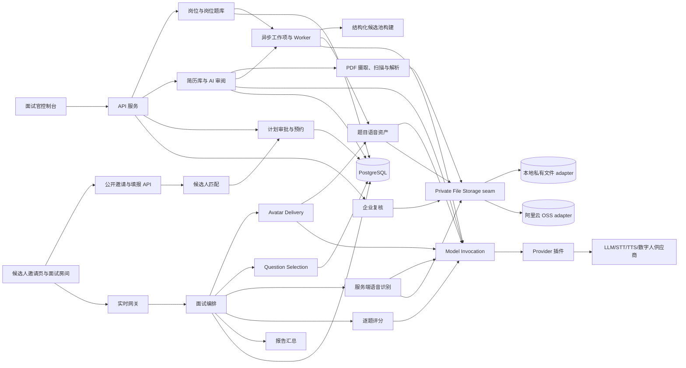
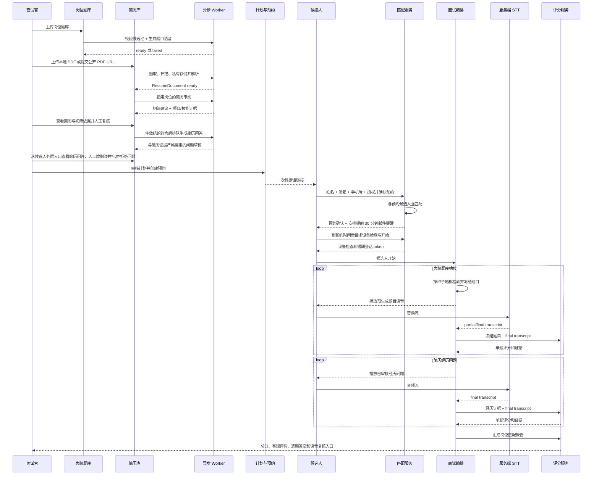

# 实时数字人面试系统架构

## 明确结束但没有技术回答（023）

理解层增加answer_declined/next，完整服务端证据明确结束但未提供技术内容时，沿用CandidateAnswer和ANSWER_SUBMITTED事务保存真实响应；所有权、当前题目、完整音频及准备指纹保护保持有效。它不发技术追问，也不进入utterance.not_accepted的澄清循环。评分层从租户隔离持久会话核验答案/理解/发言绑定，全组未作答产生正常0分revision；混合证据只用实际技术响应评分。根回答及追问的审计引用继续保留，候选进度仅统计已回答的不同正式题。

023回归同时修复取消关闭导致的供应商流遗留：ContinuousSTT持有唯一的有界清理任务，调用者取消不撤销清理，重复关闭共享等待；每条流保留2秒关闭期限。服务端原录音、识别与提交语义不变。

## 追问等待与识别完成（022）

供应商正常结束且本段无文字必须区别于超时、断线或丢失结果。内部 `transcript.empty` 仅由完整发送及正常结束确认产生，经网关校验后推进该段音频水位；它不提供文字、不代表否定，不可单独形成答案。任何已见非空partial/稳定预览在跨流恢复时也不能被empty抹去。已确认回答在新完整空段核验后可保留原结束语义，避免VAD活动令无字音频无限重放。

同一capture、completion_confirmed、全部STT指纹一致时，声音只取消本次等待和提交资格，保留一份有界的纯理解/追问准备。新文字、变化的final/上下文、继续补充、失败和关闭会废弃；仍需新的完整快照与全部提交fence，不使用None提交。准备45秒期限从首次启动计算，重入不续期。STT finish最多10秒，恢复每次15秒/最多3次；接收缓冲统一60秒，进入恢复不能缩小已接受的缓冲。字幕按当前题目隔离，旧题final不带入追问且迟到事件不能清当前收音状态。

## 补充确认循环修复（021）

SpokenSupplementConfirmation保留已问上下文，声学或ASR新输入撤销的是准备中的提交，不把问答重置到listening。重复“没有”“下一题”在同一问答中按语义处理；真实新增内容仍可进入继续补充。确认后的文本边界推进到当前final，避免将上次否定和新回复混为原回答后再次询问。AnswerEndpoint记录final已覆盖的文本前缀，迟到/重复partial不取消使用该final的决定。

声学中断后若新完整快照与确认final的全部指纹相同，可以复用结束意图并重新准备；无final或不完整尾部不能复用。慢理解期间继续收音、原有录音唯一性、提交fence和真实改口撤销均保留。确认决策/撤销/播放事实写入专用speech_evidence日志，修复普通模块INFO默认未启用导致诊断缺失；仅有安全字段及文字散列。

## 声音活动与可听播报（020）

端点与连续STT共用INTERVIEWER_TURN_VOICE_RMS下限，默认0.006；20ms/mode3 WebRTC VAD要求近6帧至少5帧同时满足语音特征和音量。收到PCM不是说话事实，所有已接受候选PCM仍录制和送识别。实际_receive_audio返回的当前capture/turn新增服务端文字在投影前通知端点，重复累积文字不重置5秒计时，旧capture及播报期间结果不能撤销新提案。询问后有声但缺final持续5秒会进行一次语音澄清，仍保留未识别音频且不提交旧边界。

客户端普通起音为RMS≥0.006持续120ms，agent floor包含语音生成/缓冲期并使用≥0.05持续160ms的打断门槛。字幕更新灯2秒无新文字熄灭，音频通道不表示正在说话。级联音频明确区分loading/playing/blocked，8秒加载或卡顿受阻时保留当前音频并允许恢复；playing/blocked/failed/buffering回执仅诊断，实际结束仍用原stopped协议。浏览器播放错误不再直接暂停面试，服务端补充播报30秒超时门禁保持。

## STT 补送流控与转写边界（019）

实时收帧仍先写唯一录音，再非阻塞送识别。快照排队尾帧、重开后的未确认片段和积压补送通过 ValidatedSTTStream 的可选容量等待扩展，等待网络发送实际释放空间；LiveKit 接收继续使用独立的有界 PCM 缓冲。单次恢复总预算15秒、三次尝试；单次发送无进展最多5秒，故障仍保留完整录音，绝不通过丢帧换成功。继续补充后遇到无转写片段可以使用已确认边界再次询问，边界只用于对话；未识别音频继续保留，提交仍要求新完整 final。

## 结束确认后的收口（018）

口头答复取得server final后暂不重开识别；同一final供意图与完整答案理解使用，提交前仍核对owner/turn/capture、输入revision、全部STT/上下文指纹及待处理音频。继续/澄清、失败或续说均恢复原采集；关停不重开。记录与PCM接收始终继续，已确认且主动暂停识别的准备窗口最多60秒缓冲，覆盖10秒意图+45秒理解；022起故障/缺final也使用60秒接收预算，防止进入恢复时突然收缩容量。

ServerSpeechActivity为本地WebRTC VAD适配器，固定webrtcvad-wheels==2.0.14、20ms帧、mode3，最近6帧中至少5帧含语音特征且达到配置RMS（020起默认0.006）才声明持续语音；单帧可能起音在下一帧解析前阻止提交，但不立即撤销确认。保留所有PCM；不支持格式、DC故障、检测异常按有声保守处理。端点与连续采集采用同一活动规则；服务端新增字幕也能撤销决定，VAD不能提供文本或授权结束。ASR已有新假设却缺final仍阻塞，不能因VAD未检测到就丢弃。

待定声学起音必须按字节水位关联到最终转写：已被server final覆盖的半帧不能继续阻塞；新的半帧仍阻止提交。稳定预览只因在途有声/待定起音或新ASR尾句而失稳，纯静音PCM正在send不能撤销已准备结果，否则会在持续收音下重复调用模型。此修复不把预览当作厂商处理ACK，最终提交仍等待final和音频fence。

## 静音后的口头确认（SPOKEN-SUPPLEMENT-CONFIRMATION-016）

正式生产入口在 AnswerEndpoint 内安装 SpokenSupplementConfirmation：候选人说话后连续5秒静音触发批准的“是否补充”语音，不直接提交，也不依赖EOT模型概率。实际换说话人时取得server final并冻结答复边界，同一Evidence capture/录音继续保留；询问前不做耗时答案理解。播报期间隔离麦克风回声，已确认的scoped barge-in补回最多200ms起音且只记录一次。候选口头肯定/实质补充继续听，明确否定才进行完整回答理解和既有受控后续动作。未知/低置信度再确认，无答复15秒提醒一次后继续等，30秒无播放ACK只撤销本代输出、不默认完成。此流程替代012/015正式入口的纯EOT自动提交政策；底层可撤销准备/final核验、暖场与014故障恢复仍保留。

## 正常轮次不断流预览（NONCLOSING-STT-SNAPSHOT-015，仓库verified）

正式采集支持独立 `StableTranscriptPreview`：网关验证供应商已稳定句段，ContinuousSTT 统一累积，Evidence 封存 `complete=false` 的录音前缀后才允许语义预计算。预览不是 final/权威 Utterance/完整音频 ACK，不推进生命周期；无稳定句或仍有未定尾句时继续同一连接收音。正常 continue_listening 不 finish/reopen；准备接话后只做一次最终收口，最终全字段指纹变化须重新准备，续说/owner/题目变化撤销旧结果。仅真实异常进入014恢复；未提供预览能力的 Provider 保留原兼容收口路径，试音不变。

## 连续采集自动恢复（CONTINUOUS-CAPTURE-RECOVERY-014）

识别流故障与整场面试暂停分离：`capture_recovery` 集中安全分类，AnswerEndpoint 持有最多3次、单次15秒的重建预算，ContinuousSTT 只做一次旧流清理/重开/未确认PCM补送。正常停顿仍由可撤销音频EOT与权威理解处理，不改成强制按钮；试音原自动完成不变。帧进入Provider前录一次，轮换/恢复新积压最多60秒（022起统一接收预算）；溢出作为不可忽略缺口转同题重答，不能用旧final提交。重放主动让出调度，避免健康sender尚未运行就被突发补送压满。

恢复时保留当前题和收音；耗尽封存不完整证据并关闭本代采集，InterviewSession仍in_progress，候选人可显式重试本题，无需企业人员守候。重试通过既有owner journal、当前turn/capture与私有capture_revision事务创建新代，不混入旧片段。持久恢复状态与UI投影分开：UI慢不杀识别，持久状态/完整性失败则撤销输入并保留安全错误，不能退出唯一worker后继续暗中收音。主动暂停同步撤销输入；Provider重开前后再验证会话/题目/所有权，取消不能复活旧流。

答案提交后的短UI投影失败不阻止后续表达任务调度；批准追问/澄清仍使用自身生命周期，不套用1秒UI时限。历史paused会话不自动恢复；生产服务持续不可用、存储损坏或所有权失效不冒充已恢复。真实中文停顿、长回答与网络抖动验收仍须独立完成，不能由合成回归推断端到端稳定率。

## 邀请与路由就绪刷新（ROUTE-READINESS-REFRESH-013）

健康状态计算与探测协调集中在 Model Route Readiness seam，供 AppointmentAdmission、部署只读 readiness 和模型管理复用；HTTP/页面不自行判断 TTL。过期是待确认，不是已确认故障。GET/基础设施健康接口不调用付费模型，命令路径才在权限和前置条件检查后刷新所需路由；网络等待位于最终邀请/start 事务之外，成功后再次复核全部门禁。

自动刷新有并发/单次/整批时限、失败冷却、持久租约和配置绑定。管理员可单独刷新预约 readiness 而不发邀请；界面完整列出试音、正式 STT、理解、追问和表达 TTS。真正探测失败仍失败关闭，不扩大有效期、不改为 mock、不承诺一次基础 `/readyz` 覆盖所有预约能力。

## 可撤销自动轮次（INTERRUPTIBLE-AUTOMATIC-TURNS-012）

发布范围：自动轮次/合并推理与稳定性修复默认生效；下面的 TTS streaming transport **默认关闭，仅显式实验**。
真实 Chrome 合成测试表明当前 MediaStream 时钟包含发送端停供静音，不等价于内容 sample playhead；在解决同源映射前沿用可靠私有资产播放，
不为了展示首包速度启用未验收的抢话/截尾风险。当前本机媒体地址漂移（旧.104→实际.108）已更新；`scripts/local-media.sh doctor` 用于只读检查，
不能把 HTTP readiness 或信令连接成功当作浏览器 ICE/音频路径成功。

本节替代 011 的强制按钮收口。正式回答使用 `AnswerEndpoint`（提议/撤销/准备/核验）与 `ContinuousSTT`（识别句段轮换/有序缓冲/权威累计 final）两个 seam。VAD 只表示声音活动，本地音频 EOT 概率与最低静音门槛共同产生提议，仍需权威转写和严格理解；不依赖结束词库，也不把静音时长或 STT 句段 final 当作整题结束。`finish_answer` 是可选提前结束建议，新语音同样可以撤销它。暖场仍自动结束。

理解准备期间 Floor 保持 candidate，媒体继续进入同一 Evidence capture；只 seal 私有录音前缀 checkpoint，不能提前标记 complete。识别流轮换期间缓冲至多 5 秒，帧按原顺序且只录一次，缺失 final 的有声段保留并向新流重放，不复用旧 final 冒充完整回答。提交前再次 flush final 并对比全文、置信度、分段与来源；在链锁内复查 owner/capture/输入版本及冻结题目/预算上下文，通过后才同步切断采集并封存。静音尾帧仍保留在私有录音，保守能量门槛只是额外输入失效保护，不构成准确 VAD 的证明。

`prepare_decision` 在后台运行，理解＋受控追问通常合成一次 LLM 请求；短事务执行器不等待模型/TTS。新语音或补传使旧提案失效；准备失败最多 3 次（1 秒、2 秒退避），随后仍收音，不把语义服务暂时故障升级成整场暂停。未知 EOT 不提交，长时间不确定只提示仍在听。媒体损坏/缓冲耗尽/owner 丢失仍安全停止。动态表达在答案提交后后台生成，播放前重查原 owner/turn/act-selection/floor，暂停、换题、接管后的迟到成功或失败均不能影响新轮次。

本轮分阶段计时覆盖 EOT、STT snapshot/final、理解准备、决策提交、TTS 合成/开流/首 PCM/订阅确认、音频导入、远端排空确认及撤销计数，无音频/文本/候选人标签。源码/离线场景验证与目标麦克风/并发/生产验收分开记录；不得以本地 EOT 推理时间代替端到端首音延迟或真实中文轮次准确率。

第二阶段使用 `ApprovedSpeechOutput` 承接已批准动态表达：原 TTS route 的严格 PCM streaming extension → 独立最小权限 LiveKit publisher → 精确绑定的客户端播放器。Provider 开流、候选订阅 ready、首 PCM、唯一 final、本机 source 排空、远端媒体时钟排空是不同阶段；只有最后的当前输出 ACK 才移交 Floor。队列 200ms、20ms 帧、持续 owner/turn/selected-act/performance fence，取消同时停止 Provider 和音轨。预生成题目不改，不支持 streaming 的模型在首 PCM 前回到已有私有资产路径；首 PCM 后失败不整段重播。完整 PCM 经私有资产 seam 归档，供应商 URL 不进入事件。控制连接中断撤销旧轨道，新控制连接只能以新代次重播仍匹配当前题的已批准 act；禁止把不可重放的 transient track 留为永远 active。G2P 和 MediaStream 时钟不等于精确 RTP/sample 对齐，真实浏览器抖动/尾音与端到端首音尚须验收。

## 正式完成确认与理解引用合同（TURN-COMPLETION-UNDERSTANDING-011）

011 曾使用显式 `finish_answer` 收口，其强制按钮语义已被上面的 012 替代；引用合同、安全校验和历史记录仍保留。正式 `speech.stopped(endpoint_countdown_ms=0)` 不是自动 seal 指令；暖场保留 2.5 秒自动端点。资源上限、断线 grace、owner/capture fence 仍有效，不承诺无限录音。

Understanding 保持原有 Module Interface，内部以 `interview_turn_understanding.v2` 让模型选择服务端生成的 E 原文片段 ID、P 冻结能力点 ID；统一 wire schema 检验后精确还原为原领域字段，再执行完整分区、原文引用和 claim 声明检查。不存在模糊匹配、静默补点或模型重写证据。失败只携带固定类别重新生成一次，每次逻辑调用上限 20 秒（合计至多 40 秒）；仍不合法时维持安全暂停且不得产生 CandidateAnswer。成功 JSON 不等于通过领域内容校验，诊断记录拒绝原因/尝试数但不保存原始响应。

百炼 constrained-decoding 不接受 array.uniqueItems：Adapter 仅在发送的厂商 schema 副本中去掉此关键字，网关继续用完整原 schema 检验唯一性；其它约束保留。静音、语义处理、模型格式约束和安全暂停现在分别有明确状态与职责。

## 正式语音同题重说的事务边界

`ENDPOINT-CAPTURE-SCOPE-010`：每次 owner 真正开流生成独立 `capture_id`，通过同 causation 的 transient ready 投影；客户端 VAD 绑定它与 turn，barge-in 在未 ready 时只打断当前表达，不能为后续新流调度停止计时。端点另有每次停顿独立的 `endpoint_id`，服务端在创建/到期/执行 durable seal 时验证作用域，重新开口、换题、同题重说和 reset 会取消旧计时。暖场连续静音收口窗口仍为 2.5 秒；正式回答使用 012 的可撤销提案，不以延长超时掩盖跨流竞态。

Provider 明确返回无 final 时，仅保留录音和 `transcription.started/failed` 事实，不构造空/None utterance、不调用理解/评分；与当前 capture 释放在同一事务完成后，返回可恢复的“未得到有效转写，继续说或重说”，快照驱动新开流。真正的 Provider 故障仍走真实 batch repair；没有真实批量路由时网关拒绝 mock，不冒充补偿成功。已有语义 schema/内容安全暂停、owner fence 与人工恢复权限保持不变。

采集完成与题目作答完成是不同事实（`EVIDENCE-NONANSWER-RECAPTURE-009`）。录音封存后，若权威理解要求澄清、重读、继续听或暂停，`UTTERANCE_REJECTED` 与 durable capture revision 推进在同一事务提交。原 utterance/录音保留，未采纳片段进入既有旧 revision 留存链路；下一次同题开流从空 checkpoint 开始。未决或已采纳的完整采集仍禁止普通 reset/open。转写状态与答案提交除 owner fence 外还校验 capture revision，旧 writer 或跨 revision repair 不能污染新录音。封存命令若在结果应答前崩溃且缺少可确认 receipt，继续按既有失败关闭规则处理，不把新采集当成旧答案。

## 目标

系统围绕“岗位”组织招聘知识与面试执行，目标闭环如下：

1. 企业创建岗位，并为岗位维护一个或多个知识库式题库；题目入库后校验结构化字段、形成候选池并异步预生成读题语音。
2. 企业把候选人基本信息和 PDF 简历上传到组织级简历库；简历可来自浏览器本地文件或公开 HTTPS URL，但都要先进入系统私有存储，再由 AI 按指定岗位异步形成可解释初筛并提取项目/职责/技能证据。只有生效结论符合时才独立生成与这些证据严格绑定的过往经历问题；AI 草稿和面试官人工创建的问题共同组成候选人的简历问答。
3. 面试官基于岗位、岗位题库、候选人简历审阅结果确认生成面试计划；React 工作台在这一命令内原子完成装配与批准，并冻结所选题库共同的 TTS 模型、音色、语言、格式和语速，随后创建预约和一次性邀请链接。
4. 候选人打开链接，填写姓名、邮箱、手机号码并完成隐私告知与授权；系统与预约绑定的简历库记录匹配后确认预约、安排面试前 30 分钟邮件提醒，并按计划冻结的语音特征异步准备本场简历题语音，到预约时间且语音完成后才允许进入设备检查和面试。
5. 面试中，数字人在已批准计划和已冻结题目池内进行可审计的随机检索，播放预生成题目语音；服务端识别候选人回答并逐题评分，然后进入下一题。
6. 岗位题库问题结束后，数字人继续询问由简历项目经历生成的问题；面试结束后汇总岗位维度总分和客观匹配证据。
7. 企业可以查看每题题干、转写、评分证据和候选人原始语音，自行复核并作出最终招聘决定。

AI 输出用于辅助企业判断，不自动作出录用或淘汰决定。

## 用户角色

- 面试官：维护岗位题库、上传候选人与简历、审核简历问题、批准计划、预约面试、查看和复核报告。
- 候选人：通过一次性邀请链接完成身份匹配和授权，听数字人提问并用语音回答。
- 复核人：查看答案、原始语音、转写、评分证据和报告，必要时修正转写并触发重评。
- 管理员：管理组织、权限、供应商配置、语音、数据留存和审计策略。
- AI 协作者：根据本文档实现服务、接口、测试和后续能力。

## 总体架构

## 模块职责

| 模块 | 职责 | 设计要点 |
| --- | --- | --- |
| 面试官控制台 | 岗位、题库、简历、计划、预约和复核 | 题库页先列出 KnowledgeBase；进入详情后再加载题目、语音配置和构建进度，不在前端复制业务规则 |
| 候选人邀请页 | 展示安全的预约摘要，收集姓名、邮箱、手机号码和授权，确认预约并在到点后进入设备检查 | 不暴露简历是否存在、标准答案或计划细节；确认预约不等于启动面试 |
| 候选人面试房间 | 真实摄像头本地预览、三层收音状态、实时字幕、3D 数字人与可打断自动轮转 | `CandidateInterviewExperience` 只消费统一 view/event；生产评分只接受服务端 STT final，致命故障暂停或人工接管 |
| 岗位与题库 | `JobPosition`、首版 `RoleRequirement`、可复用 `KnowledgeBase`、岗位关联、题目、答案、标签、评分规则、导入导出 | 新工作台在同一事务创建岗位与首版要求；题库由组织统一维护，可关联多个岗位，只有构建完成且已关联的题库可用于该岗位计划 |
| Question Speech Build | 根据题库语音配置批量生成不可变题目语音 | 深模块；配置 revision、题目 fan-out、幂等、过期结果拒绝、进度聚合和失败重试都隐藏在一个队列 interface 后 |
| 题库构建流水线 | 解析导入文件、校验答案/关键点/标签/难度、形成结构化候选池、异步生成题目语音 | 每项有独立状态、重试和失败原因；不在上传、建题或配置请求内调用模型 |
| 简历库 | 保存企业上传的候选人基本信息、不可变 `ResumeDocument` 和岗位初筛投影 | 候选人支持增查改删；简历只接受 PDF，本地上传与 URL 导入形成相同资源和状态语义，并通过短期受控地址展示 |
| Resume Ingestion | 接收 multipart PDF 或拉取公开 HTTPS PDF，执行限流、哈希、类型校验、恶意文件扫描和解析 | URL 每次重定向都做 SSRF 防护；成功前文件处于隔离区，不直接交给 AI |
| Private File Storage | 统一保存、读取、签发受控访问和删除私有文件 | 深模块；本地开发使用文件系统 adapter，部署后通过配置切换阿里云 OSS adapter，业务 module 不感知厂商 SDK |
| Resume Review | 异步形成岗位初筛并提取项目/职责/技能证据 | 深模块；短简历优先单次调用，输出截断时自动改用页感知 Map/Reduce，长简历直接按页和输入预算执行证据 Map/分层压缩/最终 Reduce；分块只提证据，全部成功前不形成筛选结论，也不生成问题 |
| Candidate Question Bank | 只为生效结论符合的候选人聚合 AI/人工简历问题，提供增查改、批准/拒绝和归档 | `resume.experience_questions.generate` 在符合后独立排队；每题必须绑定不可变证据快照且题干点名证据标签。批准只使 `ExperienceQuestion` 可入计划，语音延迟到候选人确认预约后按计划冻结特征生成 |
| 候选人匹配 | 把邀请填报与预约绑定的候选人记录匹配 | 使用规范化邮箱或手机号强匹配；姓名只作联合校验，禁止仅按姓名模糊匹配 |
| Interview Plan Assembly | 从岗位要求、岗位题库和简历审阅形成计划 | 产出抽题槽位、结构化 `QuestionCandidatePool`、经历问题、阶段顺序、权重和解释；冻结所选题库唯一 `speech_profile`，冲突时拒绝装配 |
| 计划审批与预约 | 批准计划，绑定岗位、候选人、题库、时间窗和邀请 | 邀请要求题库语音就绪且计划已冻结语音特征；候选人确认后创建预约级简历题 TTS 工作，全部完成前禁止 start |
| Appointment Reminder | 候选人确认预约后安排并发送开始前 30 分钟邮件提醒 | DurableWorkItem 只保存预约 ID；发送时才解密邮箱，SMTP 凭据只来自环境变量 |
| Avatar Performance | 把已批准文本编译为可中断 TTS、15 viseme 与动作时间线 | 深模块；优先使用 Provider 时间戳，否则经中英文 G2P seam 对齐；VRM 1.0 的标准元音可来自 preset、辅音可来自 custom，静态图和音量假口型不存在于正式候选人路径 |
| Question Selection | 在计划冻结的结构化候选池中为题库槽位抽题 | 深模块；使用 SQL 过滤、会话随机种子、去重、覆盖和难度约束，保存选择事实并冻结题目快照；不依赖向量数据库 |
| InterviewSession 生命周期 | 接受领域命令，推进会话/轮次并形成持久事件 | REST、WebSocket、数字人和 worker 不得自行改状态 |
| Agent 控制与事件传输 | 一次性 ticket、统一 Agent WebSocket、有界重放和角色投影 | 只传 JSON 控制/事件，拒绝二进制 PCM；不决定抽题、状态迁移或评分 |
| Authoritative Evidence Ingress | 服务端订阅 LiveKit 候选人麦克风，统一私有录音、`stt.streaming`、唯一 final、持久 checkpoint 和 batch repair | `attach/dispatch/detach` 为外部 interface；数据库 lease/fence/journal 是真相，Redis 只是 wake hint，旧 owner 不能提交证据效果 |
| Model Invocation | 统一执行模型能力调用 | 吸收路由、凭证、schema、重试、回退、超时、断路器、审计和成本 |
| 逐题评分 | 使用冻结题目、服务端最终转写和岗位要求输出可解释评分 | 保存命中点、缺失点、证据、置信度与 revision |
| 报告与企业复核 | 汇总岗位维度、经历问题和风险提示，提供答案与音频复核 | 报告使用“匹配度/需复核”，最终决定由企业人员完成 |

路由声明与 transport implementation 分离：`app/api/routes.py` 只负责 include，具体路径按 `system/admin/catalog/talent/plans/interviews/realtime` 放在 `app/api/routers/`；`app/transport/service_locator.py` 按需构造路由调用的 deep module，`InterviewAgentRuntime` 与 `AuthoritativeEvidenceIngress` 分别独占 Agent 事件/对话编排和权威证据提交，`app/realtime_bus.py` 只传输最小安全事件与唤醒提示。`app/transport/http/responses.py + fields/` 独占 JSON 编码、集合/异步/错误格式与声明式字段 allow-list。路由不维护这些 implementation，transport fields 也不反向进入业务 module。成功资源保持既有顶层形状，集合统一为 `items + next_cursor`。

内置 Web 工作台以 React 19 + Vite 构建，FastAPI 托管生产 bundle/vendor 资产，授权 VRM 只经候选人绑定的短期 grant 与私有端点交付；静态面试官图片不是可访问的候选人资产。仓库默认从 `model/interviewer.vrm + model/interviewer-license.json` 读取本地形象，部署可用显式环境变量覆盖；二进制 hash、VRM spec、humanoid/lookAt/blink、preset 与 custom 表情并集以及去敏许可字段必须全部一致。`WorkbenchProvider` 统一持有 hash 路由、认证会话、角色重定向、资源缓存、弹窗、toast 和可取消请求；Workspace Query 按角与路由加载资源。`CandidateInterviewExperience.open/subscribe/act/close` 是候选人端唯一 facade，内部吸收 LiveKit、Agent WebSocket、AudioWorklet、加密环形缓冲、事件排序和 VRM 表达；页面只渲染 `CandidateExperienceView`。业务组件与命令 hooks 按 `questions/workflow/plans/interviews/models/candidate` 分区，旧全局 DOM/controller 及多通道候选人 runtime 已物理删除。

## 核心业务流程

## 深模块与关键不变量

当前代码已有 `InterviewSessionLifecycle`、Interview Plan Assembly 和 Model Invocation 三个 seam。目标架构继续保持这些边界，并新增 Resume Review、Question Selection、Candidate Matching 和 Question Speech Build seam。Question Speech Build 对调用方只暴露“配置并重建、只重建失败项、查询构建”三个主要操作；TTS 路由组装、题目 fan-out 和 Celery 投递都属于其 implementation。

- `KnowledgeBase.job_position_id` 保留题库创建时的初始管理上下文；`JobPosition.knowledge_base_ids` 是岗位可用题库的显式关联。旧数据把初始岗位视为已关联，新增跨岗位使用必须先执行关联命令。
- 岗位关联只引用既有 KnowledgeBase，不复制或改写 Question、KnowledgeBaseSpeechProfile、声音或 QuestionSpeechAsset；计划选择的所有题库都必须已关联到目标岗位。
- KnowledgeBaseSpeechProfile 显式绑定一个已启用、`ready` 且支持 `tts.synthesize` 的 ModelConfiguration，以及该模型可用的声音、语言、格式和语速。切换模型、声音、语言或影响输出的参数会创建新 profile revision 并排队整库重建，旧资产保持不可变。
- 新建题库时若组织已经配置 enabled 的 `tts.synthesize + question_speech_generation` route，Question Catalog 会解析其 ready primary ModelConfiguration 和模型默认音色，并立即冻结为题库 revision 1 profile；后续 route 变化不会静默改写既有题库。没有有效默认路由时生产环境保持 `configuration_required`；开发 mock 只用于离线流程，必须在投影中明确标为不可试听。
- 上传题目后，结构化字段校验和题目语音异步完成。正式计划只能引用 `ready` 的题库版本，且每道活动题必须有完整评分依据和匹配当前 speech profile revision 的可用语音资产；服务端即时 TTS 只作为面试期间播放故障的受控降级。
- 旧 speech build 完成时若题库已切换到新 revision，只能保存为历史资产或幂等结束，不能回写当前 `speech_asset_id` 或把题库误标为 ready。已批准计划和历史 InterviewQuestionSnapshot 继续引用原不可变资产。
- Resume Review 对调用方只暴露“排队审阅、读取状态”。字符/Token 估算、最终响应数量/长度边界、单次输出截断后的 Map/Reduce 降级、分页分块、并发 Map、证据去重/压缩、最终 Reduce、按简历版本隔离的工作幂等和 queued 孤儿自愈都封装在 module 内；只读取系统托管简历，初筛不使用受保护属性，人工覆盖保留 AI 原结论。
- `InterviewAppointment` 必须绑定已批准计划、候选人记录、岗位、题库版本和时间窗。候选人填报至少用邮箱或手机号与该记录精确匹配，不能通过查询接口枚举简历库。
- 随机抽题不是无约束随机。计划批准时冻结可选题目版本和抽题规则；会话保存随机种子、候选集合哈希、选择原因和题目快照，保证可审计且历史不受题库编辑影响。
- 一个轮次只有服务端 streaming/batch STT 的 authoritative final 可以形成 `CandidateAnswer`。partial 只用于界面显示；客户端文本和浏览器 final 不是领域输入。
- 每题评分完成或进入明确的可恢复失败态后才能推进；报告只能使用当前评分 revision 和冻结的岗位/计划快照。

## 推荐技术边界

- FastAPI：后台、公开邀请 REST API 和 WebSocket。
- PostgreSQL：岗位、结构化题库候选池、简历审阅结果、预约和面试聚合；MVP 不要求 pgvector 或独立向量数据库。
- Redis：短期会话、限流、分布式锁和流式转写协调，不作为领域真相来源。
- Celery + Redis broker：调度题库导入/校验、题目语音、简历解析/初筛、经历问题、预约邮件提醒、批量补转写、报告和初筛留存清理任务；所有 task 定义与执行编排只放在 `app/workers/`。Celery message 只负责唤醒，数据库 DurableWorkItem 或候选人留存事实仍是状态、租约、幂等、退避和 dead-letter 的真相来源。
- Private File Storage seam：统一管理原始简历、解析文本、题目语音、候选人回答音频和导出文件；本地开发可保留受控本地录音，生产录音必须形成 `candidate_answer_audio` FileObject 并通过阿里云 OSS 等私有 adapter 存取。
- Pydantic：API、异步工作项和模型统一输入输出校验。
- 模型网关：统一管理 LLM、STT、TTS、数字人 provider 插件、路由、凭证和调用日志；Embedding 仅作为未来可选能力保留。
- Prompt Contract：`app/core/prompt/` 集中维护所有版本化 system/user/probe Prompt、对应响应 Schema 和 JSON-object fallback 强化指令。业务 module 只通过 `prompt_contract(name, context)` 取得消息与格式合同，不能内嵌 Prompt。
- Structured AI Response Validation：Provider 只把原始响应解析为统一类型；Model Gateway 在返回业务 module 前统一用 Prompt Contract 的 Schema 校验类型、必填字段、枚举、数量/长度、额外字段和非空内容。校验失败进入结构化 `provider_schema_invalid` 重试/fallback/调用日志路径，领域写入发生在校验之后。

这些是推荐边界，不锁定具体厂商；替换实现时必须保持相同资源、状态、隐私和审计语义。

## 实时通信与语音

- WebSocket：会话状态、题目事件、partial/final 转写、评分进度和错误通知。
- WebRTC：生产候选人音频流和数字人媒体；MVP 可先用 WebSocket 发送 Opus/WebM 音频分片。
- 题目语音是可版本化资产，优先由题库当前 KnowledgeBaseSpeechProfile 预生成；播放失败时按预约策略降级为服务端 TTS 或文字，不能让客户端自报已朗读。
- 新预约默认 `avatar_mode=local`：服务端只签发当前轮次冻结语音的短期访问地址，浏览器用内置形象和说话状态渲染，不创建云会话。显式 `cloud` 继续走腾讯云 WebRTC/SFU；缺 route 或 Provider 失败时复用同一 local adapter，并返回 `fallback_reason=cloud_unavailable`。历史预约缺少该字段时按 `cloud` 解释，保持旧链路语义。
- 候选人回答必须在服务端进入 `stt.streaming` 或以完整录音进入 `stt.batch`。流中断时保存音频，轮次保持 `transcribing`，由 `stt.batch` 修复后再评分。
- receive-only LiveKit ingress 在权威 sink 前维护 `accepted/delivered` 单调水位。`evidence.seal` 先冻结调用时已接收的水位并等待该前缀全部通过录音/STT sink，再允许 Provider final 和 CandidateAnswer；排空超时必须按权威音频故障失败关闭，不能让控制命令越过仍在队列中的音频或用 partial 补答案。浏览器 VAD 的默认停止窗口与 STT 分句静音一致为 800ms，减少自然停顿产生的重复 start/stop 命令，正式回答以显式完成为收口事实，服务端 2.5 秒自动端点只保留给暖场。
- SQLite 只用于本地开发/测试；事务读写仍直接以 SQLite 为权威，提交后仅把该事务实际增删改的文档、工作项、凭据和调用日志增量同步到进程内兼容读模型。禁止在每条实时命令后反序列化全库；启动/显式重开时才执行完整装载，生产多实例继续使用 PostgreSQL/RLS。

## 数据流

1. 岗位与题库：创建岗位，上传题目、标准答案、关键点和 rubric。
2. 题库构建：校验技能、难度、题型、标准答案、关键点和 rubric，形成可用候选池并异步生成题目语音。
3. 简历入库：企业上传本地 PDF 或提交公开 HTTPS PDF URL；服务端流式摄取、校验、扫描并写入当前配置的私有文件 adapter，形成不可变 `ResumeDocument`。
4. 简历解析与审阅：解析文本保留 PDF 页边界并先脱敏；预算内走单次审阅，超预算则按页分块并发抽取证据，必要时分层压缩，最后基于全部证据聚合符合性、命中项、缺口和经历问题。任一分块失败时整体失败，不产生淘汰结论；人工可复核最终建议。
5. 计划与预约：形成题库抽题槽位和经历问题，人工批准后绑定候选人与时间窗并发出邀请。
6. 候选人填报：姓名、邮箱、手机号和授权与预约候选人匹配，公开 start 签发会话范围的 HMAC 候选人 token。

岗位管理使用显式生命周期边界：新增与编辑走 version CAS；删除前读取影响预览并要求岗位名称精确确认。确认后系统按 PositionCandidateMembership 清除该岗位全部候选人的私有文件和敏感投影，归档岗位要求/计划、取消预约并保留不可识别的历史审计占位。KnowledgeBase 是组织共享资源，不由岗位拥有，因此不参与岗位级联删除。
7. 动态抽题：用关系库字段在冻结候选池内按岗位、题库、状态、技能、难度和题型过滤，再按种子、覆盖和去重约束选题并保存快照。
8. 语音问答：播放题目语音，服务端识别回答；final 转写创建回答并触发单题评分。
9. 经历追问：岗位题库阶段完成后按已审核的简历经历问题继续问答与评分。
10. 报告与复核：汇总岗位维度、经历可信度与风险提示；企业回听音频、查看答案并可修正转写后重评。

## 安全与隐私

- 所有后台数据按 `organization_id` 隔离；公开邀请接口只返回安全摘要。
- 邀请 token 只保存哈希，必须短期、可撤销、一次性消费；填报错误使用统一响应，避免枚举候选人。
- 简历、手机号、邮箱、音频、转写和报告均为敏感数据；访问、下载、修正和导出必须审计。简历 URL 导入只允许受控 HTTP 客户端访问公开 HTTPS 资源，禁止私网、环回、链路本地、云元数据地址和携带 URL 凭证。
- 候选人填报前展示隐私告知、录音用途、AI 处理说明和留存期限，并保存同意版本与时间。
- Resume Review 和评分不使用性别、年龄、民族、婚育、照片等受保护或无关属性推断能力。
- 给供应商的数据按目的最小化；简历审阅、STT、评分使用不同 purpose 和脱敏策略。HTTP access log 在格式化前统一遮蔽私有文件、私有媒体和邀请 URL 的敏感 path segment，以及 `grant/token/ticket/signature` 等查询凭据；保留路由后缀、非敏感查询与状态码，但不保留短期 bearer。
- 企业复核音频使用短期签名 URL；默认禁止公开、跨组织分享和永久链接。

## 可靠性要求

- 题库校验/候选池构建、题目语音、简历审阅和经历问题语音均为可重试、幂等、可观察的持久工作项。Celery 使用 `acks_late`/worker-lost 重投，定时 dispatcher 补发未成功发布或租约过期的工作项；重复 delivery 不得重复生成当前资产。
- 所有模型能力共享一条失败边界：Outbox `failed` 只是下一次 attempt 的等待态，不产生领域失败事实；仅 `dead_letter` 才能把题目语音、简历审阅/经历题、答案评分、报告或题库导入写成终态失败。尤其不得用重试等待态推进受 `source_version` 保护的模型输入聚合，否则下一次成功响应会被自身造成的 version 变化错误判为 superseded。
- KnowledgeBase 的通用 version 可由题目语音进度高频推进，语音配置命令因此使用 profile revision 语义 CAS。运行中切换模型会在同一事务中协作取消旧 revision 工作、推进全部 Question source version 并创建新 build；旧 Provider 请求若已发出只允许完成为 superseded，在资产落库前还会再做一次 revision/cancel guard。
- 正式邀请和候选人开始前执行 readiness gate：计划已批准、题库版本可用、经历问题已审核、所需题目语音可用、服务端 STT 路由健康、时间窗有效。
- 实时会话从持久 `InterviewSession`、随机选择事实和生命周期事件恢复；刷新或断线不能重复抽题或跳过未评分答案。
- STT 失败先批量补转写，不得把浏览器 SpeechRecognition 或客户端文本当作最终答案；补转写仍失败时保持可恢复失败态并请求人工处理。
- 正式候选人路径的 VRM、WebGL、TTS 或权威媒体失败均通过候选人 token 绑定的 allow-list 故障命令推进真实 `InterviewSessionLifecycle.pause`，再向页面确认已暂停并等待人工接管；不以纯前端提示冒充状态迁移，也不回退静态图、浏览器语音或问卷按钮。
- 模型评分失败进入待重试队列，不阻塞已保存音频与转写；最终报告明确展示未评分或低置信度项目。

## 当前实现与环境验收边界

当前本地 MVP 已把新主链路接入同一事务型 Persistence seam 和 `InterviewSessionLifecycle`：

- `JobPosition -> KnowledgeBase -> Question` 边界、结构化字段校验、题库 readiness 和异步 `QuestionSpeechAsset` 工作项已实现；正式路径不调用 embedding。
- 企业简历库、脱敏 Resume Review、证据化 ExperienceQuestion 草稿、人工批准和预约确认后语音生成已实现；简历主入口只接受 PDF，支持 multipart 与公开 URL，同一 `ResumeIngestion` 流水线完成隔离、magic/MIME/大小校验、扫描、私有存储和解析。旧 `resume_text` API 已删除。
- 候选人专属计划以 execution v2 槽位、冻结 `QuestionCandidatePool` 和经历题快照为唯一执行表示；会话只能由预约创建。预约使用服务端告知与明确授权、哈希 token、强匹配、带 TTL 的准入事实、时间窗、原子消费和并发幂等 self-start。
- `QuestionSelection` 使用会话种子与 HMAC-SHA256 在批准候选池内稳定随机，选择事实与题目快照保存在会话聚合中；岗位题完成后生命周期进入 `resume_experience`。
- 音频回答会先进入 `transcribing`；LiveKit receive-only subscriber 把冻结 candidate microphone 轨重采样为 16 kHz/mono/20 ms PCM，同时进入持久 Evidence segment 与 `ModelGateway.open_stream()`，只有唯一服务端 final＋可验证录音能成为答案。断流时先由当前 owner 根据已 seal checkpoint 执行 batch repair；必要时客户端仅在服务端授权 gap 内用 JSON `evidence.recovery.*` 精确补传加密环形缓冲帧。
- 实时面试采用“双轨单真相”：同一 PCM 可并行进入权威 `stt.streaming` 和可选 `speech.dialogue_realtime`。前者形成 CandidateAnswer 并驱动异步评分；后者只负责低延迟语音表达，必须等待确定性策略批准追问文本后逐字播报，输出音频分片不能写入评分证据。回答请求在 `answer.evaluate` 入 Outbox 后立即返回，追问/下一题不等待评分模型；worker 完成评分和报告后再广播安全状态。
- 动态追问是 root turn 的深度 1–2、权重 0 子轮次；每 root 最多 2 次、全场最多 `min(4, 主问题数)`，剩余不足 90 秒不再新增。先用确定性中英文元意图抑制“重读/未说完/暂停/澄清”，再运行 `TurnUnderstanding -> controlled_followup`；任何 Provider/Schema/证据校验问题形成去敏 `UnderstandingProblem` 并 fail closed，不自由聊天。
- 国内实时媒体实现仍保持 provider seam：DashScope adapter 把 PCM 映射为 Qwen-Audio 3.0 duplex ASR、把私有录音映射为 Qwen3-ASR batch，并把 Qwen Omni/Audio Realtime 映射为统一 `speech.dialogue_realtime`；Volcengine adapter 把 Seed ASR 2.0 二进制流、极速批量 ASR、Seed-TTS 2.0 和 Seeduplex API v3 JSON events 映射到同一组统一能力，Ark Chat/Embedding 继续复用 OpenAI-compatible HTTP runtime；官方 OpenAI adapter 提供 Realtime、批量转写及常用 Chat/Embedding/TTS 模型。Avatar Delivery 在该 seam 上方按预约选择 adapter，自研模式复用 `QuestionSpeechAsset + PrivateFileStorage`，云模式继续由腾讯云数智人 adapter 用 HTTPS 管理 create/stat/start/close、用签名 WSS command channel发送 SEND_TEXT，媒体由腾讯云 WebRTC/SFU 承载，React 通过 TCPlayerLite 播放 `webrtc://`。切换模式或厂商不改变 InterviewSession 状态机；离场、换流和异常必须关闭数智人会话释放并发。
- 企业复核 projection、五分钟签名音频访问、实际下载审计、append-only 转写修正、重评、报告 revision、JSON/CSV 导出和复核完成记录已实现。
- 后台 Bearer RBAC、候选人 token 窄接口与 allow-list 安全投影、Redis fail-closed 公开限流、HTTP 元数据审计、联系人/Provider 凭证加密、显式到期数据清理、Outbox 退避/dead-letter/监控/重放、数据库共享断路器、Redis 跨实例事件 adapter、心跳超时监控、抽题公平性分布及脱敏评分金标校准已实现。
- PostgreSQL adapter 与显式 `python -m app.migrations.postgresql` 部署迁移已实现，包含租户 RLS、预约单会话、选择槽位和 Outbox 幂等约束；迁移 owner 与最小权限 runtime role 分离，应用启动只读校验 schema、从不执行 DDL。Memory/SQLite 仍用于本地测试。
- `/healthz` 只承担存活探针；`/readyz` 在所有运行环境都检查本地模式所需的 VRM 合同；显式 `INTERVIEWER_LOCAL_MEDIA=true` 时还真实探测仓库自带 LiveKit/Egress 与 receive-only Evidence ingress。production 继续只读检查数据库、Redis、生产密钥、私有 OSS、扫描器、LiveKit/Egress，并验证 30 天内的 HMAC 签名 `realtime-interview-agent.acceptance.v2` 验收报告。报告必须精确绑定 `deployment_id + release_revision`，覆盖 Chrome/Edge/Safari 桌面矩阵，并只携带有界指标/样本计数/数据集 hash，无转写或候选人 ID；缺失或跨版本复用时失败关闭。Appointment Admission 与候选人 Agent ticket 会再次校验相同媒体配置、报告和显式组织灰度名单，不能绕过 `/readyz`。
- `app.operations.production_config` 把生产配置生成和静态检查收敛在一个运维 module：生成入口原子创建 `0600`、Git 忽略且不可覆盖的 shell 配置，检查入口只解析变量名/格式、不导出环境、不连接外部依赖；真正运行状态仍以 `/readyz` 为准。调用方不需要自行拼接 token JSON、Fernet 或 HMAC 密钥。

仓库内能力已完成本地验证，并已有 `openai_compatible`、`deepseek`、`zhipuai`、`dashscope` 与 `volcengine` 的 LLM HTTP adapter，OpenAI-compatible、智谱 GLM-TTS、DashScope 与 Volcengine 的 TTS/实时及批量 ASR，以及 `media_http` 的通用媒体协议和 `tencent_cloud_avatar` 的云渲染 WebRTC adapter。Model Invocation 仍是单一 deep module：插件 manifest 声明连接/凭证表单和按 `llm/embedding/tts/stt/avatar/realtime_speech` 分类的模型表单，`ProviderConnection`、`ModelConfiguration` 与 `ModelRoute` 分别承载连接、具体模型和业务选择；registry 负责校验和加载，前端只通用渲染 schema。网关从 `model_configuration_id` 解析连接、凭证和 adapter，业务 module 不感知厂商差异。Provider/模型健康探针、异步 LLM/TTS/STT/数字人进度可以推进聚合 `version`，但不推进配置语义 `configuration_revision`；人工命令统一在提交前读取最新资源，只吸收语义身份未变的运行态 version，真正的配置或业务内容变化失败关闭。没有账号、凭据、语音 Resource ID、并发额度和真实模型探针时仍不能把模型标记为健康。本机隔离 PostgreSQL 16/Redis 7 已通过最小权限 RLS、事务/CAS、约束、索引查询计划、跨实例事件和限流集成验收；官方 ClamAV arm64 daemon 已用本地 EICAR 验收库完成真实 TCP PING/INSTREAM/FOUND 协议测试。目标生产集群、阿里云 OSS、生产 clamd、真实 ASR WER/延迟、腾讯 WebRTC 可用性及外部模型音质/费用仍需部署联调。`INTERVIEWER_RUNTIME_ENV=production` 要求私有对象存储、显式非 mock 且近期健康的模型路由、扫描器和生产密钥；缺失时 `/readyz`、邀请或 start 按职责失败关闭。旧向量题库、管理员直建/直接 start、客户端文本答案、运行时计划 `items` 和旧模型 provider config interface 已删除。

补充的实时语音实现沿用同一 Model Invocation deep module：官方 `openai`、`dashscope` 与 `volcengine` 均实现 `realtime_speech` 模型类型和 `speech.dialogue_realtime` capability。Provider PCM delta 先进入有界隔离缓冲，只有 final transcript 与冻结 ApprovedConversationAct 逐字一致才成为可播放的私有 AgentExpressionAudio；偏离时整段丢弃并用批准文本走 cascade。Volcengine 的私有 adapter 封装 Seed ASR 二进制帧和 Seeduplex API v3 JSON session，并用 speech replacement 只提交已批准文本；这些厂商协议不会改变统一批准门禁。

### 已验证的核心架构修复

深度审查确认的六个问题已通过代码、显式迁移、旧 interface 删除和自动化验收，细节见 [已知问题与修复设计](known-issues-and-remediation.md)。修复通过加深现有 module 完成：

- Interview Plan Assembly 独占计划编辑、校验、批准和执行物化规则，消除 `items`/`bank_slots` 双执行表示。
- Candidate Matching 和 Appointment admission 分别独占明确同意证据与 start 准入；时间由可注入 Clock 提供，准入、消费和唯一会话创建原子提交。
- Report 先物化 current evaluation 集合，再从该集合生成所有分数、证据和复核标记。
- Question Catalog 统一公开后台搜索与计划候选池查询；embedding 只能位于可删除的治理 projection/adapter 后。
- Candidate Session Projection 独占候选人 token 校验、字段最小化和当前轮次媒体范围，后台详情不再复用于候选人页面。

`PLAN-001`、`CONSENT-001`、`APPOINTMENT-001`、`REPORT-001`、`SEARCH-001` 和 `CANDIDATE-ACCESS-001` 的仓库验收已通过；生产化代码证据与外部环境待验收项统一登记在 [已知问题与修复设计](known-issues-and-remediation.md)。

## 智能生题审核边界

智能生题属于题库创作流程，不属于运行时抽题。React 只提交题库定位、标签、可选要求、数量和一个明确的
ready `llm.chat_json` ModelConfiguration；HTTP 在同一事务创建 `QuestionGenerationBatch` 与
`question_generation.plan` DurableWorkItem 后返回 202。Celery Beat/worker 只调度持久工作项 ID。
`QuestionGenerationService` 先通过 `question_blueprint_planning` 取得与目标数量一致、考察方向互斥的蓝图；随后每
1–2 个蓝图形成一个 `question_generation.generate_chunk` 子工作，子工作只保存结构化候选结果，不能直接写入
GeneratedQuestionDraft。全部子工作完成后，唯一的 `question_generation.merge` 工作按槽位顺序校验、去重和合并。

合并同时比较活动正式题目与本批次已接受题目：规范化完全相同或文本相似度超过阈值的候选被拒绝；蓝图的
`topic/scenario/focus` 组合另有稳定互斥键。缺失槽位以原蓝图和排除摘要定向补生成，最多两轮；仍不足时保留数量
告警并进入人工审核，不会伪造题目。规划和分片输出分别由 `app/core/prompt/` 的严格 JSON Schema 在 Model Gateway
校验，领域服务再校验槽位完整性、蓝图唯一性和完整评分依据。

草稿可以修改或删除，但 Question Catalog 完全看不到它们。面试官确认后，系统冻结剩余草稿并创建幂等
`knowledge_base.import` 工作；正式 Question 继续经过评分依据校验，并由既有题目语音 worker 生成 TTS。
正式题目记录 `generation_batch_id/generation_draft_id` 以便追踪来源。该双阶段边界避免模型错误直接进入计划、
面试或付费语音生成，也让生成失败与导入失败分别可观察、可重试。

生题任务控制继续收进 `QuestionGenerationService` 的同一深模块 interface。独立 React 工作台只发送 stop、resume、
retry-failed、retry-chunk 和审核命令，并渲染服务端 `tasks/available_actions` 投影；页面不理解 Outbox 租约或 Celery
状态机。停止事实写入 QuestionGenerationBatch，未执行工作进入 cancelled，在途工作通过 execution revision guard
在外部调用前或结果提交前结束为 superseded；不得用 `celery revoke(terminate=True)` 作为领域状态来源。

规划/分片调用的 DurableWorkItem 使用覆盖真实模型响应的 lease；worker 在取得 lease 后才调用 Provider，完成后以
lease token 提交结果。生题 route 不再内嵌同参数重试，一个 DurableWorkItem attempt 最多产生一次供应商调用，业务
退避统一由 Outbox 控制。Provider 以 `finish_reason=length` 结束时返回不可原样重试的
`provider_output_truncated`；双槽位分片由 QuestionGenerationService 原子标记为 superseded，并只为原槽位创建两个
单槽位替代工作，已完成分片和批次 execution revision 保持不变。单槽位仍截断则首个 attempt 直接 dead-letter，等待
显式人工重试。父批次投影只用活动替代分片计算进度，旧 worker 不能覆盖新 lease 的结果。

## 向量数据库决策

正式面试主链路不使用向量数据库。面试官已经把题目放入明确岗位题库，题目又有技能、难度、题型、状态和 rubric；Question Selection 只需在批准计划冻结的题目 ID/version 集合上做结构化过滤和可审计随机抽样。

答案评分也不需要向量相似度。评分 module 把冻结题干、标准答案、关键点、rubric、岗位要求和服务端最终转写一起交给 `llm.chat_json`，要求模型输出命中点、缺失点、错误陈述、证据和结构化分数。仅比较 embedding/余弦相似度容易把“词语相近但结论错误或否定”的答案误判为正确。

`embedding.text` 和 pgvector 只保留为未来可选优化，例如题库达到很大规模、面试官需要自然语言查题、自动发现近似重复题或对长文档做 RAG。即使以后启用，它也只辅助题库治理和计划准备，不成为实时随机抽题或答案评分的必要依赖。

## 完整实时面试智能体（REALTIME-AGENT-001）

正式候选人入口收敛为一个高 depth module：`InterviewAgentRuntime.open(OpenAgentSession) -> AgentChannel`。`OpenAgentSession` 只接收已认证 principal、面试 ID、一次性连接 ID、恢复 cursor 与客户端能力；问题、同意、追问预算、模型 route、录像状态和当前轮次全部由服务器读取冻结事实。`AgentChannel.send(ClientSignal)` 是唯一命令入口，`events()` 只投影稳定 `AgentEvent`，关闭时中断表达、证据流和设备占用。React、WebSocket、Provider 和企业监看页面均不得直接推进 `InterviewSessionLifecycle`。

运行时内部隐藏五条私有链路：Floor 独占 `agent/candidate/human/none` 发言权和 barge-in；Evidence 独占权威音频、唯一 final、录音持久化与 batch repair；Understanding 形成版本化 `ConversationUtterance/TurnUnderstanding`；Decision 只能产出经过预算和安全 gate 的 `ApprovedConversationAct`；Expression 把批准文本变成可中断的 TTS、viseme 与动作时间线。评分 worker 不阻塞下一题，对话动作与评分结论严格分离。

候选人端由 `CandidateInterviewExperience` facade 独占一次设备请求、自拍预览、AudioWorklet VAD、三层声音状态、暖场 2.5 秒可取消端点、正式完成确认、滚动字幕、控制恢复以及所有资源关闭。正式静音仅提示并继续同一采集，显式完成后才开始 final/理解；浏览器只显示服务端 `speech.stopped` 事件，不能自行倒计时并伪造 `understanding`。暂停/完成快照会立即清除端点与本地 VAD 状态，并禁止继续发送候选人语音命令。Evidence open 在 facade 中明确分成 `requested` 与 `ready`：只有单一 fenced owner 在 Provider stream 真正打开后，以同一 causation 投影 transient `floor.changed(reason=warmup_stream_open|evidence_stream_open)`，页面才从“准备识别”进入“正在听”；握手前普通候选人 VAD 不发送 `speech.started/stopped`，控制重连只对未确认 open 有界重提一次并等待新的 causation ACK。若握手期间人仍在持续说话，ready 后承接本地 speaking 状态；已按高置信门槛确认的 agent-speaking barge-in 则仍在 200ms 目标内先静音并发出 start。每次正式表达还拥有唯一 playback identity；本地 barge-in、服务端 interrupt、替换或关闭会先原子失效该 identity、移除旧 `<audio>` 监听器再释放媒体，旧元素迟到的 `error/ended/play()` rejection 不能暂停新会话或确认新表达。AudioWorklet VAD 以 sample count/sample rate 换算持续毫秒，不再依赖浏览器 render quantum 数量；普通发言和 agent-speaking 回声场景使用不同开始门槛，停止也要求持续静音窗口，避免几毫秒 start/stop 抖动。浏览器音频环形缓冲使用非导出 AES-GCM key，硬限 30 秒/2 MiB/32 KiB 帧；只在 ticket 返回 `media.recovery.server_checkpoint + browser_backfill` 且服务端授权 gap 时，才以 JSON `evidence.recovery.begin/chunk/complete` 补传。企业端由独立 monitor 订阅媒体和安全事件；人工接管使用 60 秒可续租独占 lease，普通企业 ticket 不能发布，当前 lease/version 只能交换一个 15 秒、仅 microphone 的媒体许可。AI 立即停止，人工问话保存为 `unscored_intervention`，lease 丢失后断开媒体并保持暂停。

媒体面决策记录在 [ADR-0002](adr/0002-self-host-livekit-media-plane.md)：自托管 LiveKit 负责 WebRTC/SFU、TURN、分轨和 Participant Egress，业务状态仍在本项目。`LiveKitMediaPlane` 吸收 Egress 的存储差异：本地开发的绝对容器路径在适配层还原为逻辑 object key，生产请求继续携带私有 OSS 配置。`PrivateFileStorage.verify_recording_protection()` 明确区分 `local_private_development` 与可验证的 AES256/KMS，生产不允许降级。一次性 Agent ticket 只授予房间与 microphone/camera 最小权限；未同意视频时 camera grant 为空。候选人发布媒体后只建立 receive-only Evidence，试音期间不启动 Egress；只有 `warmup.confirm` 先删除暖场证据，再在正式首题前启动同意范围内的私有录制。录制不可用时暂停，不可静默无视频降级。receive-only subscriber 以服务端冻结 identity 精确选择 microphone publication，把 16 kHz/mono PCM 按序送入连接独立的 Evidence/STT，慢消费时失败关闭。Evidence 门在 Provider WebSocket 握手完成前无锁丢弃 LiveKit 的环境静音；端点成立后先关闭门、释放链锁，再等待 Provider final。LiveKit sink 与 DashScope sender 都使用默认五秒、硬上限 30 秒的无损有界背压窗口，分别由 `INTERVIEWER_LIVEKIT_INGRESS_BACKPRESSURE_SECONDS` 和模型配置 `stream_send_backpressure_seconds` 调整；短时调度/网络抖动不会立即断流，超限仍明确失败关闭而不丢帧。DashScope duplex adapter 使用独立有界发送队列与后台收/发任务，厂商 `send/recv` 抖动不阻塞 LiveKit 收帧。`authoritative_media_binding` 不能被新控制连接替换；候选人重连票据会复用冻结的 LiveKit identity，只更新控制 `connection_id` 与 backfill epoch，30 秒 grace 内同一 subscriber、录音、STT 和 endpoint timer 继续存活。

`FORMAL-STT-PARTIAL-BACKPRESSURE-005` 进一步收紧这条路径：浏览器上一段播放迟到的 `avatar.performance.stopped` 必须通过当前 `performance_id` 的原子 compare-and-clear，不匹配时不得切换 floor 或提前打开正式 STT。`transcript.partial` 是可丢 UI 投影，从权威收帧回调解耦后按 `(kind, turn_id)` latest-wins 有界合并；final/reset/stop 以顺序屏障清除迟到 partial，非 partial、私有 Evidence、CandidateAnswer 和 fence 仍走原无损链。DashScope 直连 WebSocket 把 LiveKit 的 20ms PCM 合并为约 100ms 供应商包，`use_environment_proxy=false` 显式禁用进程环境代理。LiveKit track 失败另保留去敏 `cause_code/cause_type`供特权诊断，候选人仍只看到统一暂停信息。

`WARMUP-BACKPRESSURE-RECOVERY-006` 把非评分暖场与正式证据的故障策略明确分开：暖场 `audio_stream_failed` 原子失效当前本地 warm-up epoch、取消端点、abort 临时流并进入 `retrying + calibration_retry_required=true`，保持 InterviewSession 运行但要求候选人显式重试；已经开始等待 Provider final 的旧 seal 在返回后还要校验 epoch/track failure，不能投影迟到 final 或确认表达。reset 只有在同一 LiveKit microphone publication 的 lossless iterator 已重启（否则重建 subscriber）后才清 retry gate。正式流没有这个降级，因为其音频属于 CandidateAnswer Evidence，断流仍暂停或进入已有 checkpoint repair/人工接管路径。

所有权决策记录在 [ADR-0004](adr/0004-authoritative-evidence-ownership-fencing.md)。`EvidenceOwnershipCoordinator` 使用独立持久记录和 transaction database clock 原子 claim/renew/release；owner 变更严格递增 `ownership_epoch`，control attach 另外递增 `control_generation`。Streaming STT 和理解可在事务外运行，但 transcription 状态、非答案 utterance 和 CandidateAnswer 事务都必须先锁所有权行并验证 owner/lease/epoch/到期时间。因此旧 owner 即使迟到收到 Provider final，也不能形成第二份答案。

`EvidenceCommandJournal` 已通过同一持久化 Interface 提供确定性 command ID、请求指纹、control generation、owner fence、deadline、claim TTL、attempt 和最小安全 outcome。submit 在返回前持久化；同 key 并发/重试读取同一结果，过期 claim 由当前 epoch 重领。连接无关 owner executor 持续通过数据库 polling 获取命令，Redis 只缩短唤醒延迟；remote controller 是待 terminal receipt 的 proxy，绝不建第二个 subscriber/STT/录音。owner 失联后新 epoch 重领未完命令，已完成 effect receipt 阻止重复 final/CandidateAnswer。

正式配置是 `INTERVIEWER_LIVEKIT_INGRESS_MODE=database_fenced`。每 turn 的 PCM 以有界 segment 封存到 PrivateFileStorage，数据库 checkpoint 保存 revision、ordinal、frame range、checksum 和完整标记；新 owner 只能重建已 seal 前缀，未 seal 内存后缀不被伪称持久。必要时浏览器 backfill 每帧先落私有 FileObject，journal 只存 file ID/hash/epoch/sequence；owner 验证 source 已消费 connection、audio epoch、连续序号与 checksum 后注入同一 Evidence chain，以 `ack_through` 幂等去重。Agent WebSocket 始终拒绝二进制 PCM，补传不是第二条常态音频传输。

AgentEvent fan-out 先把每个可回放事件收敛为按类型 allow-list 的最小共享载荷，再按候选人、reviewer/observer、interviewer/admin 角色现场投影；带 lease、actor、私有媒体定位和内部能力点的特权字段不会进入共享历史或 Redis。每条连接使用有界队列，瞬时事件可被新值合并，关键可回放事件积压则关闭慢连接；重连只接收一次新鲜角色快照和 cursor 之后的安全历史，cursor 落在已裁剪历史之前时必须重新同步，不能静默制造状态倒退。

表达面决策记录在 [ADR-0003](adr/0003-local-vrm-avatar-expression.md)：正式本地路径使用 Three.js + VRM 1.0，`AvatarPerformance` 以统一音频时钟交付 15 个 viseme、眨眼、注视、呼吸、点头、倾听、思考、打断与告别。TTS Provider cue 经严格单调/时长校验后标记 `provider_timestamp`；缺少时使用词组感知的普通话＋英文技术实体 G2P，标记 `g2p_estimate`，不冒充 Provider 时间戳。候选人正式页面没有静态肖像或 CSS 假口型；授权 VRM、hash、商用许可清单、完整表情集合或 30 FPS 任一缺失均暂停/人工接管。音画偏差 `<80ms` 与目标设备帧率仍必须由真实资产/设备数据集验收。

动态 TTS 和通过逐字批准门禁的 S2S 音频都先进入私有 `AgentExpressionAudio` FileObject；会话仅保存 `agent-expression://file_id`，每次 AgentEvent 按当前 principal 签发短期读取地址。开场、追问以及缺少可播放预生成资产的主问题统一回落到 `interview_agent_expression` 受管 TTS，不允许浏览器朗读，也不会因开发占位语音直接停场。开发环境若显式配置该 TTS 或实时 STT/理解/追问 route，准入必须看到近期健康结果，不能在配置故障时静默回退 mock。S2S Provider 的原始音频 delta 在 final 文本获批前只存在于有界内存缓冲，文本偏离时整段丢弃；因此 Provider 自由生成、临时 URL 和 data URI 不会进入可回放历史。`AvatarPerformance.delivery` 明确区分 `pre_generated/cascade/s2s`，用于正确的首音指标而不改变批准文本。

题目 TTS 与动态表达共用 `PrivateAssetImporter` 媒体完整性边界。对 WAV，导入器在计算最终 checksum 和调用 PrivateFileStorage 前解析 RIFF/WAVE chunk；结构完整的标准容器保持逐字节不变。它只规范化两种有实证且不推断正文的编码器模式：已识别的 signed-limit RIFF/data 流式占位值在前置 chunk 完整、最终 data 到实际 EOF 且 PCM block-aligned 时收口为真实长度；所有 child chunk/padding 已完整消费到 HTTP EOF 后，外层 RIFF 恰好漏计四字节 WAVE form type 时只改 outer size。其他截断 chunk、任意长度偏差、重复或无序的关键 chunk、块对齐错误、尾随垃圾及 MIME/魔数不一致均拒绝入库，不能把“字节非空”冒充为可播放资产。历史冻结 FileObject 不原地修补；修复后通过既有重建/新预约流程生成新的不可变资产。

本地短期私有文件交付对浏览器媒体元素实现同一单 Range 合同：无 `Range` 的 `GET/HEAD` 返回 `200` 与完整 `Content-Length`，合法 closed/open-ended/suffix byte range 返回 `206`、`Accept-Ranges: bytes`、精确 `Content-Range/Content-Length`，不可满足、多段或畸形范围返回空体 `416` 与 `Content-Range: bytes */{total}`；`HEAD` 与对应 `GET` 的状态和头一致但不返回正文。Range 只改变受 grant 保护对象的传输，不改变 FileObject、checksum、访问审计或权限边界。

人工接管的获取、续租、发言事务复核、释放、到期 watchdog 与媒体许可全部使用 transaction database clock；任意在线 AgentChannel 都可触发到期清理，lease 丢失后强制断开人工 participant、保持暂停且不自动恢复 AI。

最后一题接受后，runtime 先停止 Evidence/Egress，再播放可中断告别 `AvatarPerformance`；只有收到 `avatar.performance.stopped` 或有界超时后才发出唯一 `completed` 提交回执，包含录制留存说明与人工审核声明，随即关闭设备/会话。旧 `/live`、`/stt-stream`、`audio-answers`、`avatar/speak` 和 avatar close 路由及多通道前端 runtime 已删除，不存在长期双实现。任何致命故障进入暂停/人工接管，不退回静态图、手动问卷或浏览器 final。

仓库已实现固定词汇的无标签运行指标与离线签名 acceptance runner，可对延迟、WER/实体召回、元意图/能力点、追问安全、断线恢复、未同意视频上行字节、Chrome/Edge/Safari 和试点问卷执行硬 gate。生产报告必须绑定当前部署与不可变发布 revision，组织必须进入显式灰度名单。这些是验收 module，不是通过证明；本机 VRM 已在 `personalProfit` 范围通过资产合同，目标 LiveKit/TURN/Egress/OSS、目标部署使用范围许可、真实 STT/TTS/LLM 路由、金标数据集和受控试点仍为 environment/data pending。

`telemetry.observe` 是候选人鉴权后的无 PII、best-effort 进程观测旁路，不是 Agent 领域命令。合法样本直接进入固定指标词汇并显式让出调度；它不获取领域信号锁，不读写幂等键、InterviewSession、事件历史、Evidence journal 或 takeover 状态，非法/越界样本静默丢弃且不能暂停面试。候选端对 `avatar_viseme_drift_ms` 和 `avatar_freeze_ms` 分指标使用 1 秒窗口，只发送窗口最大值；连接关闭、播放停止或页面关闭时丢弃未发送窗口，其他低频延迟指标仍即时上报。Evidence owner 续租另以无标识符的 `evidence_owner_renew_scheduler_lag_ms`、`evidence_owner_renew_db_latency_ms` 和 `evidence_owner_renew_success` 观测调度、数据库与结果；观测失败不能改变续租正确性，已过期或 fence 不匹配仍严格 self-fence，旧 owner 不能恢复权威 Evidence。该 `EVIDENCE-LEASE-TELEMETRY-004` 合同已在仓库验证，目标新会话仍待复验，不能据此宣称生产完成。

`REALTIME-WARMUP-VAD-RANGE-003` 当前状态为“verified（仓库），目标环境复验 pending”。该项只收紧私有媒体传输、Evidence 握手、暖场失败恢复、本地 VAD 与显示帧率门禁：暖场 final 失败只消费/封存一次原流，持久写入 `calibration_retry_required`，必须由候选人显式 `warmup.retry` 清门后才能新开流；服务端在该 durable gate 未清时拒绝直接 open。owner 执行 reset 后，live `warmup_retry` 或 snapshot 的 `retrying + retry_required=false` 都是已授权恢复事实，当前 control 可用新 causation open/reassert；重复 retry ACK 被忽略，旧 control 由 generation fence 拒绝，existing-open 只重发 ready ACK 而不重复创建付费 Provider 流。VRM FPS 健康判断使用与 UI 相同的显示整数 `Math.round(fps) >= minimum_fps`。面试抽题、冻结证据、答案形成、评分、追问、S2S/cascade 和人工接管业务规则均未改变；目标浏览器新会话中的 LiveKit/STT、私有媒体 seek/Range、扬声器回声与真实打断仍须环境复验。
