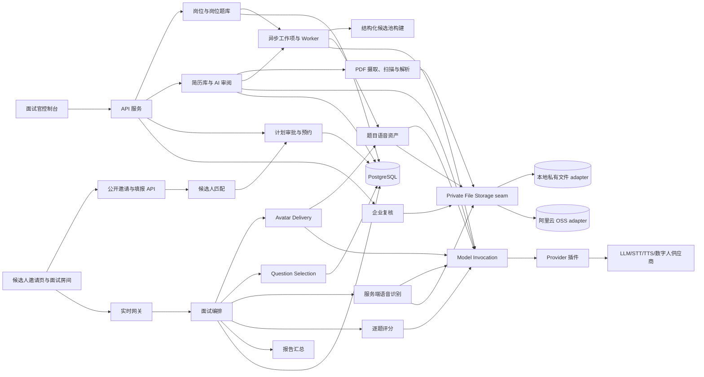
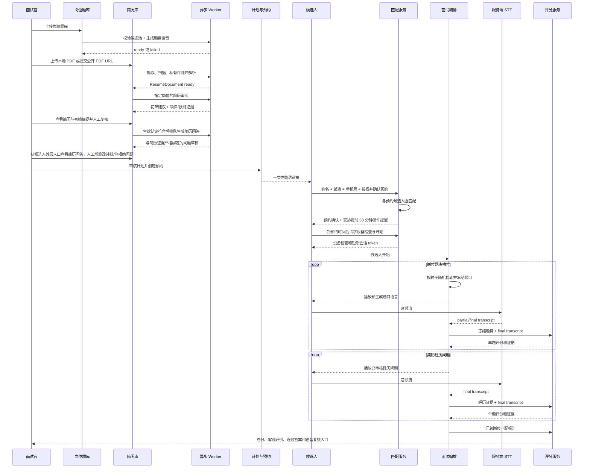

# 实时数字人面试系统架构

## 目标

系统围绕“岗位”组织招聘知识与面试执行，目标闭环如下：

1. 企业创建岗位，并为岗位维护一个或多个知识库式题库；题目入库后校验结构化字段、形成候选池并异步预生成读题语音。
2. 企业把候选人基本信息和 PDF 简历上传到组织级简历库；简历可来自浏览器本地文件或公开 HTTPS URL，但都要先进入系统私有存储，再由 AI 按指定岗位异步形成可解释初筛并提取项目/职责/技能证据。只有生效结论符合时才独立生成与这些证据严格绑定的过往经历问题；AI 草稿和面试官人工创建的问题共同组成候选人的简历问答。
3. 面试官基于岗位、岗位题库、候选人简历审阅结果确认生成面试计划；React 工作台在这一命令内原子完成装配与批准，并冻结所选题库共同的 TTS 模型、音色、语言、格式和语速，随后创建预约和一次性邀请链接。
4. 候选人打开链接，填写姓名、邮箱、手机号码并完成隐私告知与授权；系统与预约绑定的简历库记录匹配后确认预约、安排面试前 30 分钟邮件提醒，并按计划冻结的语音特征异步准备本场简历题语音，到预约时间且语音完成后才允许进入设备检查和面试。
5. 面试中，数字人在已批准计划和已冻结题目池内进行可审计的随机检索，播放预生成题目语音；服务端识别候选人回答并逐题评分，然后进入下一题。
6. 岗位题库问题结束后，数字人继续询问由简历项目经历生成的问题；面试结束后汇总岗位维度总分和客观匹配证据。
7. 企业可以查看每题题干、转写、评分证据和候选人原始语音，自行复核并作出最终招聘决定。

AI 输出用于辅助企业判断，不自动作出录用或淘汰决定。

## 用户角色

- 面试官：维护岗位题库、上传候选人与简历、审核简历问题、批准计划、预约面试、查看和复核报告。
- 候选人：通过一次性邀请链接完成身份匹配和授权，听数字人提问并用语音回答。
- 复核人：查看答案、原始语音、转写、评分证据和报告，必要时修正转写并触发重评。
- 管理员：管理组织、权限、供应商配置、语音、数据留存和审计策略。
- AI 协作者：根据本文档实现服务、接口、测试和后续能力。

## 总体架构

## 模块职责

| 模块 | 职责 | 设计要点 |
| --- | --- | --- |
| 面试官控制台 | 岗位、题库、简历、计划、预约和复核 | 题库页先列出 KnowledgeBase；进入详情后再加载题目、语音配置和构建进度，不在前端复制业务规则 |
| 候选人邀请页 | 展示安全的预约摘要，收集姓名、邮箱、手机号码和授权，确认预约并在到点后进入设备检查 | 不暴露简历是否存在、标准答案或计划细节；确认预约不等于启动面试 |
| 候选人面试房间 | 麦克风检查、数字人展示、答题、网络与转写状态 | 生产评分只接受服务端 STT final |
| 岗位与题库 | `JobPosition`、首版 `RoleRequirement`、可复用 `KnowledgeBase`、岗位关联、题目、答案、标签、评分规则、导入导出 | 新工作台在同一事务创建岗位与首版要求；题库由组织统一维护，可关联多个岗位，只有构建完成且已关联的题库可用于该岗位计划 |
| Question Speech Build | 根据题库语音配置批量生成不可变题目语音 | 深模块；配置 revision、题目 fan-out、幂等、过期结果拒绝、进度聚合和失败重试都隐藏在一个队列 interface 后 |
| 题库构建流水线 | 解析导入文件、校验答案/关键点/标签/难度、形成结构化候选池、异步生成题目语音 | 每项有独立状态、重试和失败原因；不在上传、建题或配置请求内调用模型 |
| 简历库 | 保存企业上传的候选人基本信息、不可变 `ResumeDocument` 和岗位初筛投影 | 候选人支持增查改删；简历只接受 PDF，本地上传与 URL 导入形成相同资源和状态语义，并通过短期受控地址展示 |
| Resume Ingestion | 接收 multipart PDF 或拉取公开 HTTPS PDF，执行限流、哈希、类型校验、恶意文件扫描和解析 | URL 每次重定向都做 SSRF 防护；成功前文件处于隔离区，不直接交给 AI |
| Private File Storage | 统一保存、读取、签发受控访问和删除私有文件 | 深模块；本地开发使用文件系统 adapter，部署后通过配置切换阿里云 OSS adapter，业务 module 不感知厂商 SDK |
| Resume Review | 异步形成岗位初筛并提取项目/职责/技能证据 | 深模块；短简历优先单次调用，输出截断时自动改用页感知 Map/Reduce，长简历直接按页和输入预算执行证据 Map/分层压缩/最终 Reduce；分块只提证据，全部成功前不形成筛选结论，也不生成问题 |
| Candidate Question Bank | 只为生效结论符合的候选人聚合 AI/人工简历问题，提供增查改、批准/拒绝和归档 | `resume.experience_questions.generate` 在符合后独立排队；每题必须绑定不可变证据快照且题干点名证据标签。批准只使 `ExperienceQuestion` 可入计划，语音延迟到候选人确认预约后按计划冻结特征生成 |
| 候选人匹配 | 把邀请填报与预约绑定的候选人记录匹配 | 使用规范化邮箱或手机号强匹配；姓名只作联合校验，禁止仅按姓名模糊匹配 |
| Interview Plan Assembly | 从岗位要求、岗位题库和简历审阅形成计划 | 产出抽题槽位、结构化 `QuestionCandidatePool`、经历问题、阶段顺序、权重和解释；冻结所选题库唯一 `speech_profile`，冲突时拒绝装配 |
| 计划审批与预约 | 批准计划，绑定岗位、候选人、题库、时间窗和邀请 | 邀请要求题库语音就绪且计划已冻结语音特征；候选人确认后创建预约级简历题 TTS 工作，全部完成前禁止 start |
| Appointment Reminder | 候选人确认预约后安排并发送开始前 30 分钟邮件提醒 | DurableWorkItem 只保存预约 ID；发送时才解密邮箱，SMTP 凭据只来自环境变量 |
| Avatar Delivery | 按预约冻结的 `avatar_mode` 选择自研或云数字人，并归一化播放和关闭合同 | 深模块；`local` 复用冻结题目语音和候选人端渲染，`cloud` 复用 Model Gateway/WebRTC；云失败只通过同一本地 adapter 降级 |
| Question Selection | 在计划冻结的结构化候选池中为题库槽位抽题 | 深模块；使用 SQL 过滤、会话随机种子、去重、覆盖和难度约束，保存选择事实并冻结题目快照；不依赖向量数据库 |
| InterviewSession 生命周期 | 接受领域命令，推进会话/轮次并形成持久事件 | REST、WebSocket、数字人和 worker 不得自行改状态 |
| 实时网关 | WebSocket/WebRTC 信令、音频分片和状态投影 | 不决定抽题、状态迁移或评分 |
| 服务端语音识别 | 将音频送入 `stt.streaming`，产出 partial/final；失败后可用 `stt.batch` 修复 | 浏览器识别只能开发预览，不得成为生产评分真相 |
| Model Invocation | 统一执行模型能力调用 | 吸收路由、凭证、schema、重试、回退、超时、断路器、审计和成本 |
| 逐题评分 | 使用冻结题目、服务端最终转写和岗位要求输出可解释评分 | 保存命中点、缺失点、证据、置信度与 revision |
| 报告与企业复核 | 汇总岗位维度、经历问题和风险提示，提供答案与音频复核 | 报告使用“匹配度/需复核”，最终决定由企业人员完成 |

路由声明与 transport implementation 分离：`app/api/routes.py` 是仅负责 include 的总装入口，具体路径按 `system/admin/catalog/talent/plans/interviews/realtime` 放在 `app/api/routers/`；`app/transport/service_locator.py` 按需构造路由调用的 deep module，`app/transport/realtime.py` 独占本机 WebSocket、跨实例事件 fan-out 和按角色裁剪，`app/transport/http/responses.py + fields/` 独占 JSON 编码、集合/异步/错误格式与声明式字段 allow-list。路由不维护这些 implementation，transport fields 也不反向进入业务 module。成功资源保持既有顶层形状，集合统一为 `items + next_cursor`，从而在提高 locality 的同时避免一次性破坏 React 和外部客户端。

内置 Web 工作台以 React 19 + Vite 构建，FastAPI 只托管生产 bundle、图片和 vendor 资产；浏览器仍与后端同源，不新增 BFF 或复制领域规则。`WorkbenchProvider` 统一持有 hash 路由、认证会话、角色重定向、资源缓存、弹窗、toast 和可取消请求；Workspace Query 按角色与路由加载资源。题库一级路由只加载全组织 KnowledgeBase 摘要，`/#questions/{knowledge_base_id}` 详情路由才加载该题库的 Question、KnowledgeBaseSpeechProfile、可选 TTS 模型/声音和最近构建，避免继续把所有题目平铺在题库首页；总览仍只读取 `/workspace/question-overview`。Candidate Interview Runtime 独占候选人媒体、WebSocket、本地完整录音和失败恢复；Avatar Delivery Runtime 以同一个 `play/stop` interface 处理冻结音频、浏览器语音、云视频/WebRTC 和云会话关闭。业务组件与命令 hooks 已按 `questions/workflow/plans/interviews/models/candidate` 分区，React feature registry 声明导航和角色，旧全局 DOM/controller 已物理删除。浏览器 WebSocket 使用后台 Bearer 换取的短期面试范围 ticket，后端仍兼容非浏览器客户端直接提供 `Authorization` header。

## 核心业务流程

## 深模块与关键不变量

当前代码已有 `InterviewSessionLifecycle`、Interview Plan Assembly 和 Model Invocation 三个 seam。目标架构继续保持这些边界，并新增 Resume Review、Question Selection、Candidate Matching 和 Question Speech Build seam。Question Speech Build 对调用方只暴露“配置并重建、只重建失败项、查询构建”三个主要操作；TTS 路由组装、题目 fan-out 和 Celery 投递都属于其 implementation。

- `KnowledgeBase.job_position_id` 保留题库创建时的初始管理上下文；`JobPosition.knowledge_base_ids` 是岗位可用题库的显式关联。旧数据把初始岗位视为已关联，新增跨岗位使用必须先执行关联命令。
- 岗位关联只引用既有 KnowledgeBase，不复制或改写 Question、KnowledgeBaseSpeechProfile、声音或 QuestionSpeechAsset；计划选择的所有题库都必须已关联到目标岗位。
- KnowledgeBaseSpeechProfile 显式绑定一个已启用、`ready` 且支持 `tts.synthesize` 的 ModelConfiguration，以及该模型可用的声音、语言、格式和语速。切换模型、声音、语言或影响输出的参数会创建新 profile revision 并排队整库重建，旧资产保持不可变。
- 新建题库时若组织已经配置 enabled 的 `tts.synthesize + question_speech_generation` route，Question Catalog 会解析其 ready primary ModelConfiguration 和模型默认音色，并立即冻结为题库 revision 1 profile；后续 route 变化不会静默改写既有题库。没有有效默认路由时生产环境保持 `configuration_required`；开发 mock 只用于离线流程，必须在投影中明确标为不可试听。
- 上传题目后，结构化字段校验和题目语音异步完成。正式计划只能引用 `ready` 的题库版本，且每道活动题必须有完整评分依据和匹配当前 speech profile revision 的可用语音资产；服务端即时 TTS 只作为面试期间播放故障的受控降级。
- 旧 speech build 完成时若题库已切换到新 revision，只能保存为历史资产或幂等结束，不能回写当前 `speech_asset_id` 或把题库误标为 ready。已批准计划和历史 InterviewQuestionSnapshot 继续引用原不可变资产。
- Resume Review 对调用方只暴露“排队审阅、读取状态”。字符/Token 估算、最终响应数量/长度边界、单次输出截断后的 Map/Reduce 降级、分页分块、并发 Map、证据去重/压缩、最终 Reduce、按简历版本隔离的工作幂等和 queued 孤儿自愈都封装在 module 内；只读取系统托管简历，初筛不使用受保护属性，人工覆盖保留 AI 原结论。
- `InterviewAppointment` 必须绑定已批准计划、候选人记录、岗位、题库版本和时间窗。候选人填报至少用邮箱或手机号与该记录精确匹配，不能通过查询接口枚举简历库。
- 随机抽题不是无约束随机。计划批准时冻结可选题目版本和抽题规则；会话保存随机种子、候选集合哈希、选择原因和题目快照，保证可审计且历史不受题库编辑影响。
- 一个轮次只有服务端 streaming/batch STT 的 authoritative final 可以形成 `CandidateAnswer`。partial 只用于界面显示；客户端文本和浏览器 final 不是领域输入。
- 每题评分完成或进入明确的可恢复失败态后才能推进；报告只能使用当前评分 revision 和冻结的岗位/计划快照。

## 推荐技术边界

- FastAPI：后台、公开邀请 REST API 和 WebSocket。
- PostgreSQL：岗位、结构化题库候选池、简历审阅结果、预约和面试聚合；MVP 不要求 pgvector 或独立向量数据库。
- Redis：短期会话、限流、分布式锁和流式转写协调，不作为领域真相来源。
- Celery + Redis broker：调度题库导入/校验、题目语音、简历解析/初筛、经历问题、预约邮件提醒、批量补转写、报告和初筛留存清理任务；所有 task 定义与执行编排只放在 `app/workers/`。Celery message 只负责唤醒，数据库 DurableWorkItem 或候选人留存事实仍是状态、租约、幂等、退避和 dead-letter 的真相来源。
- Private File Storage seam：统一管理原始简历、解析文本、题目语音、候选人回答音频和导出文件；本地开发可保留受控本地录音，生产录音必须形成 `candidate_answer_audio` FileObject 并通过阿里云 OSS 等私有 adapter 存取。
- Pydantic：API、异步工作项和模型统一输入输出校验。
- 模型网关：统一管理 LLM、STT、TTS、数字人 provider 插件、路由、凭证和调用日志；Embedding 仅作为未来可选能力保留。
- Prompt Contract：`app/core/prompt/` 集中维护所有版本化 system/user/probe Prompt、对应响应 Schema 和 JSON-object fallback 强化指令。业务 module 只通过 `prompt_contract(name, context)` 取得消息与格式合同，不能内嵌 Prompt。
- Structured AI Response Validation：Provider 只把原始响应解析为统一类型；Model Gateway 在返回业务 module 前统一用 Prompt Contract 的 Schema 校验类型、必填字段、枚举、数量/长度、额外字段和非空内容。校验失败进入结构化 `provider_schema_invalid` 重试/fallback/调用日志路径，领域写入发生在校验之后。

这些是推荐边界，不锁定具体厂商；替换实现时必须保持相同资源、状态、隐私和审计语义。

## 实时通信与语音

- WebSocket：会话状态、题目事件、partial/final 转写、评分进度和错误通知。
- WebRTC：生产候选人音频流和数字人媒体；MVP 可先用 WebSocket 发送 Opus/WebM 音频分片。
- 题目语音是可版本化资产，优先由题库当前 KnowledgeBaseSpeechProfile 预生成；播放失败时按预约策略降级为服务端 TTS 或文字，不能让客户端自报已朗读。
- 新预约默认 `avatar_mode=local`：服务端只签发当前轮次冻结语音的短期访问地址，浏览器用内置形象和说话状态渲染，不创建云会话。显式 `cloud` 继续走腾讯云 WebRTC/SFU；缺 route 或 Provider 失败时复用同一 local adapter，并返回 `fallback_reason=cloud_unavailable`。历史预约缺少该字段时按 `cloud` 解释，保持旧链路语义。
- 候选人回答必须在服务端进入 `stt.streaming` 或以完整录音进入 `stt.batch`。流中断时保存音频，轮次保持 `transcribing`，由 `stt.batch` 修复后再评分。

## 数据流

1. 岗位与题库：创建岗位，上传题目、标准答案、关键点和 rubric。
2. 题库构建：校验技能、难度、题型、标准答案、关键点和 rubric，形成可用候选池并异步生成题目语音。
3. 简历入库：企业上传本地 PDF 或提交公开 HTTPS PDF URL；服务端流式摄取、校验、扫描并写入当前配置的私有文件 adapter，形成不可变 `ResumeDocument`。
4. 简历解析与审阅：解析文本保留 PDF 页边界并先脱敏；预算内走单次审阅，超预算则按页分块并发抽取证据，必要时分层压缩，最后基于全部证据聚合符合性、命中项、缺口和经历问题。任一分块失败时整体失败，不产生淘汰结论；人工可复核最终建议。
5. 计划与预约：形成题库抽题槽位和经历问题，人工批准后绑定候选人与时间窗并发出邀请。
6. 候选人填报：姓名、邮箱、手机号和授权与预约候选人匹配，公开 start 签发会话范围的 HMAC 候选人 token。

岗位管理使用显式生命周期边界：新增与编辑走 version CAS；删除前读取影响预览并要求岗位名称精确确认。确认后系统按 PositionCandidateMembership 清除该岗位全部候选人的私有文件和敏感投影，归档岗位要求/计划、取消预约并保留不可识别的历史审计占位。KnowledgeBase 是组织共享资源，不由岗位拥有，因此不参与岗位级联删除。
7. 动态抽题：用关系库字段在冻结候选池内按岗位、题库、状态、技能、难度和题型过滤，再按种子、覆盖和去重约束选题并保存快照。
8. 语音问答：播放题目语音，服务端识别回答；final 转写创建回答并触发单题评分。
9. 经历追问：岗位题库阶段完成后按已审核的简历经历问题继续问答与评分。
10. 报告与复核：汇总岗位维度、经历可信度与风险提示；企业回听音频、查看答案并可修正转写后重评。

## 安全与隐私

- 所有后台数据按 `organization_id` 隔离；公开邀请接口只返回安全摘要。
- 邀请 token 只保存哈希，必须短期、可撤销、一次性消费；填报错误使用统一响应，避免枚举候选人。
- 简历、手机号、邮箱、音频、转写和报告均为敏感数据；访问、下载、修正和导出必须审计。简历 URL 导入只允许受控 HTTP 客户端访问公开 HTTPS 资源，禁止私网、环回、链路本地、云元数据地址和携带 URL 凭证。
- 候选人填报前展示隐私告知、录音用途、AI 处理说明和留存期限，并保存同意版本与时间。
- Resume Review 和评分不使用性别、年龄、民族、婚育、照片等受保护或无关属性推断能力。
- 给供应商的数据按目的最小化；简历审阅、STT、评分使用不同 purpose 和脱敏策略。
- 企业复核音频使用短期签名 URL；默认禁止公开、跨组织分享和永久链接。

## 可靠性要求

- 题库校验/候选池构建、题目语音、简历审阅和经历问题语音均为可重试、幂等、可观察的持久工作项。Celery 使用 `acks_late`/worker-lost 重投，定时 dispatcher 补发未成功发布或租约过期的工作项；重复 delivery 不得重复生成当前资产。
- 所有模型能力共享一条失败边界：Outbox `failed` 只是下一次 attempt 的等待态，不产生领域失败事实；仅 `dead_letter` 才能把题目语音、简历审阅/经历题、答案评分、报告或题库导入写成终态失败。尤其不得用重试等待态推进受 `source_version` 保护的模型输入聚合，否则下一次成功响应会被自身造成的 version 变化错误判为 superseded。
- KnowledgeBase 的通用 version 可由题目语音进度高频推进，语音配置命令因此使用 profile revision 语义 CAS。运行中切换模型会在同一事务中协作取消旧 revision 工作、推进全部 Question source version 并创建新 build；旧 Provider 请求若已发出只允许完成为 superseded，在资产落库前还会再做一次 revision/cancel guard。
- 正式邀请和候选人开始前执行 readiness gate：计划已批准、题库版本可用、经历问题已审核、所需题目语音可用、服务端 STT 路由健康、时间窗有效。
- 实时会话从持久 `InterviewSession`、随机选择事实和生命周期事件恢复；刷新或断线不能重复抽题或跳过未评分答案。
- STT 失败先批量补转写，不得把浏览器 SpeechRecognition 或客户端文本当作最终答案；补转写仍失败时保持可恢复失败态并请求人工处理。
- 数字人视频失败可降级为已生成题目语音；题目语音失败可按策略降级服务端 TTS。
- 模型评分失败进入待重试队列，不阻塞已保存音频与转写；最终报告明确展示未评分或低置信度项目。

## 当前实现与环境验收边界

当前本地 MVP 已把新主链路接入同一事务型 Persistence seam 和 `InterviewSessionLifecycle`：

- `JobPosition -> KnowledgeBase -> Question` 边界、结构化字段校验、题库 readiness 和异步 `QuestionSpeechAsset` 工作项已实现；正式路径不调用 embedding。
- 企业简历库、脱敏 Resume Review、证据化 ExperienceQuestion 草稿、人工批准和预约确认后语音生成已实现；简历主入口只接受 PDF，支持 multipart 与公开 URL，同一 `ResumeIngestion` 流水线完成隔离、magic/MIME/大小校验、扫描、私有存储和解析。旧 `resume_text` API 已删除。
- 候选人专属计划以 execution v2 槽位、冻结 `QuestionCandidatePool` 和经历题快照为唯一执行表示；会话只能由预约创建。预约使用服务端告知与明确授权、哈希 token、强匹配、带 TTL 的准入事实、时间窗、原子消费和并发幂等 self-start。
- `QuestionSelection` 使用会话种子与 HMAC-SHA256 在批准候选池内稳定随机，选择事实与题目快照保存在会话聚合中；岗位题完成后生命周期进入 `resume_experience`。
- 音频回答会先进入 `transcribing`；React 候选人端把麦克风重采样为 16 kHz 单声道 PCM，经独立 `stt-stream` WebSocket 交给 `ModelGateway.open_stream()`，校验有序 partial/final，并只把唯一服务端 final 交给评分；浏览器 WebM 完整录音链路仍作为建流失败时的 batch 修复路径。本地 mock 允许显式开发转写输入，生产配置禁止该输入。
- 实时面试采用“双轨单真相”：同一 PCM 可并行进入权威 `stt.streaming` 和可选 `speech.dialogue_realtime`。前者形成 CandidateAnswer 并驱动异步评分；后者只负责低延迟语音表达，必须等待确定性策略批准追问文本后逐字播报，输出音频分片不能写入评分证据。回答请求在 `answer.evaluate` 入 Outbox 后立即返回，追问/下一题不等待评分模型；worker 完成评分和报告后再广播安全状态。
- 动态追问是 root turn 的深度 1、权重 0 子轮次；每个 root 最多 1 次、全场默认最多 2 次，并受回答长度和剩余时间约束。判定只使用当前权威转写与冻结关键点，候选人投影不暴露缺失关键点或内部原因。
- 国内实时媒体实现仍保持 provider seam：DashScope adapter 把 PCM 映射为 Qwen-Audio 3.0 duplex ASR、把私有录音映射为 Qwen3-ASR batch，并把 Qwen Omni/Audio Realtime 映射为统一 `speech.dialogue_realtime`；官方 OpenAI adapter 提供 Realtime、批量转写及常用 Chat/Embedding/TTS 模型。Avatar Delivery 在该 seam 上方按预约选择 adapter，自研模式复用 `QuestionSpeechAsset + PrivateFileStorage`，云模式继续由腾讯云数智人 adapter 用 HTTPS 管理 create/stat/start/close、用签名 WSS command channel发送 SEND_TEXT，媒体由腾讯云 WebRTC/SFU 承载，React 通过 TCPlayerLite 播放 `webrtc://`。切换模式或厂商不改变 InterviewSession 状态机；离场、换流和异常必须关闭数智人会话释放并发。
- 企业复核 projection、五分钟签名音频访问、实际下载审计、append-only 转写修正、重评、报告 revision、JSON/CSV 导出和复核完成记录已实现。
- 后台 Bearer RBAC、候选人 token 窄接口与 allow-list 安全投影、Redis fail-closed 公开限流、HTTP 元数据审计、联系人/Provider 凭证加密、显式到期数据清理、Outbox 退避/dead-letter/监控/重放、数据库共享断路器、Redis 跨实例事件 adapter、心跳超时监控、抽题公平性分布及脱敏评分金标校准已实现。
- PostgreSQL adapter 与显式 `python -m app.migrations.postgresql` 部署迁移已实现，包含租户 RLS、预约单会话、选择槽位和 Outbox 幂等约束；迁移 owner 与最小权限 runtime role 分离，应用启动只读校验 schema、从不执行 DDL。Memory/SQLite 仍用于本地测试。
- `/healthz` 只承担存活探针；`/readyz` 通过 Deployment Readiness module 只读检查数据库、Redis、生产认证/加密密钥、私有 OSS bucket 鉴权和命令行或 clamd 扫描器。业务模型 route 的组织/purpose/TTL readiness 继续由 Appointment Admission 独占。
- `app.operations.production_config` 把生产配置生成和静态检查收敛在一个运维 module：生成入口原子创建 `0600`、Git 忽略且不可覆盖的 shell 配置，检查入口只解析变量名/格式、不导出环境、不连接外部依赖；真正运行状态仍以 `/readyz` 为准。调用方不需要自行拼接 token JSON、Fernet 或 HMAC 密钥。

仓库内能力已完成本地验证，并已有 `openai_compatible`、`deepseek`、`zhipuai` 与 `dashscope` 的 LLM HTTP adapter，OpenAI-compatible、智谱 GLM-TTS 与 DashScope 的 TTS/实时及批量 ASR，以及 `media_http` 的通用媒体协议和 `tencent_cloud_avatar` 的云渲染 WebRTC adapter。Model Invocation 仍是单一 deep module：插件 manifest 声明连接/凭证表单和按 `llm/embedding/tts/stt/avatar` 分类的模型表单，`ProviderConnection`、`ModelConfiguration` 与 `ModelRoute` 分别承载连接、具体模型和业务选择；registry 负责校验和加载，前端只通用渲染 schema。网关从 `model_configuration_id` 解析连接、凭证和 adapter，业务 module 不感知厂商差异。Provider/模型健康探针、异步 LLM/TTS/STT/数字人进度可以推进聚合 `version`，但不推进配置语义 `configuration_revision`；人工命令统一在提交前读取最新资源，只吸收语义身份未变的运行态 version，真正的配置或业务内容变化失败关闭。没有账号、凭据、数智人资产、并发额度和真实模型探针时仍不能把模型标记为健康。本机隔离 PostgreSQL 16/Redis 7 已通过最小权限 RLS、事务/CAS、约束、索引查询计划、跨实例事件和限流集成验收；官方 ClamAV arm64 daemon 已用本地 EICAR 验收库完成真实 TCP PING/INSTREAM/FOUND 协议测试。目标生产集群、阿里云 OSS、生产 clamd、真实 ASR WER/延迟、腾讯 WebRTC 可用性及外部模型音质/费用仍需部署联调。`INTERVIEWER_RUNTIME_ENV=production` 要求私有对象存储、显式非 mock 且近期健康的模型路由、扫描器和生产密钥；缺失时 `/readyz`、邀请或 start 按职责失败关闭。旧向量题库、管理员直建/直接 start、客户端文本答案、运行时计划 `items` 和旧模型 provider config interface 已删除。

补充的实时语音实现沿用同一 Model Invocation deep module：官方 `openai` 与 `dashscope` 新增 `realtime_speech` 模型类型和 `speech.dialogue_realtime` capability，候选人端按 PCM delta 排队播放。火山豆包 S2S 已确认产品能力，但当前二进制会话协议不能冒充 OpenAI-style adapter，继续以 `implemented=false` TODO 保留，待按官方完整协议实现并验证“批准文本约束”后再开放路由。

### 已验证的核心架构修复

深度审查确认的六个问题已通过代码、显式迁移、旧 interface 删除和自动化验收，细节见 [已知问题与修复设计](known-issues-and-remediation.md)。修复通过加深现有 module 完成：

- Interview Plan Assembly 独占计划编辑、校验、批准和执行物化规则，消除 `items`/`bank_slots` 双执行表示。
- Candidate Matching 和 Appointment admission 分别独占明确同意证据与 start 准入；时间由可注入 Clock 提供，准入、消费和唯一会话创建原子提交。
- Report 先物化 current evaluation 集合，再从该集合生成所有分数、证据和复核标记。
- Question Catalog 统一公开后台搜索与计划候选池查询；embedding 只能位于可删除的治理 projection/adapter 后。
- Candidate Session Projection 独占候选人 token 校验、字段最小化和当前轮次媒体范围，后台详情不再复用于候选人页面。

`PLAN-001`、`CONSENT-001`、`APPOINTMENT-001`、`REPORT-001`、`SEARCH-001` 和 `CANDIDATE-ACCESS-001` 的仓库验收已通过；生产化代码证据与外部环境待验收项统一登记在 [已知问题与修复设计](known-issues-and-remediation.md)。

## 智能生题审核边界

智能生题属于题库创作流程，不属于运行时抽题。React 只提交题库定位、标签、可选要求、数量和一个明确的
ready `llm.chat_json` ModelConfiguration；HTTP 在同一事务创建 `QuestionGenerationBatch` 与
`question_generation.plan` DurableWorkItem 后返回 202。Celery Beat/worker 只调度持久工作项 ID。
`QuestionGenerationService` 先通过 `question_blueprint_planning` 取得与目标数量一致、考察方向互斥的蓝图；随后每
1–2 个蓝图形成一个 `question_generation.generate_chunk` 子工作，子工作只保存结构化候选结果，不能直接写入
GeneratedQuestionDraft。全部子工作完成后，唯一的 `question_generation.merge` 工作按槽位顺序校验、去重和合并。

合并同时比较活动正式题目与本批次已接受题目：规范化完全相同或文本相似度超过阈值的候选被拒绝；蓝图的
`topic/scenario/focus` 组合另有稳定互斥键。缺失槽位以原蓝图和排除摘要定向补生成，最多两轮；仍不足时保留数量
告警并进入人工审核，不会伪造题目。规划和分片输出分别由 `app/core/prompt/` 的严格 JSON Schema 在 Model Gateway
校验，领域服务再校验槽位完整性、蓝图唯一性和完整评分依据。

草稿可以修改或删除，但 Question Catalog 完全看不到它们。面试官确认后，系统冻结剩余草稿并创建幂等
`knowledge_base.import` 工作；正式 Question 继续经过评分依据校验，并由既有题目语音 worker 生成 TTS。
正式题目记录 `generation_batch_id/generation_draft_id` 以便追踪来源。该双阶段边界避免模型错误直接进入计划、
面试或付费语音生成，也让生成失败与导入失败分别可观察、可重试。

生题任务控制继续收进 `QuestionGenerationService` 的同一深模块 interface。独立 React 工作台只发送 stop、resume、
retry-failed、retry-chunk 和审核命令，并渲染服务端 `tasks/available_actions` 投影；页面不理解 Outbox 租约或 Celery
状态机。停止事实写入 QuestionGenerationBatch，未执行工作进入 cancelled，在途工作通过 execution revision guard
在外部调用前或结果提交前结束为 superseded；不得用 `celery revoke(terminate=True)` 作为领域状态来源。

规划/分片调用的 DurableWorkItem 使用覆盖真实模型响应的 lease；worker 在取得 lease 后才调用 Provider，完成后以
lease token 提交结果。生题 route 不再内嵌同参数重试，一个 DurableWorkItem attempt 最多产生一次供应商调用，业务
退避统一由 Outbox 控制。Provider 以 `finish_reason=length` 结束时返回不可原样重试的
`provider_output_truncated`；双槽位分片由 QuestionGenerationService 原子标记为 superseded，并只为原槽位创建两个
单槽位替代工作，已完成分片和批次 execution revision 保持不变。单槽位仍截断则首个 attempt 直接 dead-letter，等待
显式人工重试。父批次投影只用活动替代分片计算进度，旧 worker 不能覆盖新 lease 的结果。

## 向量数据库决策

正式面试主链路不使用向量数据库。面试官已经把题目放入明确岗位题库，题目又有技能、难度、题型、状态和 rubric；Question Selection 只需在批准计划冻结的题目 ID/version 集合上做结构化过滤和可审计随机抽样。

答案评分也不需要向量相似度。评分 module 把冻结题干、标准答案、关键点、rubric、岗位要求和服务端最终转写一起交给 `llm.chat_json`，要求模型输出命中点、缺失点、错误陈述、证据和结构化分数。仅比较 embedding/余弦相似度容易把“词语相近但结论错误或否定”的答案误判为正确。

`embedding.text` 和 pgvector 只保留为未来可选优化，例如题库达到很大规模、面试官需要自然语言查题、自动发现近似重复题或对长文档做 RAG。即使以后启用，它也只辅助题库治理和计划准备，不成为实时随机抽题或答案评分的必要依赖。
