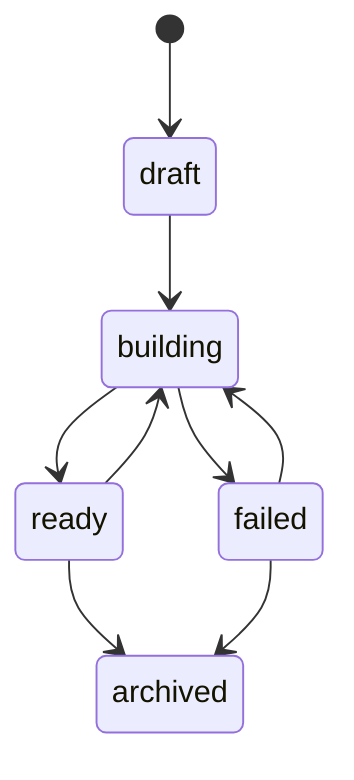
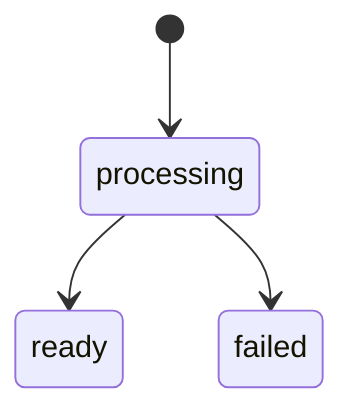
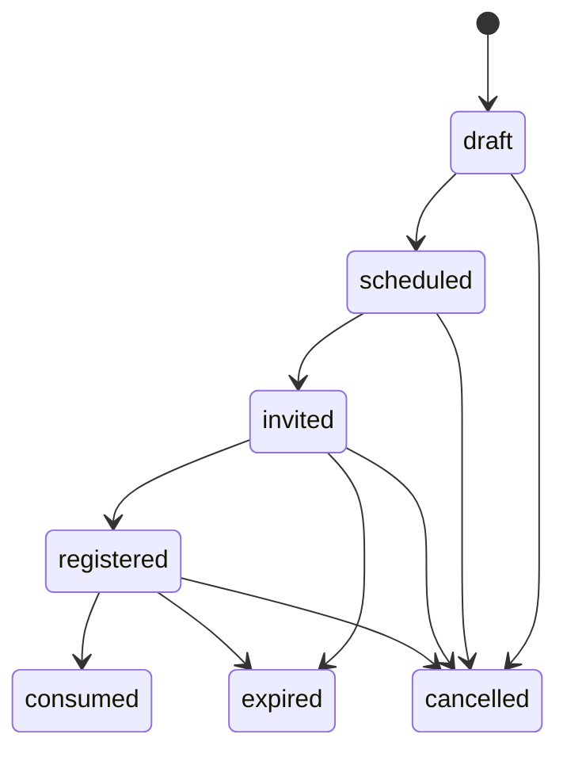
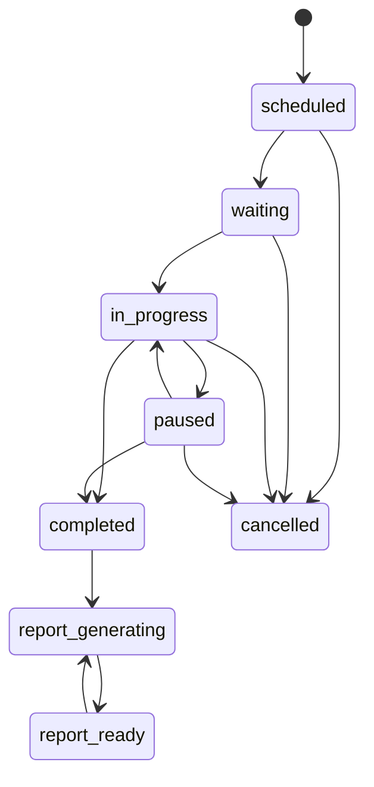
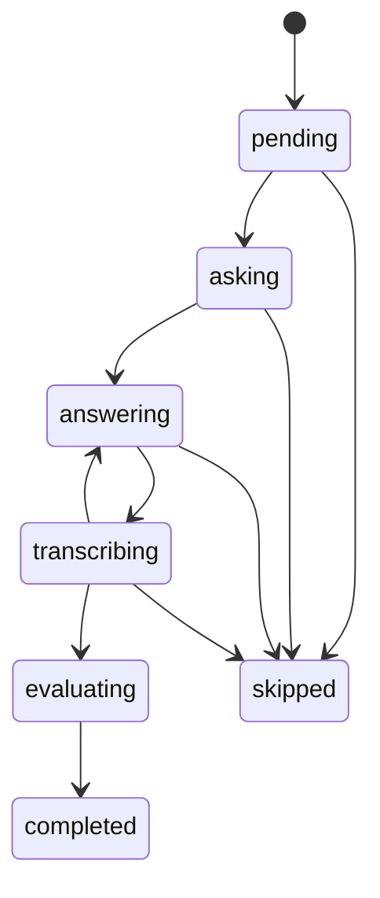

# 领域模型

本文定义岗位题库、简历审阅、预约、实时面试和企业复核的核心实体、状态与存储边界。字段名用于指导数据库 schema、Pydantic schema 和 API 实现。

当前实现已为本页主要聚合建立 versioned document repository，并把 `QuestionSelection`、候选人/计划/题目快照、轮次、回答、转写 revision、评分 revision 和报告 revision 保存在 `InterviewSession` 聚合中。Memory/SQLite 用于本地，PostgreSQL adapter 与迁移已提供 JSONB 持久化、乐观并发、Outbox 幂等、预约单会话/选择槽位约束和强制租户 RLS；真实 PostgreSQL 实例上的迁移、RLS 与查询计划仍属于部署环境验收。联系方式与 Provider 凭证在 repository 边界加密，PDF 原件和解析文本都由 `FileObject + PrivateFileStorage` 托管。

## 核心实体

### Organization

组织或租户，是所有招聘数据的隔离边界。

| 字段 | 说明 |
| --- | --- |
| `id` | 组织 ID |
| `name` | 组织名称 |
| `settings` | 数据留存、匹配、录音、供应商和默认评分策略 |

### User

后台用户，如面试官、管理员、复核人。

| 字段 | 说明 |
| --- | --- |
| `id` | 用户 ID |
| `organization_id` | 所属组织 |
| `role` | `admin`、`interviewer`、`reviewer` |
| `email` | 登录邮箱 |

### JobPosition

企业可复用的岗位。岗位是题库、岗位要求、简历审阅和面试计划的共同上层边界；`RoleRequirement` 不能替代岗位本身。

| 字段 | 说明 |
| --- | --- |
| `id` | 岗位 ID |
| `organization_id` | 所属组织 |
| `code` | 组织内唯一岗位编码 |
| `name` | 岗位名称 |
| `department` | 部门，可为空 |
| `description` | 岗位长期说明 |
| `default_duration_minutes` | 默认面试时长 |
| `status` | `active`、`archived` |
| `created_by` | 创建人 |

### KnowledgeBase

岗位知识库式题库。MVP 中每个题库必须且只能属于一个 `JobPosition`；一个岗位可以按轮次、语言或方向拥有多个题库。跨岗位复用要显式复制或发布新版本，不能在检索时隐式混用。

| 字段 | 说明 |
| --- | --- |
| `id` | 题库 ID |
| `organization_id` | 所属组织 |
| `job_position_id` | 所属岗位 |
| `name` | 题库名称 |
| `description` | 说明 |
| `language` | 默认读题语言 |
| `voice_profile_id` | 默认语音配置 |
| `status` | `draft`、`building`、`ready`、`failed`、`archived` |
| `build_summary` | 导入、结构化字段校验和题目语音构建计数及失败原因 |

`ready` 表示每道活动题都有完整题干、标准答案、关键点、rubric、技能、难度和题型，并且已有与题库语言/音色匹配的可用读题语音。只有 `ready` 题库可进入正式计划；不要求 embedding 或向量索引。

### Question

岗位题库中的面试题目。

| 字段 | 说明 |
| --- | --- |
| `id` | 题目 ID |
| `knowledge_base_id` | 所属题库 |
| `title` | 后台展示标题 |
| `question_text` | 数字人实际读出的题干 |
| `standard_answer` | 标准答案 |
| `key_points` | 关键点列表，带权重和别名 |
| `rubric` | 评分规则 |
| `skills` | 技能标签 |
| `difficulty` | `junior`、`mid`、`senior`、`expert` |
| `type` | `open_ended`、`coding_discussion`、`scenario`、`behavioral` |
| `status` | `draft`、`active`、`archived` |
| `validation_status` | `pending`、`valid`、`failed`；决定能否进入结构化候选池 |
| `speech_status` | `pending`、`ready`、`failed` |
| `created_by` | 创建人 |
| `updated_at` | 更新时间 |

### QuestionSpeechAsset

题目或经历问题的可版本化读题语音。上传题库或批准经历问题后由异步工作项生成，数字人优先读取该资产。

| 字段 | 说明 |
| --- | --- |
| `id` | 语音资产 ID |
| `owner_type` | `question` 或 `experience_question` |
| `owner_id` | 题目或经历问题 ID |
| `source_version` | 生成时的题目版本 |
| `language` | 语言 |
| `voice_profile_id` | 音色配置 |
| `audio_uri` | 对象存储地址 |
| `duration_ms` | 音频时长 |
| `provider_info` | provider、model、request ID |
| `status` | `pending`、`ready`、`failed` |
| `content_hash` | 题干、语言和音色的内容哈希，用于幂等 |

题干、语言或音色改变后必须生成新资产；历史面试引用的资产不可原地覆盖。

### CandidateProfile

企业上传到组织简历库的候选人记录，可参与多次岗位评估。它不是面试会话内的冻结快照。

| 字段 | 说明 |
| --- | --- |
| `id` | 候选人记录 ID |
| `organization_id` | 所属组织 |
| `name` | 姓名 |
| `normalized_email` | 规范化邮箱，可为空、加密存储 |
| `normalized_phone` | E.164 或组织统一格式手机号，可为空、加密存储 |
| `external_ref` | ATS 或企业内部 ID，可为空 |
| `status` | `active`、`archived` |
| `retention_expires_at` | 留存到期时间 |
| `created_by` | 上传人 |

邮箱和手机号至少有一个；照片、性别、年龄、婚育等与能力无关字段不进入 AI 评估输入。

### ResumeDocument

候选人简历 PDF 的不可变版本。`local_upload` 与 `url_import` 只是摄取来源，成功后都引用系统托管的私有文件对象；外部 URL 和解析文本都不能替代原始 PDF 作为版本真相。

| 字段 | 说明 |
| --- | --- |
| `id` | 简历版本 ID |
| `candidate_profile_id` | 所属候选人记录 |
| `source_type` | `local_upload`、`url_import` |
| `original_file_name` | 清洗后的原始文件名，仅用于展示 |
| `source_url_hash` | URL 导入来源的不可逆哈希，可为空；默认不保存完整 URL |
| `file_object_id` | 系统私有文件对象 ID；业务层不保存调用方提交的 URI |
| `file_hash` | 文件内容哈希 |
| `mime_type` | 当前只允许 `application/pdf` |
| `size_bytes` | 原始 PDF 字节数 |
| `ingestion_status` | `queued`、`receiving`、`quarantined`、`scanning`、`stored`、`parsing`、`ready`、`failed` |
| `scan_status` | `pending`、`clean`、`infected`、`failed` |
| `parse_status` | `pending`、`parsed`、`failed` |
| `parsed_text_object_id` | 脱敏解析文本的私有文件对象 ID，可为空 |
| `failure_code` | 摄取、扫描或解析失败原因枚举，可为空 |
| `uploaded_by` | 上传人 |

不变量：

- `ready` 必须同时满足 PDF 类型/文件签名有效、扫描为 `clean`、原始文件已进入私有存储且解析成功。
- `url_import` 的初始 URL 和每次重定向都必须通过 SSRF 校验；源站内容变化只能创建新 `ResumeDocument`，不能覆盖旧版本。
- Resume Review 只能引用 `ready` 的 `ResumeDocument`，并从 `file_object_id`/`parsed_text_object_id` 读取；不能回源下载外部 URL。
- 切换本地文件系统和阿里云 OSS 只改变私有文件 adapter，不改变 `ResumeDocument` ID、状态或业务 interface。

### FileObject

系统私有文件对象的元数据；数据库不保存文件 BLOB，业务资源不直接保存公开 URL 或本地绝对路径。

| 字段 | 说明 |
| --- | --- |
| `id` | 文件对象 ID |
| `organization_id` | 所属组织 |
| `purpose` | `resume_pdf`、`resume_parsed_text`、`question_speech` 等用途 |
| `status` | `awaiting_download`、`quarantined`、`ready`、`failed` |
| `storage_backend` | `local_private` 或 `aliyun_oss` |
| `object_key` | adapter 内部对象键，不作为公开 URL |
| `content_type` | 受校验的 MIME |
| `checksum` | `sha256:` 内容哈希 |
| `byte_count` | 文件大小 |
| `scan_status` | `pending`、`clean`、`derived_clean_source`、`failed` |
| `source_type` | 上传、URL 导入或从可信 PDF 派生 |
| `source_reference` | 脱敏来源路径/资源 ID，不含 query、fragment 或凭据 |

PDF 原件扫描为 clean 后存为一个 FileObject；解析文本使用另一个 `resume_parsed_text` FileObject，`ResumeDocument` 只保存两者 ID。API projection 不返回解析正文、对象键或本地路径。

### ResumeReview

指定简历版本面向指定岗位的一次 AI 异步审阅结果。审阅提取可追溯的项目、职责和技能证据，并生成过往经历问题，不直接给出录用决定。

| 字段 | 说明 |
| --- | --- |
| `id` | 审阅 ID |
| `organization_id` | 所属组织 |
| `candidate_profile_id` | 候选人记录 |
| `resume_document_id` | 使用的简历版本 |
| `job_position_id` | 目标岗位 |
| `role_requirement_id` | 使用的岗位要求版本 |
| `status` | `queued`、`processing`、`ready`、`failed` |
| `project_evidence` | 项目名、职责、技术、结果和简历证据位置 |
| `skill_evidence` | 与岗位能力维度的对应证据 |
| `warnings` | 内容缺失、解析置信度低等提示 |
| `model_info` | 模型、prompt 版本和 invocation ID |
| `created_at` | 创建时间 |

同一 `(resume_document_id, job_position_id, role_requirement_version, prompt_version)` 可幂等复用。输入变更产生新审阅，旧结果不覆盖。

### ExperienceQuestion

由 `ResumeReview` 生成、面试官可编辑和批准的过往经历问题。

| 字段 | 说明 |
| --- | --- |
| `id` | 经历问题 ID |
| `resume_review_id` | 来源审阅 |
| `question_text` | 问题文本 |
| `project_ref` | 对应项目或经历证据引用 |
| `evaluation_focus` | 要核验的职责、技术选择、结果或复盘能力 |
| `rubric` | 经历问题评分规则 |
| `weight` | 计划中的建议权重 |
| `status` | `draft`、`approved`、`rejected` |
| `speech_status` | `pending`、`ready`、`failed` |
| `edited_by` | 最近编辑人 |

AI 生成内容默认为 `draft`，未经面试官批准不得进入正式计划。

### RoleRequirement

某个岗位的一版招聘与评估要求，用于计划装配和评分；同一岗位可以随招聘批次维护多个版本。

| 字段 | 说明 |
| --- | --- |
| `id` | 岗位要求 ID |
| `organization_id` | 所属组织 |
| `job_position_id` | 对应岗位 |
| `description` | 原始岗位要求 |
| `must_have_skills` | 必备技能 |
| `nice_to_have_skills` | 加分技能 |
| `seniority` | 目标级别 |
| `parsed_profile` | 技能权重、场景和难度 |
| `version` | 乐观并发版本 |

### InterviewPlan

面向一个岗位和一个候选人的面试计划。计划由岗位题库抽题槽位与简历经历问题共同组成，经面试官批准后才能预约。

| 字段 | 说明 |
| --- | --- |
| `id` | 计划 ID |
| `organization_id` | 所属组织 |
| `job_position_id` | 目标岗位 |
| `knowledge_base_ids` | 仅限该岗位的题库 |
| `role_requirement_id` | 使用的岗位要求 |
| `candidate_profile_id` | 目标候选人 |
| `resume_review_id` | 使用的 `ready` 简历审阅 |
| `status` | `draft`、`approved`、`archived` |
| `estimated_minutes` | 预计时长 |
| `bank_slots` | 岗位题库抽题槽位和约束 |
| `question_candidate_pools` | 每个槽位按结构化字段冻结的 Question ID/version 集合及哈希 |
| `experience_question_ids` | 已批准的经历问题，按执行顺序排列 |
| `selection_policy` | 覆盖、去重、难度、随机种子和补位策略 |
| `assembly_summary` | 候选池规模、覆盖、告警和选择解释 |
| `created_by` | 创建人 |

`bank_slots + question_candidate_pools + experience_question_ids + selection_policy` 是计划唯一的 execution v2 representation。请求、响应和运行时持久化不得包含固定 `items`；升级旧数据只能在应用启动前运行显式一次性迁移，把固定题目转换为单候选槽位并写入 `execution_schema_version=2`。会话只能由预约 start 通过 Plan Assembly interface 读取该表示。

`bank_slots` 示例：

```json
[
  {
    "id": "slot_01J...",
    "order": 1,
    "phase": "position_bank",
    "dimension": "python",
    "difficulty": ["mid", "senior"],
    "weight": 0.12,
    "expected_minutes": 5
  }
]
```

计划批准时形成每个槽位的 `QuestionCandidatePool`，冻结题库版本、筛选条件、可选题目 ID/version 清单及哈希，而不是提前固定所有岗位题目。面试时 `QuestionSelection` 在该候选池内按会话随机种子选题；经历问题固定排在岗位题库阶段之后。候选池、简历审阅、题目语音或经历问题未就绪时不能批准。

### InterviewAppointment

面试预约与邀请聚合，绑定“谁、哪个岗位、哪些题库、哪份计划、何时面试”。

| 字段 | 说明 |
| --- | --- |
| `id` | 预约 ID |
| `organization_id` | 所属组织 |
| `job_position_id` | 岗位 |
| `knowledge_base_ids` | 题库 |
| `candidate_profile_id` | 预期候选人 |
| `plan_id` | 已批准计划 |
| `scheduled_start_at` | 预约开始时间 |
| `scheduled_end_at` | 预约结束或最晚开始时间 |
| `timezone` | 展示时区 |
| `status` | `draft`、`scheduled`、`invited`、`registered`、`consumed`、`cancelled`、`expired` |
| `invitation_token_hash` | 一次性邀请 token 哈希 |
| `invitation_expires_at` | 邀请过期时间 |
| `settings` | 录音、数字人、语言和音色策略 |
| `admission_policy` | 冻结的提前/延后宽限、设备检查有效期和服务端 readiness 要求 |
| `readiness_facts` | 最近一次浏览器、麦克风和音频格式检查结果、服务端检查时间及失效时间 |
| `created_by` | 创建人 |

只有计划、题库、经历问题语音和生产 STT 路由通过 readiness gate 后才能从 `scheduled` 进入 `invited`。token 只能被一次候选人登记消费，可撤销、不可明文持久化。邀请过期和预约 start 窗口是两个独立条件；默认允许开始的窗口为 `[scheduled_start_at, scheduled_end_at]`，任何宽限都必须显式冻结在 `admission_policy` 中。

### CandidateIntake

候选人通过预约链接提交的一次性填报和授权记录，用来核验邀请持有人并生成会话快照。目标流程要求姓名、邮箱和手机号三项都填写；匹配时至少一个联系方式必须与预约绑定记录精确一致。

| 字段 | 说明 |
| --- | --- |
| `id` | 填报 ID |
| `appointment_id` | 对应预约，会话内唯一 |
| `name` | 候选人填写姓名 |
| `normalized_email` | 规范化邮箱 |
| `normalized_phone` | 规范化手机号 |
| `matched_candidate_profile_id` | 匹配后的候选人记录 |
| `match_method` | `email`、`phone`、`email_and_phone` |
| `consent_version` | 隐私与录音告知版本 |
| `privacy_accepted` | 候选人是否明确接受隐私告知 |
| `recording_accepted` | 候选人是否明确接受本次录音 |
| `notice_hash` | 服务端允许版本对应的告知内容哈希 |
| `consent_evidence_status` | `verified` 或迁移数据使用的 `legacy_unverified` |
| `consented_at` | 服务端记录的同意时间 |
| `submitted_at` | 提交时间 |

匹配只针对预约已绑定的 `CandidateProfile`。至少一个邮箱或手机号必须精确匹配，姓名用于联合校验；禁止仅凭姓名模糊匹配，也不能通过错误差异暴露其他候选人是否存在。预约创建时从服务端允许目录冻结实际告知正文、版本与内容 hash；候选人只能接受公开邀请返回的同一版本。服务端要求 `privacy_accepted=true`；预约设置 `record_audio=true` 时还必须满足 `recording_accepted=true`。客户端时间不是同意证据，重复 intake 也不能把已有授权覆盖为更弱授权；`legacy_unverified` 数据在生产 start 前必须重新同意。

### InterviewPlanSnapshot

从已批准计划冻结到面试会话的不可变执行与汇总依据，包含岗位、岗位要求、题库版本与候选池哈希、抽题槽位、经历问题、权重和阶段顺序。

| 字段 | 说明 |
| --- | --- |
| `id` | 计划快照 ID |
| `source_plan_id` | 来源计划 ID |
| `source_plan_version` | 来源计划版本 |
| `job_position` | 岗位快照 |
| `role_requirement` | 岗位要求快照 |
| `knowledge_base_revisions` | 题库版本及候选池哈希 |
| `bank_slots` | 抽题槽位与规则 |
| `question_candidate_pools` | 每个槽位冻结的 QuestionCandidatePool |
| `experience_questions` | 已批准经历问题快照 |
| `question_snapshots` | 本次选择后用于轮次与评分的题目快照列表；不得命名为 `items` |
| `estimated_minutes` | 预计时长 |
| `selection_policy` | 随机检索和约束策略 |

### InterviewCandidate

从 `CandidateProfile` 和已匹配 `CandidateIntake` 冻结、只属于一次 `InterviewSession` 的最小候选人快照。简历库后续变化不能改写历史面试。

| 字段 | 说明 |
| --- | --- |
| `id` | 会话候选人快照 ID |
| `source_candidate_profile_id` | 来源记录 ID，仅用于追溯 |
| `source_resume_document_id` | 使用的简历版本 ID |
| `name` | 姓名 |
| `masked_email` | 脱敏邮箱 |
| `masked_phone` | 脱敏手机号 |
| `consent_version` | 本次同意版本 |
| `privacy_accepted` | 已验证的隐私同意事实 |
| `recording_accepted` | 已验证的录音同意事实 |
| `consent_notice_hash` | 对应告知内容哈希 |
| `consented_at` | 服务端记录的同意时间 |

### QuestionSelection

岗位题库槽位的一次不可变选择事实。

| 字段 | 说明 |
| --- | --- |
| `id` | 选择 ID |
| `interview_id` | 面试会话 |
| `slot_id` | 计划抽题槽位 |
| `random_seed` | 会话级随机种子或其不可逆哈希 |
| `candidate_set_hash` | 冻结候选集合哈希 |
| `selected_question_id` | 选中题目 |
| `selected_question_version` | 选中版本 |
| `selection_reason` | 满足的覆盖、难度、去重和补位规则 |
| `selected_at` | 选择时间 |

同一 `(interview_id, slot_id)` 只能有一条记录。断线恢复必须复用它，不能再次随机。

### InterviewSession

一次由预约启动的真实面试，是轮次、回答、评分与报告的事务聚合根。

| 字段 | 说明 |
| --- | --- |
| `id` | 面试 ID |
| `appointment_id` | 来源预约，唯一 |
| `plan_snapshot` | 不可变计划快照 |
| `candidate` | 本次会话候选人快照 |
| `status` | 见状态机 |
| `settings` | 录音、数字人和语言配置 |
| `random_seed` | 抽题随机种子，创建后不可变 |
| `current_turn_id` | 当前轮次 |
| `current_report_id` | 当前报告 revision ID |
| `lifecycle_events` | 按序追加的领域事件 |
| `interruption` | 最近中断上下文 |
| `last_activity_at` | 最近活动时间 |
| `started_at` | 开始时间 |
| `completed_at` | 完成时间 |

状态、抽题、轮次推进和报告触发只能由生命周期命令改变。REST、WebSocket、数字人、STT、评分和 worker 只提交命令或效果结果。

候选人持有独立短期 `candidate_session_token`，它不授予后台资源访问权。Candidate Session Projection 使用 allow-list，只暴露姓名、会话状态、轮次 ID/顺序/状态，以及当前或已完成轮次的题干；不得暴露 token 本身、联系方式、计划/候选池、未来题干、`question_snapshot.standard_answer`、rubric、评分 revision 或报告。候选人录音提交还必须证明媒体属于当前 `interview_id + current_turn_id`。

### InterviewLifecycleEvent

生命周期模块对已接受命令形成的不可变领域事实，与会话变更和 Outbox 工作项原子提交。WebSocket 事件只是传输投影。

| 字段 | 说明 |
| --- | --- |
| `id` | 事件 ID |
| `interview_id` | 面试会话 |
| `sequence` | 会话内连续单调递增序号 |
| `type` | `question.selected`、`answer.transcribing`、`evaluation.completed` 等 |
| `payload` | 最小可审计数据 |
| `occurred_at` | 发生时间 |

### InterviewQuestionSnapshot

题目被选入会话时冻结的评分和朗读依据。`source_type` 为 `knowledge_base` 或 `resume_experience`；评分、重评和报告不得读取后来修改的源题目。

| 字段 | 说明 |
| --- | --- |
| `id` | 快照 ID |
| `source_type` | 来源类型 |
| `source_question_id` | 来源 ID |
| `source_question_version` | 来源版本 |
| `question_text` | 冻结题干 |
| `speech_asset_id` | 冻结语音资产 ID |
| `standard_answer` | 岗位题标准答案，可为空 |
| `project_evidence` | 经历问题的简历证据，可为空 |
| `key_points` | 冻结关键点 |
| `rubric` | 冻结评分规则 |
| `skills` | 冻结技能标签 |
| `difficulty` | 冻结难度 |

### InterviewTurn

一次问答轮次。

| 字段 | 说明 |
| --- | --- |
| `id` | 轮次 ID |
| `interview_id` | 面试 ID |
| `phase` | `position_bank` 或 `resume_experience` |
| `plan_slot_or_item_id` | 抽题槽位或经历问题项 ID |
| `question_snapshot` | 本轮题目快照 |
| `order` | 实际顺序 |
| `status` | `pending`、`asking`、`answering`、`transcribing`、`evaluating`、`completed`、`skipped` |
| `started_at` | 开始时间 |
| `completed_at` | 完成时间 |

### CandidateAnswer

候选人一轮回答及其权威转写。

| 字段 | 说明 |
| --- | --- |
| `id` | 回答 ID |
| `turn_id` | 轮次 ID |
| `audio_uri` | 原始回答音频地址 |
| `transcript_status` | `streaming`、`final`、`repair_pending`、`failed`、`manually_corrected` |
| `raw_transcript` | 服务端 STT 原始 final |
| `final_transcript` | 当前用于评分的最终文本 |
| `transcript_source` | `server_streaming_stt`、`server_batch_repair`、`manual_text_fallback` |
| `transcript_revision` | 转写修订号 |
| `stt_confidence` | 识别置信度 |
| `stt_segments` | 带时间戳的片段 |
| `stt_provider_info` | provider、model、request ID |
| `language` | 语言 |
| `duration_seconds` | 回答时长 |
| `current_evaluation_id` | 当前评分 revision ID |

浏览器 SpeechRecognition 的 partial/final 不得写入生产 `raw_transcript`。人工修正产生新转写 revision 并触发新评分 revision，原文本保留审计。

### AnswerEvaluation

单题追加式评分。岗位题使用标准答案与关键点；经历题使用简历证据、核验重点和候选人解释，但不能因为简历表述本身直接给分。

| 字段 | 说明 |
| --- | --- |
| `id` | 评分 ID |
| `answer_id` | 回答 ID |
| `question_snapshot_id` | 使用的题目快照 |
| `transcript_revision` | 使用的转写版本 |
| `revision` | 同一回答内递增 revision |
| `supersedes_evaluation_id` | 上一当前 revision，可为空 |
| `trigger_reason` | 初评、补转写、人工修正、模型变更等 |
| `score` | 0-100 |
| `confidence` | 评分置信度 |
| `dimension_scores` | 维度得分 |
| `covered_key_points` | 命中点 |
| `missing_key_points` | 缺失点 |
| `evidence` | 回答中的证据片段与时间戳 |
| `feedback` | 客观评价 |
| `review_flags` | 低 STT 置信度、无回答、证据冲突等 |
| `model_info` | 模型和 prompt 版本 |
| `created_at` | 生成时间 |

### InterviewReport

面试报告的追加式 revision。

| 字段 | 说明 |
| --- | --- |
| `id` | 报告 ID |
| `interview_id` | 面试 ID |
| `revision` | 会话内递增 revision |
| `evaluation_ids` | 使用的单题评分 revision |
| `overall_score` | 0-100 |
| `job_fit_level` | `strong_match`、`match`、`partial_match`、`insufficient_evidence`、`manual_review` |
| `job_fit_evidence` | 与岗位要求对应的支持和不足证据 |
| `dimension_scores` | 岗位维度分 |
| `resume_experience_summary` | 经历问题表现摘要 |
| `strengths` | 优势 |
| `risks` | 风险和待复核点 |
| `review_status` | `unreviewed`、`in_review`、`reviewed` |
| `generated_at` | 生成时间 |

`job_fit_level` 是证据化辅助判断，不等于录用/淘汰决定。企业复核人可查看题目、音频、转写和评分，修正转写后产生新的评分与报告 revision；旧 revision 禁止覆盖。

生成报告时先从每个 `CandidateAnswer.current_evaluation_id` 物化唯一的 current evaluation 集合。`overall_score`、维度、证据、风险、`manual_review` 和 `evaluation_ids` 必须全部从该集合计算；历史评分 revision 只属于引用它的历史报告，不能影响新报告。

### ProviderConnection、ModelConfiguration、ModelRoute 与 ModelInvocationLog

`ProviderPluginDefinition` 是安装期声明，不是租户聚合：它定义厂商连接表单、凭证表单、模型类型、模型目录、模型配置表单和 runtime entrypoint。`ProviderConnection` 保存组织级连接参数与 `credential_ref`，不选择具体模型；未发送 credentials 表示保留现有密钥。`ModelConfiguration` 属于一个 ProviderConnection，保存 `model_type`、`provider_model_id`、厂商专属 `settings`、统一 `default_parameters`、支持能力及健康状态。两者更新都携带 `expected_version`。

`ModelRoute` 按 `organization_id + capability + purpose` 选择 primary、fallback、超时、重试和断路器策略；route target 仅包含 `model_configuration_id/timeout_s/pricing`，不再复制 provider 或模型名。创建路由时模型必须已启用、健康且支持目标 capability。`ModelInvocationLog` 对每个 attempt 追加连接 ID、模型配置 ID、provider、模型、延迟、成本、统一错误码和脱敏请求哈希。

正式面试流程至少需要以下 purpose：

- `question_speech_generation`
- `resume_review`
- `resume_experience_question_generation`
- `candidate_answer_transcription`
- `candidate_answer_repair`
- `answer_evaluation`
- `interview_report`

`question_similarity_analysis` 可以作为未来题库去重或自然语言查题的可选 purpose，但不参与题库 ready、随机抽题或答案评分。

日志不得保存明文简历、候选人联系方式、完整答案、音频或凭证。

## 聚合版本与并发

所有可变聚合根使用整数 `version` 做乐观并发，包括 `JobPosition`、`KnowledgeBase`、`Question`、`CandidateProfile`、`ResumeDocument`、`ResumeReview`、`ExperienceQuestion`、`RoleRequirement`、`InterviewPlan`、`InterviewAppointment`、`InterviewSession`、`ProviderConnection`、`ModelConfiguration` 和 `ModelRoute`。

- 新聚合从 `version=1` 开始；写入必须匹配组织、ID 和旧 version。
- 陈旧写入返回明确冲突，调用方重新读取并重新执行领域判断，不能静默覆盖。
- `CandidateIntake` 通过 `(appointment_id)` 唯一约束和幂等键保护。
- `QuestionSelection` 通过 `(interview_id, slot_id)` 唯一约束防止断线后重复抽题。
- `InterviewCandidate`、计划/题目快照、轮次、回答、评分和生命周期事件由 `InterviewSession.version` 保护。
- 语音资产、模型调用、审计、Outbox、评分和报告 revision 采用追加式或内容哈希幂等写入。

## 状态机

### KnowledgeBase.status



### ResumeDocument.ingestion_status



`ResumeDocument.status` 对调用方暴露 `processing/ready/failed`；细粒度阶段由 `FileObject.status/scan_status`、`DurableWorkItem.status` 和失败码共同表达。`local_upload` 先写隔离文件，`url_import` 由 worker 安全下载后进入同一处理器。失败重试复用同一工作项/简历版本；感染文件不得进入正式 FileObject，达到最大尝试后进入 dead-letter，只有审计后的人工重放才能继续。

### InterviewAppointment.status



- `scheduled -> invited` 必须通过计划、题库、经历问题语音和 STT readiness gate。
- `invited -> registered` 必须成功匹配候选人填报并保存可验证的隐私/录音同意记录。
- `registered -> consumed` 必须位于预约允许的 start 窗口，且设备和服务端 readiness fact 均未过期；准入判断、状态消费、创建/启动唯一 `InterviewSession` 在同一事务提交，重复 start 返回同一会话。

### InterviewSession.status



- 候选人登记与设备就绪只形成准入事实；公开 start 必须校验预约时间窗和生产 STT 路由，并在同一事务创建已进入 `in_progress` 的会话。
- 岗位题库槽位按顺序选择并冻结问题；全部完成后才能进入 `resume_experience` 阶段。
- 回答停止后进入 `transcribing`。只有服务端 streaming/batch STT 的 authoritative final 才能进入 `evaluating`；客户端文本或浏览器 final 不是领域命令。
- 评分完成后推进下一题；最后一题完成后形成 `completed` 并异步生成报告。
- 暂停/断线保留当前轮次、选择事实和音频；恢复不得重新随机或重复评分。

### InterviewTurn.status



`transcribing -> answering` 只用于可恢复的录音/STT 失败重答；已有 final transcript 后不能回退。

## 结构化题目候选池

正式计划和面试使用关系数据形成候选池，不建立必需的向量文档。每个候选项至少包含：

```json
{
  "organization_id": "org_01J...",
  "job_position_id": "pos_backend",
  "knowledge_base_id": "kb_backend_cn",
  "knowledge_base_version": 3,
  "question_id": "q_01J...",
  "question_version": 4,
  "skills": ["python", "concurrency"],
  "difficulty": "senior",
  "type": "scenario",
  "status": "active",
  "validation_status": "valid",
  "speech_status": "ready"
}
```

计划批准时冻结满足岗位、题库、状态、技能、难度、题型和语音条件的题目 ID/version 清单及集合哈希。Question Selection 只能从该清单随机选择。

未来如果题库规模或后台自然语言查题确实需要，可以为 Question 增加可重建的可选语义索引；它不是领域真相，删除后不影响计划、预约、随机抽题、评分或历史报告。Resume Review 默认直接把已解析简历和岗位要求交给 LLM；只有超长简历/附件集合需要 RAG 时才建立候选人私有的短期索引。

## 审计事件

以下行为必须记录主体、组织、资源、时间和结果：

- 创建或归档岗位，上传、编辑、发布题库，重建候选池或题目语音。
- 上传本地简历、提交 URL 导入、URL 拉取失败、扫描/解析、查看、下载或删除简历，触发 AI 审阅，编辑或批准经历问题。
- 生成、修改、批准计划，创建、邀请、撤销、过期或消费预约。
- 候选人填报、匹配成功/失败、同意隐私和录音告知。
- 面试开始、随机选题、读题、STT final、暂停、恢复、结束和失败修复。
- 查看或下载回答音频，人工修改转写，触发重评或重新汇总报告。
- 新增、修改、测试或停用模型供应商配置和路由。

审计载荷只保存资源 ID、结果和必要摘要，不保存明文 token、联系方式、简历、完整音频或供应商凭证。

## 数据留存与删除

- CandidateProfile 可设置 `retention_expires_at`。管理员留存任务默认只 dry-run，并记录候选 ID、数量和 cutoff；只有显式 `dry_run=false` 才执行物理/逻辑清理。
- 清理会删除 PDF/解析文本私有对象和受控本地录音，清空联系人密文/查找哈希、简历审阅证据、经历题、转写、评分和报告敏感内容，并把聚合标为 `retention_purged`；仅保留最小资源 ID、时间和审计事实。
- 物理文件删除在聚合状态提交前执行；删除失败时不把数据库伪标为已清理。已清理的签名 token 无法再解析到 ready FileObject。
- 留存清理是管理员显式、不可逆动作；审计事件不得包含被删除正文或联系方式。
