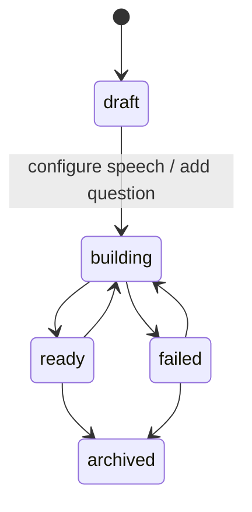
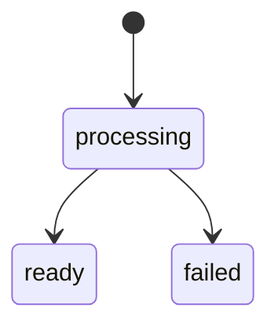
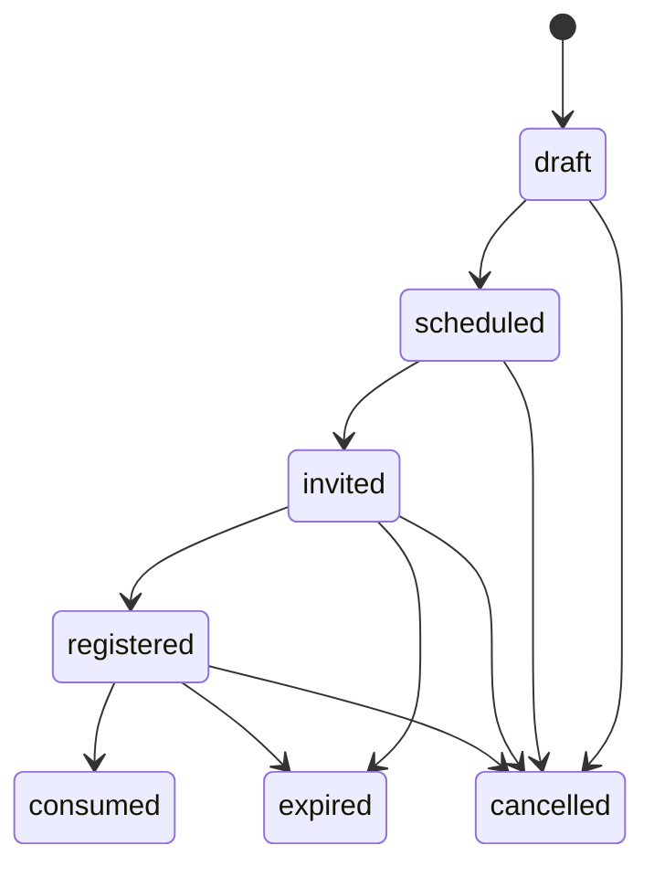
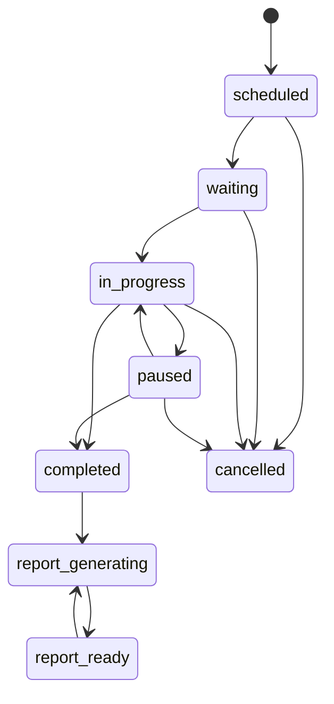
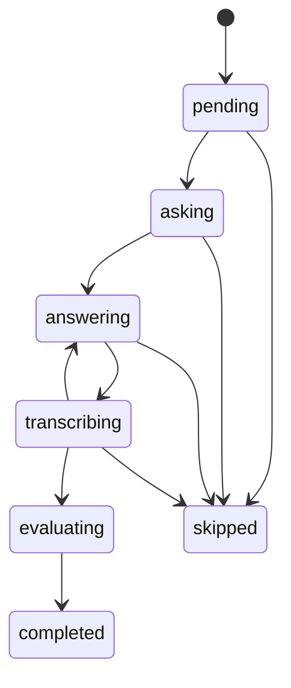

# 领域模型

本文定义岗位题库、简历审阅、预约、实时面试和企业复核的核心实体、状态与存储边界。字段名用于指导数据库 schema、Pydantic schema 和 API 实现。

当前实现已为本页主要聚合建立 versioned document repository，并把 `QuestionSelection`、候选人/计划/题目快照、轮次、回答、转写 revision、评分 revision 和报告 revision 保存在 `InterviewSession` 聚合中。Memory/SQLite 用于本地，PostgreSQL adapter 与迁移已提供 JSONB 持久化、乐观并发、Outbox 幂等、预约单会话/选择槽位约束和强制租户 RLS；真实 PostgreSQL 实例上的迁移、RLS 与查询计划仍属于部署环境验收。联系方式与 Provider 凭证在 repository 边界加密，PDF 原件和解析文本都由 `FileObject + PrivateFileStorage` 托管。

## 核心实体

### Organization

组织或租户，是所有招聘数据的隔离边界。

| 字段 | 说明 |
| --- | --- |
| `id` | 组织 ID |
| `name` | 组织名称 |
| `settings` | 数据留存、匹配、录音、供应商和默认评分策略 |

### User

后台用户，如面试官、管理员、复核人。

| 字段 | 说明 |
| --- | --- |
| `id` | 用户 ID |
| `organization_id` | 所属组织 |
| `role` | `admin`、`interviewer`、`reviewer` |
| `email` | 登录邮箱 |

### JobPosition

企业可复用的岗位。岗位是题库、岗位要求、简历审阅和面试计划的共同上层边界；`RoleRequirement` 不能替代岗位本身。

| 字段 | 说明 |
| --- | --- |
| `id` | 岗位 ID |
| `organization_id` | 所属组织 |
| `code` | 组织内唯一岗位编码 |
| `name` | 岗位名称 |
| `department` | 部门，可为空 |
| `description` | 岗位长期说明 |
| `knowledge_base_ids` | 岗位显式选择的组织题库 ID；旧题库的初始 `job_position_id` 作为兼容关联投影补入 |
| `default_duration_minutes` | 默认面试时长 |
| `status` | `active`、删除处理中 `deleting`、已删除 `archived` |
| `created_by` | 创建人 |

删除岗位是一个显式生命周期命令：先计算岗位候选关系、岗位要求、计划和预约影响，要求操作者输入完整岗位名称并携带当前 version；确认后岗位进入 `deleting`，该岗位候选人通过统一留存服务清除敏感数据，相关要求/计划归档、预约取消，最后岗位归档。历史面试和审计只保留不可识别占位；组织共享题库、题目和题库语音不属于级联删除范围。

新工作台创建 JobPosition 时必须同时提交 `initial_requirement`。服务端在同一租户事务中先写岗位、再写绑定该岗位 ID 的首版 RoleRequirement，并把后者作为 `initial_role_requirement` 返回；任一步失败时整个事务回滚。兼容 API 可以只创建岗位，但不能成为新工作台路径。

### KnowledgeBase

组织统一维护的知识库式题库。创建时记录一个初始管理岗位，但题库可通过显式岗位关联被多个 `JobPosition` 复用；检索和计划只能使用已关联题库，不能隐式混用全组织题库。

| 字段 | 说明 |
| --- | --- |
| `id` | 题库 ID |
| `organization_id` | 所属组织 |
| `job_position_id` | 创建时的初始管理岗位与旧数据兼容关联；不再表示唯一可用岗位 |
| `name` | 题库名称 |
| `description` | 说明 |
| `speech_profile` | 当前 KnowledgeBaseSpeechProfile；包含模型、声音、语言和输出参数 |
| `speech_build_status` | `configuration_required`、`queued`、`building`、`ready`、`failed` |
| `status` | `draft`、`building`、`ready`、`failed`、`archived` |
| `build_summary` | 导入、结构化字段校验和题目语音构建计数及失败原因 |

`ready` 表示每道活动题都有完整题干、标准答案、关键点、rubric、技能、难度和题型，并且已有与当前 KnowledgeBaseSpeechProfile revision 匹配的可用读题语音。只有 `ready` 题库可进入正式计划；不要求 embedding 或向量索引。

JobPosition 与 KnowledgeBase 的关联只保存引用。关联命令不得复制或修改题目、speech profile、声音或语音资产；因此多个岗位选择同一题库时看到同一套题目与读题音色。题库内容或语音 revision 更新后，新计划读取新 readiness，已批准计划和历史会话继续使用冻结快照。

新建题库若存在 enabled 的 `tts.synthesize + question_speech_generation` 组织路由，会把 ready primary 模型及其
`default_voice` 解析并冻结为 revision 1 profile；route 只是创建时默认值，之后变更不会静默覆盖题库。若没有可解析且
已确认的组织默认 TTS 模型，`speech_build_status=configuration_required`；系统不能仅凭一个声音字符串猜测具体模型。
管理员进入题库详情完成配置后才开始首轮语音构建。

### KnowledgeBaseSpeechProfile

题库当前生效的可版本化读题语音选择。它解析并冻结具体 TTS ModelConfiguration，而不是只保存组织默认 ModelRoute 别名；因此同一组织的不同题库可以使用不同模型和声音，重建结果也可复现。

| 字段 | 说明 |
| --- | --- |
| `revision` | 题库内单调递增配置版本 |
| `model_configuration_id` | 支持 `tts.synthesize` 的具体模型配置 |
| `model_configuration_version` | 配置时验证过的模型版本 |
| `voice_profile_id` | 该模型 voice catalog 中的稳定声音 ID |
| `language` | BCP 47 读题语言 |
| `audio_format` | 统一 MIME，例如 `audio/wav` |
| `speaking_rate` | 统一语速参数 |
| `source/model_route_id` | `model_route_default` 或 `knowledge_base_explicit`；默认路由来源同时记录创建时 route ID |
| `configured_by` | 操作者 |
| `configured_at` | 服务端时间 |

模型、声音、语言、格式、语速或其它影响音频输出的字段变化，必须产生新 revision 并创建 KnowledgeBaseSpeechBuild；相同值的幂等重试不增加 revision。删除仍被题库 speech profile 引用的 ModelConfiguration 时返回 `MODEL_CONFIGURATION_IN_USE`，管理员需先为受影响题库切换模型，避免题库留下悬空配置。

Question 读取投影的 `speech_preview` 是试听可用性解释，不是新的资产真相。只有当前资产已经复制为 ready 私有
FileObject 才可试听；开发 mock 即使流程状态完成，也必须投影为 `available=false/development_mock_asset`，不能把
模拟 URI 当作真实音频。未配置、生成中、生成失败和私有文件缺失分别返回稳定 reason 与面向用户的操作提示。

### KnowledgeBaseSpeechBuild

整库语音重建的只读领域投影，其写入真相是 `knowledge_base.speech.rebuild` DurableWorkItem 及题目级子工作项。

| 字段 | 说明 |
| --- | --- |
| `id` | 父工作项 ID |
| `knowledge_base_id` | 目标题库 |
| `speech_profile_revision` | 本次冻结的语音配置 revision |
| `question_manifest` | 活动 Question ID/version 清单及哈希 |
| `status` | `pending`、`running`、`completed`、`failed`、`superseded` |
| `progress` | `total/pending/running/ready/failed/superseded` 计数 |
| `failed_items` | 题目 ID、统一错误码和可重试标记，不含题干正文 |
| `created_at/updated_at` | 服务端时间 |

父工作项只负责冻结清单、分批 fan-out 和进度聚合；每道题拥有独立幂等子工作项。DurableWorkItem 的 `failed` 是仍可自动领取的重试等待态，构建投影把它计入 `pending`，且不得修改 Question 或推进其 version；只有 `dead_letter` 才把 Question 更新为 `speech_status=failed` 并进入 `failed_items`。人工重试必须重新读取当前终态失败题目的 version，并创建区别于原 dead-letter 子工作的重试身份；旧 `source_version` 只保留为失败事实，不能作为新清单。切换配置后未完成的旧 build 标记为 `superseded`，其结果不能把当前题库或 Question 标为 ready。

语音配置命令的语义 CAS 是 `expected_speech_profile_revision`，通用 KnowledgeBase `expected_version` 仍用于旧客户端与完整聚合保护。若只是旧语音子工作更新了进度/version，新 profile 可原子吸收；若 profile revision 已变则拒绝覆盖。新 revision 提交时，旧 revision 的 pending/failed 工作立即 cancelled，running 工作记录 `cancel_requested`；已到达供应商的请求可能无法物理中断，但其迟到结果在资产落库前再次校验 profile revision/cancel request，只能以 `superseded` 结束。

### Question

岗位题库中的面试题目。

| 字段 | 说明 |
| --- | --- |
| `id` | 题目 ID |
| `knowledge_base_id` | 所属题库 |
| `title` | 后台展示标题 |
| `question_text` | 数字人实际读出的题干 |
| `standard_answer` | 标准答案 |
| `key_points` | 关键点列表，带权重和别名 |
| `rubric` | 评分规则 |
| `skills` | 技能标签 |
| `difficulty` | `junior`、`mid`、`senior`、`expert` |
| `type` | `open_ended`、`coding_discussion`、`scenario`、`behavioral` |
| `status` | `draft`、`active`、`archived` |
| `validation_status` | `pending`、`valid`、`failed`；决定能否进入结构化候选池 |
| `speech_status` | `not_requested`、`deferred`；旧的全局 `pending/ready/failed` 仅作兼容读取，不用于新预约资产归属 |
| `created_by` | 创建人 |
| `updated_at` | 更新时间 |

后台“删除题目”采用归档命令：从活动题库、检索候选池和后续语音构建中移除 Question，
但保留 Question 版本、历史 InterviewQuestionSnapshot 与不可变 QuestionSpeechAsset。命令必须携带
`expected_version`；已排队但尚未执行的该题语音工作在 worker 认领后结束为 `superseded`，不得调用外部 TTS。

### QuestionGenerationBatch

智能生题的持久审核边界。批次冻结 KnowledgeBase/JobPosition 上下文、定位、标签、可选要求、目标数量和具体
LLM ModelConfiguration version；模型输出只能形成 GeneratedQuestionDraft，不能直接进入 Question catalog。

| 字段 | 说明 |
| --- | --- |
| `id/organization_id/knowledge_base_id` | 批次与租户/题库归属 |
| `context_snapshot` | 岗位/题库名称与说明、题库定位和标签的生成时快照 |
| `requirements` | 面试官本批次的可选补充要求 |
| `target_count` | 目标草稿数量，范围 1–30 |
| `model_configuration_id/version` | 本次实际使用的 ready 结构化 LLM |
| `prompt_version` | 实际生成成功时使用的 `app/core/prompt/` 合同版本；排队时可为空 |
| `phase` | `queued/planning/generating/merging/refilling/reviewing/failed` 细粒度执行阶段 |
| `blueprints` | 与目标槽位一一对应的 QuestionBlueprint；包含 `slot_id/topic/scenario/focus/difficulty/dedupe_key` |
| `generation_chunks` | 子工作快照；每项最多两个蓝图，记录 round、slot_ids、work_item_id、状态、候选和错误；截断分片可带 recovery 并由单槽位替代分片接续 |
| `merge_work_item_ids/refill_round` | 幂等合并工作及定向补生成轮次，补生成最多两轮 |
| `execution_revision` | 停止/恢复形成的执行代次；Worker 只允许当前 revision 的结果提交，旧结果必须 supersede |
| `stop_requested_at/by/reason` | 持久化停止事实；停止是领域命令，不以 Celery revoke/result 作为真相 |
| `control_history` | 停止、继续和人工重试的幂等、操作者、原因与时间摘要，不包含 Prompt 或模型原文 |
| `rejections/generation_warning` | 重复/不合格候选的拒绝依据及最终数量不足提示 |
| `prompt_versions/provider_runs` | 规划与生成 Prompt 版本，以及各阶段 Provider/usage 审计摘要 |
| `drafts` | GeneratedQuestionDraft 列表；每项可带 `import_status/import_work_item_id/imported_question_id/import_error` |
| `status` | `queued`、`generating`、`stopping`、`stopped`、`reviewing`、`importing`、`imported`、`failed` |
| `generation_work_item_id/import_work_item_id` | 对应 DurableWorkItem |
| `version` | 草稿编辑、删除和确认导入的 optimistic version |

GeneratedQuestionDraft 使用批次内稳定 `draft_id`，字段与 Question 的可编辑评分依据一致。只有 `reviewing`
批次内尚未开始导入的草稿允许修改/删除。单题导入通过 DurableWorkItem 将该草稿迁移为
`importing -> imported/failed`。草稿带独立 `version`，单题导入只对目标草稿做条件校验并在最新批次版本上提交，
不会因其他草稿的导入事实推进聚合版本而误报冲突。成功草稿保留在批次中用于审计和查看，但不能再次修改、删除或导入；同一
`generation_batch_id + generation_draft_id` 必须复用同一正式 Question。批量确认只冻结并导入剩余草稿，
批量导入工作再次执行同样不得重复创建。
QuestionBlueprint 是批次内的生成约束而非正式题目：其槽位在规划后冻结，子工作必须逐槽位返回且不得改写
`slot_id`。子工作结果只有 merge 单写者可以转换为 GeneratedQuestionDraft，因此并行 Worker 不会把半批结果暴露
给 Question Catalog。多槽位输出截断不是普通 Schema 错误：原 chunk 保存脱敏诊断后进入 `superseded`，替代 chunk
继续使用相同蓝图、round 与 execution revision；活动进度和 merge 忽略原 chunk。单槽位截断不得以相同请求自动循环。

停止命令先递增 `execution_revision`，取消未领取的规划/分片/合并工作，并给已在途工作记录取消请求。在途
Provider 调用无法由通用接口保证立即撤销，但 Worker 在调用前与提交前都校验批次状态和 revision，因而迟到结果
只能结束为 `superseded`。恢复命令只为未完成蓝图创建新 revision 工作；人工失败重试保留完成分片，并把失败工作
作为历史事实留存。React 只能消费批次 `tasks/available_actions` 投影，不能直接 replay 通用 Outbox 工作项。

### QuestionSpeechAsset

题目或经历问题的可版本化读题语音。上传题库或批准经历问题后由异步工作项生成，数字人优先读取该资产。
后台试听通过鉴权接口签发短期访问地址并记录审计，浏览器不接触对象存储凭据；不存在匹配当前题库
speech profile revision 的 ready 资产时，试听不可用。

| 字段 | 说明 |
| --- | --- |
| `id` | 语音资产 ID |
| `owner_type` | `question` 或 `experience_question` |
| `owner_id` | 题目或经历问题 ID |
| `source_version` | 生成时的题目版本 |
| `speech_profile_revision` | 生成时的题库语音配置 revision；经历问题可为空 |
| `model_configuration_id` | 实际选定的 TTS ModelConfiguration |
| `model_configuration_version` | 生成时的模型配置版本 |
| `language` | 语言 |
| `voice_profile_id` | 音色配置 |
| `audio_uri` | 对象存储地址 |
| `duration_ms` | 音频时长 |
| `provider_info` | provider、model、request ID |
| `status` | `pending`、`ready`、`failed` |
| `content_hash` | 题干、语言和音色的内容哈希，用于幂等 |

题干或 KnowledgeBaseSpeechProfile 改变后必须生成新资产；`content_hash` 至少覆盖题干、题目版本、profile revision、模型配置 ID/version、声音、语言、格式和语速。历史面试引用的资产不可原地覆盖。

真实音频字节必须先通过 PrivateAssetImporter 的容器完整性门禁，再以规范化后字节计算 FileObject checksum。标准 WAV 原样保留；只允许修复已识别的 signed-limit RIFF/data 流式占位组合，或在全部 child chunk/padding 完整到 EOF 后纠正恰好漏计 WAVE form type 的 outer size。无法唯一解析、截断、其他长度偏差、block alignment 不完整、关键 chunk 重复/无序或 MIME/魔数冲突的响应不得形成 `ready` 资产。历史 QuestionSpeechAsset 及其 FileObject 继续不可变。

### CandidateProfile

企业上传到组织简历库的候选人记录。后台录入时通过 PositionCandidateMembership 明确一个当前应聘岗位，可参与该岗位的简历审阅、计划、预约和面试；它不是面试会话内的冻结快照。

| 字段 | 说明 |
| --- | --- |
| `id` | 候选人记录 ID |
| `organization_id` | 所属组织 |
| `job_position_id` | 当前应聘岗位；新 Web 录入必填，兼容旧记录时可从审阅、计划、预约或会话引用推导 |
| `name` | 姓名 |
| `normalized_email` | 规范化邮箱，可为空、加密存储 |
| `normalized_phone` | E.164 或组织统一格式手机号，可为空、加密存储 |
| `external_ref` | ATS 或企业内部 ID，可为空 |
| `status` | `active`、`archived`、`retention_purged` |
| `retention_expires_at` | 留存到期时间 |
| `retention_reason` | 到期原因；岗位初筛未通过时为 `screening_unqualified` |
| `created_by` | 上传人 |

邮箱和手机号至少有一个；照片、性别、年龄、婚育等与能力无关字段不进入 AI 评估输入。候选人显式删除采用 `archived` 逻辑归档并从活动列表隐藏。岗位删除或到期留存清理命中时进入 `retention_purged`；联系方式、简历、录音、转写、评分和报告敏感内容被清除，历史引用不做破坏性物理级联。仅当该候选人所有最新岗位初筛的生效结论均为 `unqualified` 时，设置 `screening_unqualified` 和 7 天期限；符合、待人工复核或处理中的候选人不因初筛设置期限。

### ResumeDocument

候选人简历 PDF 的不可变版本。`local_upload` 与 `url_import` 只是摄取来源，成功后都引用系统托管的私有文件对象；外部 URL 和解析文本都不能替代原始 PDF 作为版本真相。

| 字段 | 说明 |
| --- | --- |
| `id` | 简历版本 ID |
| `candidate_profile_id` | 所属候选人记录 |
| `source_type` | `local_upload`、`url_import` |
| `file_name` | 清洗后的展示文件名；可通过乐观并发改名，但不改变 PDF 内容或版本身份 |
| `source_url_hash` | URL 导入来源的不可逆哈希，可为空；默认不保存完整 URL |
| `file_object_id` | 系统私有文件对象 ID；业务层不保存调用方提交的 URI |
| `file_hash` | 文件内容哈希 |
| `mime_type` | 当前只允许 `application/pdf` |
| `size_bytes` | 原始 PDF 字节数 |
| `status` | 对外为 `processing`、`ready`、`failed`；删除过程使用 `deleting`、`deleted` |
| `scan_status` | `pending`、`clean`、`infected`、`failed` |
| `parse_status` | `pending`、`parsed`、`failed` |
| `parsed_text_object_id` | 脱敏解析文本的私有文件对象 ID，可为空 |
| `failure_code` | 摄取、扫描或解析失败原因枚举，可为空 |
| `uploaded_by` | 上传人 |

不变量：

- `ready` 必须同时满足 PDF 类型/文件签名有效、扫描为 `clean`、原始文件已进入私有存储且解析成功。
- `url_import` 的初始 URL 和每次重定向都必须通过 SSRF 校验；源站内容变化只能创建新 `ResumeDocument`，不能覆盖旧版本。
- Resume Review 只能引用 `ready` 的 `ResumeDocument`，并从 `file_object_id`/`parsed_text_object_id` 读取；不能回源下载外部 URL。
- 切换本地文件系统和阿里云 OSS 只改变私有文件 adapter，不改变 `ResumeDocument` ID、状态或业务 interface。
- PDF 字节、内容哈希和解析证据不可原地修改；更新只允许改 `file_name`，替换内容创建新 `resume_version`。
- 删除命令先拒绝运行中的工作和 InterviewPlan/InterviewSession 历史引用，再取消尚未领取的摄取/审阅工作，清理隔离/私有对象和未进入历史的派生数据，最后写 `deleted` 最小占位与审计事实；列表和候选人最新初筛投影必须忽略 `deleting/deleted` 版本。

### FileObject

系统私有文件对象的元数据；数据库不保存文件 BLOB，业务资源不直接保存公开 URL 或本地绝对路径。

| 字段 | 说明 |
| --- | --- |
| `id` | 文件对象 ID |
| `organization_id` | 所属组织 |
| `purpose` | `resume_pdf`、`resume_parsed_text`、`question_speech`、`candidate_answer_audio` 等用途 |
| `status` | `awaiting_download`、`quarantined`、`ready`、`failed` |
| `storage_backend` | `local_private` 或 `aliyun_oss` |
| `object_key` | adapter 内部对象键，不作为公开 URL |
| `content_type` | 受校验的 MIME |
| `checksum` | `sha256:` 内容哈希 |
| `byte_count` | 文件大小 |
| `scan_status` | `pending`、`clean`、`derived_clean_source`、`failed` |
| `source_type` | 上传、URL 导入或从可信 PDF 派生 |
| `source_reference` | 脱敏来源路径/资源 ID，不含 query、fragment 或凭据 |

PDF 原件扫描为 clean 后存为一个 FileObject；解析文本使用另一个 `resume_parsed_text` FileObject，`ResumeDocument` 只保存两者 ID。生产候选人录音使用 `candidate_answer_audio`，额外绑定 `interview_id + turn_id`；`CandidateAnswer.audio_uri` 保存内部 `private-file://{file_id}` 引用，Provider 调用前由服务端读取字节，API projection 不返回对象键或存储凭据。

本地短期 grant 下的 FileObject 读取遵循单一 byte range 传输合同：无 `Range` 的 `GET/HEAD` 为 `200`，合法的 closed/open-ended/suffix 单区间为 `206` 并给出精确 `Accept-Ranges/Content-Range/Content-Length`，不可满足、畸形或多区间请求为无正文 `416` 和 `Content-Range: bytes */{byte_count}`。`HEAD` 与等价 `GET` 的状态和响应头一致但不返回文件字节。该合同只描述授权对象的浏览器交付，不改变 FileObject 内容、checksum、租户归属、访问审计或 grant 校验。

### ResumeReview

指定简历版本面向指定岗位的一次 AI 异步审阅结果。审阅形成可解释岗位初筛，提取可追溯的项目、职责和技能证据，并生成过往经历问题，不直接给出录用决定。

| 字段 | 说明 |
| --- | --- |
| `id` | 审阅 ID |
| `organization_id` | 所属组织 |
| `candidate_profile_id` | 候选人记录 |
| `resume_document_id` | 使用的简历版本 |
| `job_position_id` | 目标岗位 |
| `role_requirement_id` | 使用的岗位要求版本 |
| `status` | `queued`、`processing`、`ready_for_review`、`failed` |
| `processing_stage` | `queued/preparing/extracting_evidence/aggregating_review/completed/failed` |
| `processing_strategy` | `single_pass` 或 `map_reduce` |
| `processing_progress` | 已完成/总分块数；长任务可观察状态 |
| `evidence_chunks` | ResumeEvidenceChunk 的页范围、预算、状态、证据数量和脱敏调用元数据；不保存正文 |
| `project_evidence` | 项目名、职责、技术、结果和简历证据位置 |
| `skill_evidence` | 与岗位能力维度的对应证据 |
| `screening_recommendation` | 服务端按匹配分归一化的 AI 建议：`qualified`、`unqualified`、`manual_review` |
| `screening_score` | 0–100 的辅助匹配分；0–59 为不符合，60–74 为待人工复核，75–100 为符合 |
| `screening_policy_version` | 分数带策略版本；当前为 `candidate_screening_score.v1` |
| `screening_summary` | 对当前岗位的简短解释 |
| `matched_requirements` | 有简历证据支持的岗位要求 |
| `unmet_requirements` | 缺失或信息不足的岗位要求 |
| `human_decision` | 人工复核结论：`qualified`、`unqualified`，为空时使用 AI 建议 |
| `human_review_status/note` | `pending` 或 `reviewed`，以及人工复核说明 |
| `reviewed_by/at` | 复核人和服务端时间 |
| `warnings` | 内容缺失、解析置信度低等提示 |
| `model_info` | 模型、prompt 版本和 invocation ID |
| `created_at` | 创建时间 |

同一 `(resume_document_id, job_position_id, role_requirement_version, prompt_version)` 可幂等复用。输入变更产生新审阅，旧结果不覆盖。模型生成分数和解释，CandidateScreening 领域策略在写入前按 `candidate_screening_score.v1` 强制把分数映射为建议；模型给出的枚举与分数冲突时以分数带为准，不能把一致性责任留给 Provider。人工复核是带 `expected_version` 的领域命令，只改变生效结论与留存期限，AI 分数、按策略归一化的建议和证据必须保持不变并写入审计。失败恢复也是 ResumeReview 领域命令：仅允许 `failed + (failed|dead_letter work)` 迁移回 `queued + pending`，要求源简历仍 ready、岗位配置仍存在，重置本轮进度/attempt 但保留 replay 历史和 `resume.review.retried` 审计；同一 `Idempotency-Key` 在 version 校验前返回原 replay，新的命令若使用过期 version 仍拒绝。

`ResumeEvidenceChunk` 是 ResumeReview implementation 内部证据单元，不是独立候选人结论。每个分块覆盖连续来源页且不超过配置输入预算；分块只允许返回项目/技能证据和告警。全部分块成功并完成必要压缩后，最终 Reduce 才能写入 CandidateScreening。任何分块失败、聚合预算仍超限或 Schema 校验失败都使审阅失败，不能用部分证据生成 `unqualified`。

### CandidateQuestionBank

一个 CandidateProfile 的经历追问题集合视图，汇总 ResumeReview 自动生成和面试官人工创建的 ExperienceQuestion。
它不是独立聚合，也不复制岗位 KnowledgeBase/Question；计划、语音、评分和历史快照继续只引用 ExperienceQuestion。

### ExperienceQuestion

绑定 CandidateProfile，并由 `ResumeReview` 生成或由面试官基于该候选人简历审阅人工创建的过往经历问题。

| 字段 | 说明 |
| --- | --- |
| `id` | 经历问题 ID |
| `resume_review_id` | 来源审阅 |
| `candidate_profile_id` | 个人题库所属候选人 |
| `job_position_id` | 来源审阅对应岗位 |
| `source_type` | `ai_generated` 或 `manual` |
| `question_text` | 问题文本 |
| `evidence_refs` | 1–3 个来自 ResumeReview 项目/技能证据的不可变快照，包含标签、证据文本、来源页和证据类型 |
| `evaluation_focus` | 要核验的职责、技术选择、结果或复盘能力 |
| `rubric` | 经历问题评分规则 |
| `weight` | 计划中的建议权重 |
| `status` | `draft`、`approved`、`rejected`、归档删除使用的 `archived` |
| `speech_status` | `pending`、`ready`、`failed` |
| `edited_by` | 最近编辑人 |

AI 和人工创建内容都默认为 `draft`，未经面试官批准不得进入正式计划。只有 ResumeReview 的生效初筛结论为 `qualified` 才能生成、创建、显示、修改和组卷；AI 不符合/待复核不生成，人工改判符合时排入独立生成工作。每道题必须绑定 1–3 个同一审阅的证据快照，题干必须点名至少一个所选证据标签；无证据或与简历无关的旧题失败关闭。人工创建必须绑定同一候选人的已完成
ResumeReview，使简历版本、岗位和证据上下文可追溯。`archived` 只从活动个人题库和新计划隐藏该题，不能改写已批准
InterviewPlan 的经历题快照或历史 InterviewQuestionSnapshot。

批准 ExperienceQuestion 只表示内容与证据可用于计划，不代表已有读题资产。新计划把该题的 ID/version、题干和评分依据冻结，并清空全局 `speech_asset_id`；实际语音属于 `InterviewAppointment.speech_preparation`，候选人确认预约后才按计划冻结的 speech profile 生成。

### RoleRequirement

某个岗位的一版招聘与评估要求，用于计划装配和评分；同一岗位可以随招聘批次维护多个版本。

| 字段 | 说明 |
| --- | --- |
| `id` | 岗位要求 ID |
| `organization_id` | 所属组织 |
| `job_position_id` | 对应岗位 |
| `description` | 原始岗位要求 |
| `must_have_skills` | 必备技能 |
| `nice_to_have_skills` | 加分技能 |
| `seniority` | 目标级别 |
| `parsed_profile` | 技能权重、场景和难度 |
| `version` | 乐观并发版本 |

### InterviewPlan

面向一个岗位和一个候选人的面试计划。计划由岗位题库抽题槽位与简历经历问题共同组成，经面试官批准后才能预约。

| 字段 | 说明 |
| --- | --- |
| `id` | 计划 ID |
| `organization_id` | 所属组织 |
| `job_position_id` | 目标岗位 |
| `knowledge_base_ids` | 仅限该岗位的题库 |
| `role_requirement_id` | 使用的岗位要求 |
| `candidate_profile_id` | 目标候选人 |
| `resume_review_id` | 使用的 `ready` 简历审阅 |
| `status` | `draft`、`approved`、`archived` |
| `estimated_minutes` | 预计时长 |
| `bank_slots` | 岗位题库抽题槽位和约束 |
| `question_candidate_pools` | 每个槽位按结构化字段冻结的 Question ID/version 集合及哈希 |
| `experience_question_ids` | 已批准的经历问题，按执行顺序排列 |
| `experience_question_snapshots` | 经历题 ID/version、题干、证据和评分依据；语音状态固定为 `deferred`，不绑定全局资产 |
| `speech_profile_snapshot` | 所选题库共同的 TTS ModelConfiguration ID/version、音色、语言、格式、语速、题库 revision 映射和稳定指纹 |
| `selection_policy` | 覆盖、去重、难度、随机种子和补位策略 |
| `assembly_summary` | 候选池规模、覆盖、告警和选择解释 |
| `created_by` | 创建人 |

`bank_slots + question_candidate_pools + experience_question_ids + selection_policy` 是计划唯一的 execution v2 representation。请求、响应和运行时持久化不得包含固定 `items`；升级旧数据只能在应用启动前运行显式一次性迁移，把固定题目转换为单候选槽位并写入 `execution_schema_version=2`。会话只能由预约 start 通过 Plan Assembly interface 读取该表示。

Plan Assembly 支持两种显式命令语义：API 客户端可以先产生 `draft` 再编辑/批准；React 工作台的“生成并启用”是面试官对当前输入的一次明确确认，在同一事务中完成装配与批准。后者不得先持久化草稿、再让同一创建人执行一次没有新信息的“自审批”。

`bank_slots` 示例：

```json
[
  {
    "id": "slot_01J...",
    "order": 1,
    "phase": "position_bank",
    "dimension": "python",
    "difficulty": ["mid", "senior"],
    "weight": 0.12,
    "expected_minutes": 5
  }
]
```

计划批准时形成每个槽位的 `QuestionCandidatePool`，冻结题库版本、筛选条件、可选题目 ID/version 清单及哈希，而不是提前固定所有岗位题目。面试时 `QuestionSelection` 在该候选池内按会话随机种子选题；经历问题固定排在岗位题库阶段之后。岗位题语音必须 ready；经历题只要求批准和证据有效。多个题库的语音输出参数不一致时拒绝计划装配。

### InterviewAppointment

面试预约与邀请聚合，绑定“谁、哪个岗位、哪些题库、哪份计划、何时面试”。

| 字段 | 说明 |
| --- | --- |
| `id` | 预约 ID |
| `organization_id` | 所属组织 |
| `job_position_id` | 岗位 |
| `knowledge_base_ids` | 题库 |
| `candidate_profile_id` | 预期候选人 |
| `plan_id` | 已批准计划 |
| `scheduled_start_at` | 预约开始时间 |
| `scheduled_end_at` | 预约结束或最晚开始时间 |
| `timezone` | 展示时区 |
| `status` | `draft`、`scheduled`、`invited`、`registered`、`consumed`、`cancelled`、`expired` |
| `invitation_token_hash` | 一次性邀请 token 哈希 |
| `invitation_expires_at` | 邀请过期时间 |
| `email_reminder` | `{status, scheduled_for, work_item_id, sent_at, last_error_code}`；内部投影可追踪持久提醒，公开投影不得返回工作项 ID/错误细节 |
| `speech_preparation` | 本预约经历题语音准备聚合：冻结 profile 指纹、总数/就绪数/失败数、请求时间和每题 source version、状态、asset/work ID |
| `settings` | 冻结 `{record_audio, record_video, avatar_mode, speech_dialogue_mode, avatar_id, voice_profile_id, language}`；`avatar_mode` 只允许 `local/cloud`，`speech_dialogue_mode` 只允许 `cascade/s2s` |
| `admission_policy` | 冻结的提前/延后宽限、设备检查有效期和服务端 readiness 要求 |
| `readiness_facts` | 最近一次 camera/microphone/speaker、WebRTC、AudioWorklet、WebGL、MediaRecorder、RTT/jitter 和 avatar FPS 检查结果、服务端检查时间及失效时间 |
| `created_by` | 创建人 |

邀请要求计划、题库、岗位题语音、冻结 speech profile 和生产依赖可用，不等待经历题语音。token 只能被一次候选人登记消费，可撤销、不可明文持久化。`registered` 表示候选人身份与同意已核验、预约已确认；该事务同时幂等创建面试前 30 分钟的提醒和预约级经历题 TTS 工作，但不得自动设备检查或 start。全部预约语音 ready 且与题目版本/profile 匹配后 `can_start` 才为真；取消预约会协作取消未完成工作。邀请过期和预约 start 窗口是两个独立条件。

新建预约默认 `avatar_mode=local`，显式选择 `cloud` 才创建供应商实时会话。历史预约/会话没有该字段时按 `cloud` 解释。Appointment start 把完整 settings 冻结到 InterviewSession；会话开始后不能通过前端临时切换模式，以免改变费用、媒体授权和审计语义。

### AvatarPerformance

已批准对话动作的统一表达事实，不是额外轮次或评分来源。它保存 `performance_id/turn_id/audio_uri/audio_clock_origin_ms/text/visemes/gestures/alignment_source/delivery/interruptible`；`delivery` 只为 `pre_generated/cascade/s2s`。每个 `VisemeCue(at_ms,duration_ms,shape,weight)` 必须单调、不超过音频时长，shape 只从 15 个冻结值中选择。`alignment_source=provider_timestamp` 优先；缺失 Provider cue 时使用词组感知的普通话/英文技术实体 G2P，标记 `g2p_estimate`。候选人端同一时刻只有一个当前 playback identity：替换、barge-in、匹配 ID 的服务端 interrupt 或关闭先失效 identity，再清理监听器和媒体；失效播放器的迟到回调没有领域效果，当前播放器自然结束只确认一次，真实错误才失败关闭。持久表达只保存 `agent-expression://file_id`，角色安全投影才签发短期读取地址；候选人只从私有、候选人绑定 grant 加载经使用范围许可和 SHA-256 校验的 VRM 1.0。VRM 合同按 `expressions.preset + expressions.custom` 的名称并集验证 15 个口型，并单独验证 blink/lookAt/humanoid；不存在静态图、CSS 假口型或浏览器朗读的正式降级。

Avatar FPS 门禁使用候选人界面实际展示的整数帧率：`Math.round(fps) >= minimum_fps`。因此门槛为 30 时 29.5 显示并判为 30、通过，29.4 显示并判为 29、失败；不能让 UI 与 readiness 分别使用 round/floor 产生相反结论。

### CandidateRuntimeProblem

候选人页面在授权资产、模型加载、WebGL renderer 或统一 facade 遇到致命故障时提交的窄领域命令。它只允许四个稳定 code：`AVATAR_ASSET_UNAVAILABLE`、`AVATAR_MODEL_LOAD_FAILED`、`AVATAR_RENDERER_FAILED`、`CANDIDATE_RUNTIME_FAILED`；浏览器原始错误、栈、URL、设备信息和候选人内容均不是请求字段。主动 barge-in、表达替换、匹配的 interrupt、页面关闭，以及这些取消动作产生的旧播放器迟到回调不是 CandidateRuntimeProblem。服务端先验证 candidate session token 与会话绑定，再将 code 映射为去敏原因并幂等推进 `InterviewSessionLifecycle.pause`；只有收到持久状态为 `paused` 的响应后，候选人 UI 才能宣称“服务器已暂停”。

### CandidateIntake

候选人通过预约链接提交的一次性填报和授权记录，用来核验邀请持有人并生成会话快照。目标流程要求姓名、邮箱和手机号三项都填写；匹配时至少一个联系方式必须与预约绑定记录精确一致。

| 字段 | 说明 |
| --- | --- |
| `id` | 填报 ID |
| `appointment_id` | 对应预约，会话内唯一 |
| `name` | 候选人填写姓名 |
| `normalized_email` | 规范化邮箱 |
| `normalized_phone` | 规范化手机号 |
| `matched_candidate_profile_id` | 匹配后的候选人记录 |
| `match_method` | `email`、`phone`、`email_and_phone` |
| `consent_version` | 隐私与录音告知版本 |
| `privacy_accepted` | 候选人是否明确接受隐私告知 |
| `media_consent_scopes` | 已明确接受的 `audio_recording` / `video_recording` scope 集合 |
| `audio_recording_accepted` | 从 scope 投影的音频录制同意事实 |
| `video_recording_accepted` | 从 scope 投影的视频录制同意事实 |
| `notice_hash` | 服务端允许版本对应的告知内容哈希 |
| `consent_evidence_status` | `verified` 或迁移数据使用的 `legacy_unverified` |
| `consented_at` | 服务端记录的同意时间 |
| `submitted_at` | 提交时间 |

匹配只针对预约已绑定的 `CandidateProfile`。至少一个邮箱或手机号必须精确匹配，姓名用于联合校验；禁止仅凭姓名模糊匹配，也不能通过错误差异暴露其他候选人是否存在。预约创建时从服务端允许目录冻结隐私、音频和视频告知正文、版本与内容 hash；候选人只能接受公开邀请返回的同一版本。服务端要求 `privacy_accepted=true`；`record_audio=true` 要求 `audio_recording`，`record_video=true` 另要求 `video_recording`。两个 scope 不得合并或互相推断；客户端时间不是同意证据，重复 intake 不能把已有授权覆盖为更弱授权。

### InterviewPlanSnapshot

从已批准计划冻结到面试会话的不可变执行与汇总依据，包含岗位、岗位要求、题库版本与候选池哈希、抽题槽位、经历问题、权重和阶段顺序。

| 字段 | 说明 |
| --- | --- |
| `id` | 计划快照 ID |
| `source_plan_id` | 来源计划 ID |
| `source_plan_version` | 来源计划版本 |
| `job_position` | 岗位快照 |
| `role_requirement` | 岗位要求快照 |
| `knowledge_base_revisions` | 题库版本、speech profile revision、题目语音资产 manifest 及候选池哈希 |
| `bank_slots` | 抽题槽位与规则 |
| `question_candidate_pools` | 每个槽位冻结的 QuestionCandidatePool |
| `experience_questions` | 已批准经历问题快照 |
| `question_snapshots` | 本次选择后用于轮次与评分的题目快照列表；不得命名为 `items` |
| `estimated_minutes` | 预计时长 |
| `selection_policy` | 随机检索和约束策略 |

### InterviewCandidate

从 `CandidateProfile` 和已匹配 `CandidateIntake` 冻结、只属于一次 `InterviewSession` 的最小候选人快照。简历库后续变化不能改写历史面试。

| 字段 | 说明 |
| --- | --- |
| `id` | 会话候选人快照 ID |
| `source_candidate_profile_id` | 来源记录 ID，仅用于追溯 |
| `source_resume_document_id` | 使用的简历版本 ID |
| `name` | 姓名 |
| `masked_email` | 脱敏邮箱 |
| `masked_phone` | 脱敏手机号 |
| `consent_version` | 本次同意版本 |
| `privacy_accepted` | 已验证的隐私同意事实 |
| `media_consent_scopes` | 已验证的 `audio_recording` / `video_recording` scope 冻结集合 |
| `consent_notice_hash` | 对应告知内容哈希 |
| `consented_at` | 服务端记录的同意时间 |

### QuestionSelection

岗位题库槽位的一次不可变选择事实。

| 字段 | 说明 |
| --- | --- |
| `id` | 选择 ID |
| `interview_id` | 面试会话 |
| `slot_id` | 计划抽题槽位 |
| `random_seed` | 会话级随机种子或其不可逆哈希 |
| `candidate_set_hash` | 冻结候选集合哈希 |
| `selected_question_id` | 选中题目 |
| `selected_question_version` | 选中版本 |
| `selection_reason` | 满足的覆盖、难度、去重和补位规则 |
| `selected_at` | 选择时间 |

同一 `(interview_id, slot_id)` 只能有一条记录。断线恢复必须复用它，不能再次随机。

### InterviewSession

一次由预约启动的真实面试，是轮次、回答、评分与报告的事务聚合根。

| 字段 | 说明 |
| --- | --- |
| `id` | 面试 ID |
| `appointment_id` | 来源预约，唯一 |
| `plan_snapshot` | 不可变计划快照 |
| `candidate` | 本次会话候选人快照 |
| `status` | 见状态机 |
| `settings` | 录音、数字人、`cascade/s2s` 语音对话和语言配置 |
| `followup_policy` | 冻结追问深度、总量、每根题数量、回答长度和剩余时间预算 |
| `random_seed` | 抽题随机种子，创建后不可变 |
| `current_turn_id` | 当前轮次 |
| `current_report_id` | 当前报告 revision ID |
| `lifecycle_events` | 按序追加的领域事件 |
| `interruption` | 最近中断上下文 |
| `last_activity_at` | 最近活动时间 |
| `started_at` | 开始时间 |
| `completed_at` | 完成时间 |

状态、抽题、轮次推进和报告触发只能由生命周期命令改变。REST、WebSocket、数字人、STT、评分和 worker 只提交命令或效果结果。

候选人持有独立短期 `candidate_session_token`，它不授予后台资源访问权。Candidate Session Projection 使用 allow-list，只暴露姓名、会话状态、冻结的 `avatar_mode/record_video/speech_dialogue_mode`、轮次 ID/顺序/状态、安全父子关系，以及当前或已完成轮次的题干；不得暴露 token 本身、联系方式、追问内部 reason/target key points、计划/候选池、未来题干、`question_snapshot.standard_answer`、rubric、评分 revision 或报告。候选人录音提交还必须证明媒体属于当前 `interview_id + current_turn_id`。

### InterviewLifecycleEvent

生命周期模块对已接受命令形成的不可变领域事实，与会话变更和 Outbox 工作项原子提交。WebSocket 事件只是传输投影。

| 字段 | 说明 |
| --- | --- |
| `id` | 事件 ID |
| `interview_id` | 面试会话 |
| `sequence` | 会话内连续单调递增序号 |
| `type` | `question.selected`、`answer.transcribing`、`evaluation.completed` 等 |
| `payload` | 最小可审计数据 |
| `occurred_at` | 发生时间 |

### InterviewQuestionSnapshot

题目被选入会话时冻结的评分和朗读依据。`source_type` 为 `knowledge_base` 或 `resume_experience`；评分、重评和报告不得读取后来修改的源题目。

| 字段 | 说明 |
| --- | --- |
| `id` | 快照 ID |
| `source_type` | 来源类型 |
| `source_question_id` | 来源 ID |
| `source_question_version` | 来源版本 |
| `question_text` | 冻结题干 |
| `speech_asset_id` | 冻结语音资产 ID |
| `standard_answer` | 岗位题标准答案，可为空 |
| `project_evidence` | 经历问题的简历证据，可为空 |
| `key_points` | 冻结关键点 |
| `rubric` | 冻结评分规则 |
| `skills` | 冻结技能标签 |
| `difficulty` | 冻结难度 |

### InterviewTurn

一次问答轮次。

| 字段 | 说明 |
| --- | --- |
| `id` | 轮次 ID |
| `interview_id` | 面试 ID |
| `phase` | `position_bank` 或 `resume_experience` |
| `plan_slot_or_item_id` | 抽题槽位或经历问题项 ID |
| `question_snapshot` | 本轮题目快照 |
| `order` | 实际顺序 |
| `status` | `pending`、`asking`、`answering`、`transcribing`、`evaluating`、`completed`、`skipped` |
| `is_followup` | 是否为澄清追问子轮次 |
| `parent_turn_id` / `root_turn_id` | 追问父轮次和根轮次；根题自身为空/自身 |
| `followup_depth` | 根题为 0，追问固定为 1；不允许递归追问 |
| `followup_reason` / `target_key_points` | 企业内部可审计判定依据；不得进入候选人投影 |
| `allow_followup` | 冻结计划是否允许对该根题追问 |
| `weight` | 根题沿用批准计划权重；追问固定为 0，不重复计分 |
| `started_at` | 开始时间 |
| `completed_at` | 完成时间 |

### CandidateAnswer

候选人一轮回答及其权威转写。

| 字段 | 说明 |
| --- | --- |
| `id` | 回答 ID |
| `turn_id` | 轮次 ID |
| `audio_uri` | 原始回答音频的受控内部引用；生产为绑定当前面试/轮次的 `private-file://` FileObject |
| `transcript_status` | `streaming`、`final`、`repair_pending`、`failed`、`manually_corrected` |
| `raw_transcript` | 服务端 STT 原始 final |
| `final_transcript` | 当前用于评分的最终文本 |
| `transcript_source` | `server_streaming_stt`、`server_batch_repair`、`manual_text_fallback` |
| `transcript_revision` | 转写修订号 |
| `stt_confidence` | 识别置信度 |
| `stt_segments` | 带时间戳的片段 |
| `stt_provider_info` | provider、model、request ID |
| `language` | 语言 |
| `duration_seconds` | 回答时长 |
| `current_evaluation_id` | 当前评分 revision ID |
| `evaluation_status` | `pending`、`completed` 或 `failed`；答案落库后由 `answer.evaluate` worker 推进 |

浏览器 SpeechRecognition 的 partial/final 不得写入生产 `raw_transcript`。人工修正产生新转写 revision 并触发新评分 revision，原文本保留审计。

### ConversationUtterance、TurnUnderstanding 与 ApprovedConversationAct

`ConversationUtterance` 是带 revision 的候选人/数字人/人工话语。只有 `is_final=true + authoritative=true + server_streaming|server_batch + audio_uri` 的候选人话语可形成正式答案；暖场、partial、浏览器文本和人工干预不满足该不变量。确定性中英文 `MetaIntentDetector` 在 LLM 之前识别重读、未说完、暂停和澄清请求，这些话语不得作为答案或追问证据。`TurnUnderstanding` 引用唯一 utterance，冻结意图、摘要、主张、逐字证据、覆盖/缺失能力点、歧义、矛盾、置信度、建议动作、Prompt 版本和 Provider 元数据；额外字段、非原文证据或非冻结能力点拒绝持久化。Provider 不可用或结果被 schema/内容 gate 拒绝时，只保存去敏 `UnderstandingProblem(code,source,recoverable,action,retryable)`；它将动作限定为澄清或暂停，不会含原始 Provider 响应。

`ApprovedConversationAct` 是唯一可表达动作，类型限定为开场、问题、重读、澄清、追问、中性桥接、暖场确认、结束或不评分人工干预。它保存精确播报文本、根/当前 turn、证据、目标能力点、追问深度和批准来源；`evaluative` 在面试过程恒为 false，且合同拒绝“回答得很好/正确”等暗示性评价。追问必须同时存在冻结 root、正深度、非空逐字证据和能力点；Expression 找不到 Decision 已持久化的同一 act 时必须报 `FOLLOWUP_ACT_NOT_FROZEN`，不能临时创建。TTS/Avatar/React 均不得自由改写。

### InterviewAgentRuntime 状态与 AgentEvent

`InterviewSession.agent_runtime` 保存当前 InteractionFloor、最后事件序号、已处理 idempotency key、当前 AvatarPerformance、暖场/结束状态、durable `calibration_retry_required`、TakeoverLease、有界 browser backfill batch 与一次冻结的 `authoritative_media_binding`。该 binding 只含 provider、room、服务端签发的 candidate identity、首次 connection ID、绑定时间和 version；建立后，新的控制连接不能替换 room/identity。`AgentEvent` 以 `event_id/session_sequence/type/turn_id/causation_id/occurred_at/replayability/payload` 形成安全传输事实；只有 replayable 事件进入有界历史，瞬时音量和 cue 不进入领域真相。共享历史只保存逐类型 allow-list 的最小载荷；快照、接管 lease/actor、私有媒体 URI、加密信息和能力点由当前领域状态按角色即时重建，不在不同角色间复用。

Evidence 打开是两阶段控制握手，而不是一个本地布尔值：客户端发送 `evidence.stream.open` 后只进入 `requested`，服务端实际建立流或确认幂等 existing-open 后，以 transient `floor.changed(reason=warmup_stream_open|evidence_stream_open)` 和原命令相同的 `causation_id` 确认 `ready`。该确认不进入 replay 历史；断线恢复通过快照和有界 reassert 重新取得当前连接自己的确认。Hub 可向同一候选人的多个控制连接广播 transient 事件，因此客户端只能用本次 open 的 causation 接受 ready；不匹配事件只推进有序 cursor 和安全共享状态，不能打开本地 Evidence gate、补发 speech 或替其他标签页自动认领新流。握手完成前普通候选人 VAD 不发送 `speech.started/stopped`，若候选人已持续发言则 ready 后承接当前 speaking 状态；数字人正在播放时，经更高门槛确认的真实 barge-in 仍须在 200ms 内静音并发送 start。

`InterviewMediaCapture.storage_protection(_policy)` 保存对当前环境真实成立的录像保护描述；生产对象必须同时保存经 Provider 元数据复核的 `encryption`，本地开发录像只允许 `local_private_development` 且 `encryption=null`。二者分离，防止把本机目录误报成服务端加密。

`AuthoritativeEvidenceIngress` 是连接独立的运行态 owner actor，`LiveKitEvidenceIngress` 是其当前 SFU Adapter。同一 InterviewSession 在一个当前 `EvidenceOwnershipEpoch` 内最多存在一个权威 receive-only candidate microphone subscriber、一个私有录音和一个 StreamingSTTSession。它保存音频 ingress sequence、partial/final 和 2.5 秒 endpoint timer；candidate control WebSocket 断开后进入 30 秒 reconnect grace，重连只接管命令投影，不重建 Evidence。

`EvidenceOwnership` 不位于 InterviewSession JSON 内，而是独立版本化记录：`owner_instance_id/lease_id/ownership_epoch/lease_expires_at/state/control_connection_id/control_generation/reconnect_grace_expires_at`。租约只使用数据库时钟；owner 更换递增 epoch，续租不改 epoch，control 重连只递增 generation。每个权威提交都携带不可变 `EvidenceCommitFence`，CandidateAnswer 事务内在锁 InterviewSession 之前锁所有权行并重新校验。迟到旧 final、旧 detach 或旧 release 不能覆盖新 owner，也不能形成 CandidateAnswer。

`EvidenceCommand` 也是独立版本化事实：保存确定性 ID/idempotency hash/request fingerprint、canonical command type、turn/causation、逐类型安全 payload、control generation、target/claimed owner fence、deadline、claim TTL、attempt、状态和最小安全 outcome。状态为 `pending → running → completed|rejected|expired`，retryable failure 或 claim 到期可由当前 owner 重领；同一幂等键不能换成另一请求。owner executor 与控制连接无关，以数据库 polling 为正确性路径、Redis 为 wake hint；remote controller 只等待 journal receipt，不创建新 subscriber/STT/录音。原始幂等键、音频、转写、ticket、participant identity、私有 URI 与 Provider 原始数据不进入该事实；backfill 命令只引用已落私有存储的 file ID/hash/epoch/sequence。

正式运行模式为 `database_fenced`。新 owner 在 lease/epoch 切换后能重领命令，并从 `EvidenceMediaCheckpoint` 的完整封存前缀重建 batch repair；已落库 effect receipt 和 CandidateAnswer commit fence 使重复 finish 不产生第二答案。这是仓库多实例合同，目标 PostgreSQL/Redis/LiveKit 环境仍需并发与故障注入验收，不得由本地合同测试推导 production ready。

每个 `InterviewTurn` 增加版本化 `utterances/current_understanding/conversation_acts`，但轮次状态仍只能由 `InterviewSessionLifecycle` 推进。

暖场是非评分校准阶段：`media.published` 后可运行临时 STT，但不启动媒体录制；候选人页面在收到真实 `session.snapshot` 前只能显示“建立会话”，不得提前渲染自我介绍/暖场题。暖场 final/seal 对同一 capture 是 destructive-once：Provider final 失败后保留第一次真实错误并原子进入 `calibration_status=retrying + calibration_retry_required=true`，不得再次消费同一流或用通用 turn 错误覆盖根因。服务端在 durable retry gate 未清时拒绝 `evidence.stream.open`；页面只提供显式 `warmup.retry`。owner 清 gate 后以同 causation transient `floor.changed(reason=warmup_retry)` 确认；该 live 事实以及 snapshot 的 `retrying + calibration_retry_required=false` 都证明某个候选控制已显式授权 reset，当前 control 可用新 causation open/reassert。客户端记住已消费 retry causation，重复 ACK 不得清除新流；服务端以 control generation fence 和 existing-open 幂等 ACK 阻止旧连接或恢复过程重复创建付费 STT。`warmup.confirm` 必须先删除暖场音频/转写，再启动必需 Egress 和正式首题。结束是一个可观察的 closing handshake：最后答案接受后先停 Evidence/Egress，再创建告别 `ApprovedConversationAct/AvatarPerformance`；只有客户端确认 `avatar.performance.stopped` 或有界超时后，才发布唯一 `completed` 回执。回执只包含提交成功、录制留存说明和人工最终审核声明，不含实时评分。

候选人本地 VAD 以采样数、采样率和累计毫秒计算持续窗口，不依赖 AudioWorklet 每次回调帧长；candidate floor 使用常规起止窗口，agent-speaking 使用更高能量门槛和确认窗口抑制扬声器回声，同时保留不超过 200ms 的真实打断响应。`REALTIME-WARMUP-VAD-RANGE-003` 当前为“verified（仓库），目标环境复验 pending”。这些运行态收紧不改变题目抽取、冻结证据、权威答案、理解、评分、受控追问、S2S/cascade 决策或人工接管的领域规则。

人工接管 lease 保存 `lease_id/actor_id/reason/expires_at/version` 及媒体 permit generation/participant identity，TTL 为 60 秒；同一面试最多一个 active lease。所有获取、续租、发言事务复核、释放、到期和 permit 计算使用 transaction database clock，不依赖应用主机时钟。普通企业 ticket 只读；当前 actor 以 `lease_id + expected_version` CAS 一次换取 15 秒、限房间/限 microphone/禁止订阅的 LiveKit permit。接管成功先中断 AI 并将 floor 交给 human；release、lease 丢失或会话终止会移除媒体 participant，并保持 session paused，不自动恢复 AI。

### InterviewMediaCapture

经明确同意的私有媒体捕获独立于 CandidateAnswer，保存 `interview_id/candidate_id/provider/room_name/participant_identity/connection_id/requested_scopes/consented_scopes/status/egress_id/object_key/private_uri/content_hash/byte_count/encryption/retention_expires_at/failure_code`。requested scopes 必须是 consented scopes 子集；`recording` 必须绑定已消费 candidate ticket 的 participant identity。`media.published` 只建立权威 Evidence，暖场期间不启动 Egress；`warmup.confirm` 删除试音证据并在正式首题前启动同意 scope 的录制。必需 Egress 启动失败会写失败事实并暂停面试；停止后只有私有对象可读且 hash 完成才为 `completed`，否则保持 `hash_pending`。Egress webhook 必须先验证签名/body hash，再从已冻结 provider binding 解析 organization/room/participant；请求体不能选租户。

`EvidenceMediaStream` 按 interview/turn 唯一保存当前 `capture_revision`、content type/sample rate/channel 和连续封存 checkpoint；`EvidenceMediaSegment` 只引用 `purpose=candidate_evidence_segment` 的私有 FileObject，并保存 ordinal、frame range、checksum 和 byte count。进程内 suffix 在 seal 前不是持久事实；owner 崩溃后只有连续、校验通过的 sealed prefix 可用于 batch repair。reset 递增 revision 后，旧 revision 永远不能再参与修复，并由周期 `EvidenceMediaGarbageCollection` 先物理删对象、再硬删 segment 与 tombstone FileObject。

`BrowserBackfillBatch` 是 `agent-json-backfill.v1` 的有界恢复事实，冻结 source consumed connection、audio epoch、turn、首尾 client sequence、字节限额与 `ack_through`。每个 chunk 在进入 journal 前先转成私有 FileObject；journal 只引用 file ID/hash/epoch/sequence，当前 database-fenced owner 校验连续性后才注入同一 `InterviewEvidenceChain`。重发 chunk 按 batch/sequence/checksum 幂等，不能形成重复音频或 CandidateAnswer。候选人留存清理覆盖当前/放弃 revision、backfill 帧、CandidateAnswer 音频和 LiveKit Egress object，并将 capture/stream 最小化为 `retention_purged` tombstone。

### 根题证据组与评分 revision

追问深度可为 1 或 2，但始终 `weight=0`。根题最终评价不是各轮独立相加，而是按 `root_turn_id` 合并主回答与全部权威追问回答，生成新的 root evaluation revision；报告只引用每个根题当前 revision。追问文本、理解结果或人工接管话语都不能单独加分。

### AnswerEvaluation

单题追加式评分。岗位题使用标准答案与关键点；经历题使用简历证据、核验重点和候选人解释，但不能因为简历表述本身直接给分。

| 字段 | 说明 |
| --- | --- |
| `id` | 评分 ID |
| `answer_id` | 回答 ID |
| `question_snapshot_id` | 使用的题目快照 |
| `transcript_revision` | 使用的转写版本 |
| `revision` | 同一回答内递增 revision |
| `supersedes_evaluation_id` | 上一当前 revision，可为空 |
| `trigger_reason` | 初评、补转写、人工修正、模型变更等 |
| `score` | 0-100 |
| `confidence` | 评分置信度 |
| `dimension_scores` | 维度得分 |
| `covered_key_points` | 命中点 |
| `missing_key_points` | 缺失点 |
| `evidence` | 回答中的证据片段与时间戳 |
| `feedback` | 客观评价 |
| `review_flags` | 低 STT 置信度、无回答、证据冲突等 |
| `model_info` | 模型和 prompt 版本 |
| `created_at` | 生成时间 |

### InterviewReport

面试报告的追加式 revision。

| 字段 | 说明 |
| --- | --- |
| `id` | 报告 ID |
| `interview_id` | 面试 ID |
| `revision` | 会话内递增 revision |
| `evaluation_ids` | 使用的单题评分 revision |
| `overall_score` | 0-100 |
| `job_fit_level` | `strong_match`、`match`、`partial_match`、`insufficient_evidence`、`manual_review` |
| `job_fit_evidence` | 与岗位要求对应的支持和不足证据 |
| `dimension_scores` | 岗位维度分 |
| `resume_experience_summary` | 经历问题表现摘要 |
| `strengths` | 优势 |
| `risks` | 风险和待复核点 |
| `review_status` | `unreviewed`、`in_review`、`reviewed` |
| `generated_at` | 生成时间 |

`job_fit_level` 是证据化辅助判断，不等于录用/淘汰决定。企业复核人可查看题目、音频、转写和评分，修正转写后产生新的评分与报告 revision；旧 revision 禁止覆盖。

生成报告时先从每个 `CandidateAnswer.current_evaluation_id` 物化唯一的 current evaluation 集合。`overall_score`、维度、证据、风险、`manual_review` 和 `evaluation_ids` 必须全部从该集合计算；历史评分 revision 只属于引用它的历史报告，不能影响新报告。

### ProviderConnection、ModelConfiguration、ModelRoute 与 ModelInvocationLog

`ProviderPluginDefinition` 是安装期声明，不是租户聚合：它定义厂商连接表单、凭证表单、模型类型、模型目录、模型配置表单和 runtime entrypoint。`ProviderConnection` 保存组织级连接参数与 `credential_ref`，不选择具体模型；未发送 credentials 表示保留现有密钥。`ModelConfiguration` 属于一个 ProviderConnection，保存 `model_type`、`provider_model_id`、厂商专属 `settings`、统一 `default_parameters`、支持能力及健康状态。两者更新和删除都携带 `expected_version`，并额外维护 `configuration_revision` 区分配置语义变化与探针健康事实；探针不得增加该 revision。

ProviderConnection 是其 ModelConfiguration 生命周期的所有者：删除连接会在同一事务删除凭证、全部子模型和引用这些模型的 ModelRoute/断路器状态。单独删除 ModelConfiguration 只终止该模型及其引用路由，不删除 ProviderConnection 或同连接下其他模型。历史 ModelInvocationLog 是脱敏、追加式审计事实，不随配置删除。

`ModelRoute` 按 `organization_id + capability + purpose` 选择 primary、fallback、超时、重试和断路器策略；route target 仅包含 `model_configuration_id/timeout_s/pricing`，不再复制 provider 或模型名。创建路由时模型必须已启用、健康且支持目标 capability。`ModelInvocationLog` 对每个 attempt 追加连接 ID、模型配置 ID、provider、模型、延迟、成本、统一错误码和脱敏请求哈希。

`AvatarSpeakResponse` 是瞬时媒体合同，不新增持久聚合：`mode=webrtc` 时额外返回不透明 `session_id` 与 `player_kind`，候选人换流或离场用同一 `avatar.speak` capability 的 `operation=close` 回收供应商会话。腾讯厂商会话 ID 不进入候选人或评分领域对象；只有脱敏 ModelInvocationLog 保留调用事实。

评分校准同样不是 CandidateProfile 字段。管理员上传的金标只包含当前 `evaluation_id`、0–100 人工分和可选不透明 `cohort_*`；服务即时关联当前 AnswerEvaluation 与已有题型/语言/STT 置信度，生成指标并写最小 AuditEvent，不持久化姓名、转写、简历或自动改分规则。

正式面试流程至少需要以下 purpose：

- `question_speech_generation`
- `resume_review`
- `resume_experience_question_generation`
- `candidate_answer_transcription`
- `candidate_answer_repair`
- `answer_evaluation`
- `interview_report`

`question_similarity_analysis` 可以作为未来题库去重或自然语言查题的可选 purpose，但不参与题库 ready、随机抽题或答案评分。

日志不得保存明文简历、候选人联系方式、完整答案、音频或凭证。

## 聚合版本与并发

所有可变聚合根使用整数 `version` 做乐观并发，包括 `JobPosition`、`KnowledgeBase`、`Question`、`CandidateProfile`、`ResumeDocument`、`ResumeReview`、`ExperienceQuestion`、`RoleRequirement`、`InterviewPlan`、`InterviewAppointment`、`InterviewSession`、`ProviderConnection`、`ModelConfiguration` 和 `ModelRoute`。KnowledgeBaseSpeechProfile revision 随 KnowledgeBase 的一次 CAS 更新原子递增。

- 新聚合从 `version=1` 开始；写入必须匹配组织、ID 和旧 version。
- 陈旧写入返回明确冲突，调用方重新读取并重新执行领域判断，不能静默覆盖。
- `CandidateIntake` 通过 `(appointment_id)` 唯一约束和幂等键保护。
- `QuestionSelection` 通过 `(interview_id, slot_id)` 唯一约束防止断线后重复抽题。
- `InterviewCandidate`、计划/题目快照、轮次、回答、评分和生命周期事件由 `InterviewSession.version` 保护。
- 语音资产、模型调用、审计、Outbox、评分和报告 revision 采用追加式或内容哈希幂等写入。
- 题目语音子工作项幂等键固定为 `question.speech:{question_id}:{question_version}:{speech_profile_revision}`；worker 提交前再次核对 Question version 和题库 profile revision，旧结果不得抢占当前指针。

## 状态机

### KnowledgeBase.status



KnowledgeBase 只有在所有活动题的评分依据有效，且 `speech_build_status=ready`、当前 profile revision 的题目语音全部 ready 时才能进入 `ready`。配置切换立即执行 `ready -> building`；部分题目失败时进入 `failed`，只重试失败项后可以回到 `building -> ready`。旧 build 变为 `superseded` 不改变新 revision 的状态。

### ResumeDocument.ingestion_status



`ResumeDocument.status` 对调用方暴露 `processing/ready/failed`；删除命令内部另有 `deleting -> deleted`，其中 `deleting` 允许持有最新 version 的调用方重试完成清理。细粒度阶段由 `FileObject.status/scan_status`、`DurableWorkItem.status` 和失败码共同表达。解析文本以 form-feed 保留页边界，供证据来源页追踪；旧版无页分隔文本仍全量覆盖，但审阅会写明无法精确恢复页码的告警。失败重试复用同一工作项/简历版本。

### InterviewAppointment.status



- `scheduled -> invited` 必须通过计划、题库、经历问题语音和 STT readiness gate。
- `invited -> registered` 必须成功匹配候选人填报、保存可验证的隐私/录音同意记录并安排预约邮件提醒；该迁移不请求媒体权限、不创建面试会话。
- `registered -> consumed` 必须位于预约允许的 start 窗口，且设备和服务端 readiness fact 均未过期；准入判断、状态消费、创建/启动唯一 `InterviewSession` 在同一事务提交，重复 start 返回同一会话。

### InterviewSession.status



- 候选人登记与设备就绪只形成准入事实；公开 start 必须校验预约时间窗和生产 STT 路由，并在同一事务创建已进入 `in_progress` 的会话。
- 岗位题库槽位按顺序选择并冻结问题；全部完成后才能进入 `resume_experience` 阶段。
- 回答停止后进入 `transcribing`。只有服务端 streaming/batch STT 的 authoritative final 才能进入 `evaluating`；客户端文本或浏览器 final 不是领域命令。
- 权威答案落库后立即创建 `answer.evaluate` DurableWorkItem；若确定性策略命中缺失关键点，可在评分完成前激活一个权重 0 的追问子轮次。没有追问时当前输入门关闭，worker 完成评分后推进下一根题；最后一个未决评分完成后形成报告。
- 暂停/断线保留当前轮次、选择事实和音频；恢复不得重新随机或重复评分。

### InterviewTurn.status



`transcribing -> answering` 只用于可恢复的录音/STT 失败重答；已有 final transcript 后不能回退。

## 结构化题目候选池

正式计划和面试使用关系数据形成候选池，不建立必需的向量文档。每个候选项至少包含：

```json
{
  "organization_id": "org_01J...",
  "job_position_id": "pos_backend",
  "knowledge_base_id": "kb_backend_cn",
  "knowledge_base_version": 3,
  "question_id": "q_01J...",
  "question_version": 4,
  "skills": ["python", "concurrency"],
  "difficulty": "senior",
  "type": "scenario",
  "status": "active",
  "validation_status": "valid",
  "speech_status": "ready"
}
```

计划批准时冻结满足岗位、题库、状态、技能、难度、题型和语音条件的题目 ID/version 清单及集合哈希。Question Selection 只能从该清单随机选择。

未来如果题库规模或后台自然语言查题确实需要，可以为 Question 增加可重建的可选语义索引；它不是领域真相。Resume Review 当前对短简历单次调用、对长简历采用页感知 Map/Reduce，不建立向量索引；只有附件集合跨文档检索成为明确需求时才考虑候选人私有短期索引。

## 审计事件

以下行为必须记录主体、组织、资源、时间和结果：

- 创建或归档岗位，上传、编辑、发布题库，切换题库 TTS 模型/声音，重建候选池或题目语音，以及批量重建失败/重放。
- 上传本地简历、提交 URL 导入、URL 拉取失败、扫描/解析、查看、下载或删除简历，触发 AI 审阅，编辑或批准经历问题。
- 生成、修改、批准计划，创建、邀请、撤销、过期或消费预约。
- 候选人填报、匹配成功/失败、同意隐私和录音告知。
- 面试开始、随机选题、读题、STT final、暂停、恢复、结束和失败修复。
- 查看或下载回答音频，人工修改转写，触发重评或重新汇总报告。
- 新增、修改、测试或停用模型供应商配置和路由。

审计载荷只保存资源 ID、结果和必要摘要，不保存明文 token、联系方式、简历、完整音频或供应商凭证。

## 数据留存与删除

- CandidateProfile 可设置 `retention_expires_at`。管理员留存任务默认只 dry-run，并记录候选 ID、数量和 cutoff；只有显式 `dry_run=false` 才执行物理/逻辑清理。
- 清理会删除 PDF/解析文本私有对象、受控本地录音、LiveKit Egress 音视频对象、CandidateAnswer 音频和 EvidenceMediaSegment 的全部 capture revision，清空联系人密文/查找哈希、简历审阅证据、经历题、转写、对话理解/动作、评分和报告敏感内容，并把聚合、InterviewMediaCapture 与 EvidenceMediaStream 标为 `retention_purged`；EvidenceMediaSegment 物理删除，仅保留最小资源 ID、时间和不含对象键的审计事实。
- 物理文件删除在聚合状态提交前执行；删除失败时不把数据库伪标为已清理。已清理的签名 token 无法再解析到 ready FileObject。
- 每次周期留存工作同时回收 `capture_revision < current` 的已放弃 Evidence media；对象键只以 SHA-256 进入审计，重复执行不会重复删除对象或影响当前 revision。
- 留存清理是管理员显式、不可逆动作；审计事件不得包含被删除正文或联系方式。
