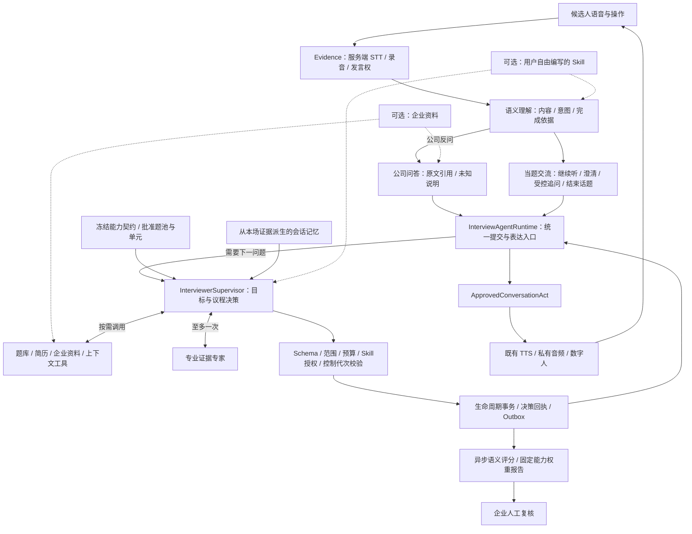

# 面试官 Agent：已实现的架构与使用方式

## 2026-09-14 · 实时交流入口（046）

`LiveKit/STT → AnswerEndpoint → SpokenSupplementConfirmation → ConversationUnderstandingService.classify_reception`先识别短交流请求；高置信度结果由当前完整final与输入/owner约束绑定，再由`ApprovedConversationAct → Expression/TTS → playback → Floor`回应和恢复倾听。稳定preview只用于提前准备；同一等待期间保留识别流，新话语可以打断在途理解和声音。普通回答、结束、反问公司继续进入原完整理解及总控路径。暂停回应播放完成后才沿同事务owner校验执行，不从旧候选请求直接改新owner的会话。

接话用固定可审计短句，题意不明确先问清具体部分；这部分不是任意知识解答生成器。Skill与企业资料缺省不影响此基础交流能力。历史v2共享接话修复，仍按已冻结题数和题目运行；v3的自主选择与预算规则保持。

日期：2026-09-10 · 实施工作项：ENTERPRISE-INTERVIEWER-IMPLEMENTATION-038；范围纠正：OPTIONAL-AGENT-CONTEXT-039。

038已将037设计落到后端、候选人页面、管理页面、持久化和测试。采用一个统一面试官入口，内部按任务调用语义理解、追问与证据专家、选题总控及受控工具。新的面试计划使用 execution v3；已有 v2 会话保留冻结的题序和评分规则。企业级要求针对Agent的可靠性、可维护性、可观察性和运行保障；Skill由用户自由编写、独立可选，企业资料同样可选。没有它们也可以按岗位正常面试。验证结果与范围纠正见[操作日志](change-log.md)，真实供应商、生产基础设施和真人面试效果仍需部署验收。

## 面试定制与公司问答（044）

用户在“面试定制”分别保存自由Skill与企业资料，后续新计划自动使用已填写部分；未填写不要求补录，已有计划不热更新。候选人中途询问公司业务时，由真实语音意图进入公司问答模块，只从本场冻结资料选择有据答复；资料未知则明确说明，随后继续当前题目。问答不形成技术评分，原始回答与录音保留；详细规则见[公司问答合同](company-question-runtime.md)。

## 1. 面试官怎样工作

企业先批准岗位能力、考察范围、题目单元、评分标准和时间/题量预算。面试官根据当前发言、已获得证据和剩余目标决定下一步；下一道问题及实际数量不再由预先排好的队列决定。数据库中的生命周期和证据仍是唯一状态来源，模型只提出结构化建议。

外部入口仍是 `InterviewAgentRuntime.open(...) -> AgentChannel`。实时语音按帧由 Evidence 驱动，模型不负责开关每一帧麦克风；播放和中断由既有 Floor/Expression 管理。没有引入另一套 Agent 框架数据库或独立发言者。

这里的“总控”分为两个协同决策层：语义与当题交流负责理解这一句话、形成合法追问；`InterviewerSupervisor` 负责跨题议程和下一次选择。两层共用本场记忆、Skill、模型网关和可信提交入口，不要求每句话固定串行调用所有专家。

## 2. 用户能直接感受到的变化

| 情况 | 当前处理 |
| --- | --- |
| “这题我不会” | 首次补充问话前先理解语义；有服务端原文依据时结束本题，不再要求补充，换题时简短承接 |
| 已说技术内容，再表示“其他不会了” | 保留已经说过的技术证据，停止当前话题追问 |
| “让我想一下” | 保持同一次采集等待，不因静音自动提交，也不循环催问 |
| “结束整场面试” | 尊重明确结束意图，保留已收回答与评分，报告说明未考察范围 |
| 一道题包含很多要求 | 计划生成时拆成批准的单点问题，面试时一次呈现一个单元 |
| 下一问推理失败 | 已提交回答保留，进入“准备下一话题”，可重试规划；不要求重复上一题 |
| 动态结束 | 候选页显示已完成话题和当前阶段，不显示虚假的固定总题数 |

仅静音、空识别、模型 confidence 高都不能形成答案。首次明确结束可以免去补充握手；含糊发言仍保留真实补充确认。普通自然陈述的无确认自动完成不是本轮全面开放的行为。所有提交依然需要完整服务端 final、当前 capture 和输入代次验证。

承接语是集中治理的简短中性表达；不透露答案、评价候选人优劣或声称其回答正确。对候选人情绪只回应其明确表达，不从脸部、声音或视线推断人格、诚信或能力。

## 3. 模块与工具的实际边界

| 模块 | 实际文件 | 责任 |
| --- | --- | --- |
| 语义与完成依据 | `services/answer_endpoint.py`、`spoken_supplement.py`、`conversation_understanding.py`、`core/prompt/semantic_turn.py` | 分离回答内容与交流意图，引用原文，取消过期准备 |
| 总控深模块 | `services/interviewer_supervisor/{service,context,tools}.py` | 提案、工具循环、专家调用、有限记忆、统一预算 |
| 自适应领域 | `domain/adaptive_interview.py`、`interview_lifecycle.py` | 冻结契约、单元选择、覆盖、停止与幂等 |
| 可信服务与运行时 | `services/interviews.py`、`interview_agent.py` | 事务前后校验、控制权、播放、暂停和恢复 |
| 可选 Skill | `services/interview_skills.py`、`schemas/interview_skills.py`、`core/prompt/interview_skills.py` | 自由文本保存即用、版本快照与用户停用 |
| 评分与复核 | `services/evaluation.py`、`reports.py`、`review.py` | 仅评实际范围，异步报告，固定能力权重与复核证据 |

工具按当前会话的能力与实际资料提供，最多包括以下六个。权限由平台运行时约束；用户Skill可选地收窄工具范围，但不授予额外权限。无Skill时仍有完整基础面试工具，无参考资料时不公开资料读取工具。

| 工具 | 返回什么 |
| --- | --- |
| `questions.search` | 已批准且仍可考察的题目与单元，有界候选范围 |
| `questions.read` | 当前冻结题目与单元信息，不返回隐藏标准答案 |
| `resume.read_evidence` | 本场已批准的简历证据 |
| `company.read_reference` | 本场可选企业资料或所选Skill的参考资料；企业文本使用`company:context`引用，正文按需读取 |
| `interview.read_context` | 本场最近交流、议程、能力证据与剩余预算 |
| `specialists.consult` | 一份有界的专业证据缺口及候选问题建议 |

TTS、播放/取消、生命周期提交、评分排队是可信执行器能力，继续封装在现有服务中，不直接暴露为模型任意调用的权限。它们只能处理通过审核的 act、合法状态命令或已提交答案。供应商继续经统一 ModelGateway 插件接入，没有绑定某一家 Agent SDK。

## 4. 动态考察与评分一起改变

工作台新计划明确发送 `execution_schema_version=3`；REST 调用省略该字段仍为2。v3 的 `assessment_contract` 冻结能力及权重、证据数量、候选题目、单元、评分范围、题量/追问/时长预算。批准后不可随题库或 Skill 新版本漂移。

计划生成时，集中 Prompt `interview_inquiry_units.v1` 将每个原关键点生成一个最多160字的口头问题。每个单元必须对应且只对应一个原关键点，标准答案引用必须是原文连续片段，`competency_ids` 是同源题能力的非空子集；统一校验不通过则不保存计划。企业批准的是包含这些单元的具体计划。实时阶段只选择批准单元，不临时编造新的主问题评分标准。

题量计算实际呈现的单元根题数，因此两道长题可以提供六个问题，不受原题数量限制。默认每个能力需要两个独立单元证据，允许配置1–5；可用单元只有一个时为一个。最低覆盖无法在预算内完成时计划生成明确报错。明确不再继续某源题后，不能改用它的另一个单元继续问。

生命周期依次发生：

1. 准入后 v3 会话先无题，START 进入 `awaiting_next_decision`。
2. 总控提出一个 `(question_id, inquiry_unit_id)`，`SELECT_NEXT` 验证后追加题目快照和轮次。
3. 提交回答与评分 Outbox 原子保存；无下一题时继续等待规划，空队列和评分完成都不表示面试结束。
4. `END_CANDIDATE_INPUT` 记录明确结束原因；覆盖充分、预算耗尽、候选人主动结束、预约截止有各自真实前置条件。
5. 已收答案继续异步评分，评分全部就绪后生成报告。迟到规划不能重新打开结束的会话。

每个单元只用当前问题、关键点及参考片段评分，`answer_evaluation.v6` 拒绝把未问关键点写进缺失项。追问保持根单元范围且不重复计权。一个原题带 Python/数据库两个标签，只问 Python 单元不能增加数据库覆盖和分数。

v3报告先在每个能力内汇总实际根题，再按冻结能力权重计算总分。必要证据或评分不全时，总分为 `null`，已有题分正常展示；不删除缺失维度后重算分母，也不按0补齐。报告同时显示原长题哪些点实际问过，能力采样充分不等于原题每个点都已考察。详见[自适应合同](adaptive-interview-contract.md)。

## 5. Skill和企业资料是两项独立的可选输入

Skill由用户自己决定怎么写。页面提供名称和自由文本/Markdown编辑，不要求固定行业模板、企业身份、语言/访谈方法枚举或企业审批。保存后即可在计划里选择，也可以始终选择“不使用Skill”，由基础面试官直接工作。

企业资料在计划中单独填写，与Skill没有绑定关系。未提供时忽略企业背景，根据岗位、题库、简历和实际回答面试；不会要求先补公司信息，也不会编造公司文化、业务或招聘承诺。

| Skill | 企业资料 | Agent行为 |
| --- | --- | --- |
| 无 | 无 | 使用基础面试能力完成整个流程 |
| 有 | 无 | 结合用户写的方法和偏好，不假定存在企业背景 |
| 无 | 有 | 使用基础面试能力，需要时读取本场企业资料 |
| 有 | 有 | 同时使用用户方法与实际提供的企业资料 |

新Skill包为`interview_skill.v2`，只需name与instructions；description和resources可选。Markdown、代码示例和资料链接可以作为普通文字保存；系统不执行里面的代码或自动访问链接。Skill不是模型参数微调，也不因为正文里写了一条命令就能越过运行时权限、预算、证据和评分范围。

保存/修改产生可用版本，不再要求“草稿→校验→人工批准”。版本快照、字段加密和用户停用用于可追溯与故障恢复。旧`enterprise_interview_skill.v1`只为已存在的版本/调用保留兼容读取与生命周期；新用户不需要走这条流程。完整请求、字段和兼容规则见[Skill API](interview-skills-api.md)。

计划本身仍先生成具体提问单元供审阅，再批准用于预约。这是在确认本场的考察内容，并不是审核用户怎么写Skill。选中Skill时计划固定其具体版本；未选中时不访问Skill内容或要求配置密钥。企业资料只进入本场受权限保护的计划/会话，不向候选人接口返回完整正文。

## 6. 企业级可靠性落实在哪里

- **模型与工具有界**：一次下一步规划共享15秒、最多3次实际供应商尝试，专家至多一次且占用同一预算；每次网关调用禁止隐式重试/备用供应商扩张尝试次数。无界自动循环不被允许。
- **控制权可验证**：推理在事务和通道锁之外；提交前再次检查 owner 租约、连接控制代次、当前上下文与 Skill epoch。暂停后恢复、接管或另一连接取得控制都会让旧提案失效。
- **真实效果可追溯**：领域事务原子保存选择/结束、decision revision、回执与 Outbox。复核仅显示安全元数据、固定理由码和调用次数，不保存模型内心推理或被拒绝响应全文。
- **记忆可重建**：从权威轮次、答案和理解派生有界最近对话、明确话题偏好和能力证据账本；不另建跨候选人的个人记忆库。
- **故障可以恢复**：新语音取消旧准备，已提交答案不依赖下一问成功；规划错误可重试，媒体失败沿现有暂停/恢复路径，不伪造完成或静默跳过答案。
- **权限与隐私延续**：企业 RBAC、租户事务/RLS、候选人安全投影、私有媒体和字段加密保留。仅服务端语音形成答案，最终招聘决定由企业人员作出。

Prompt/schema 统一在 `app/core/prompt/`，合同版本进入模型调用审计白名单。使用现有 `interview_turn_understanding`、`question_generation`、`answer_evaluation` 等路由，不需要在前端提供厂商密钥。

## 7. 启用、迁移与验收边界

部署 PostgreSQL 时按顺序执行 `migrations/003_interview_skills.sql` 和 `migrations/004_optional_interview_skills.sql`，确保字段加密与既有租户保护配置有效，再部署后端、worker及构建后的前端。新版本增加两个受保护的 Skill 文档集合；会话和计划继续使用既有聚合存储，不迁写历史答案或报告。

已有 v2 会话不热迁移成 v3；v2继续固定题序。语义优先和明确主动结束同样适用于旧会话，主动提前结束时已有成绩保留，但未覆盖计划不伪装成完整总分。若需要回退，只对后续新计划选择v2；已经开始的v3必须由理解其合同的服务完成。

038验证包括语义首问、续答尾音、动态单元选择、多维度范围、固定权重报告、Skill版本与撤销、过期控制权、严格Schema及端到端题库到报告/导出。具体命令和最终结果记于[操作日志](change-log.md)。039补充四种可选上下文组合、自由Skill保存即用、无企业信息时的默认行为与候选私有投影回归。页面验收使用独立内存预览和合成资料。

这些证据证明仓库内功能闭环，不等同生产验收：真实 PostgreSQL/Redis、OSS、扫描器、STT/TTS/数字人仍依赖部署环境；真实中文口音、延迟/成本、长时打断、不同Skill效果及跨岗位评分可比性需试点测量。未删除v2运行兼容入口，问题状态不标 `closed`。架构决策见[ADR-0005](adr/0005-goal-directed-interviewer-supervisor.md)。
