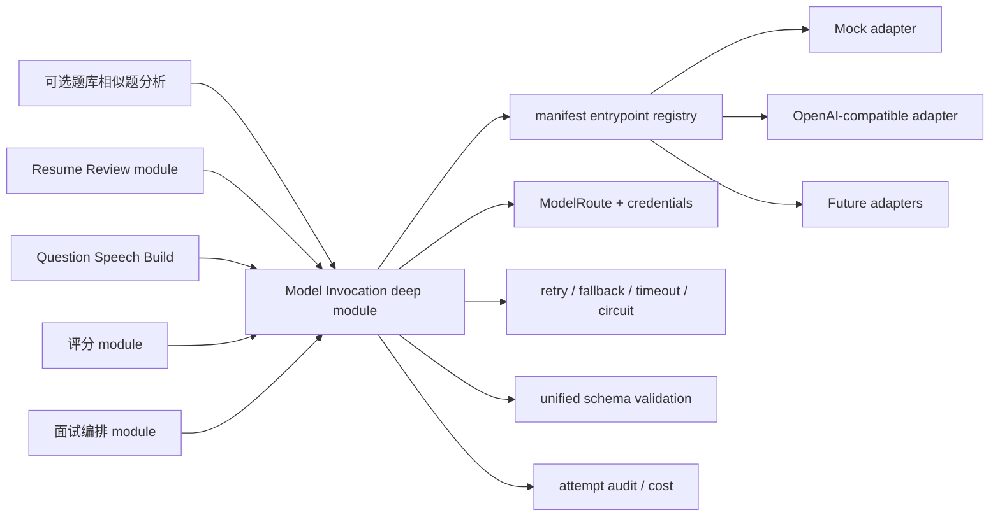

# 模型供应商插件化设计

本系统不能把 LLM、Embedding、语音识别、语音合成或数字人 SDK 直接写进业务 module。所有外部 AI 能力必须先接入“模型网关”，再由题库构建、简历审阅、评分和实时面试等业务 module 调用统一能力。Embedding 是已支持的可选能力，不是正式抽题或答案评分依赖。

## 目标

1. 管理员可以在后台配置多个默认厂商、模型、API Key、base URL 和启用状态。
2. 业务服务只依赖系统能识别的统一输入/输出格式，不感知具体厂商。
3. 后续新增厂商时，只要按插件规范实现能力接口和 manifest，就能被系统发现、校验、配置和调用。
4. 支持按组织、场景、能力、成本、延迟和可用性选择模型。
5. 支持 mock provider，方便本地开发、测试和无外网演示。
6. 正式预约把服务端 `stt.streaming`、题目语音生成和评分 route 的真实健康检查作为 readiness gate；生产环境不能静默使用 mock 或浏览器识别。

## 架构位置



Model Invocation deep module 职责：

- 读取组织级模型配置。
- 根据能力选择 provider 和模型。
- 注入凭证、超时、重试和熔断策略。
- 从 manifest `entrypoint` 加载声明能力的 adapter。
- 强制统一请求/响应 schema，拒绝 provider 返回的错误形状。
- 记录调用日志、延迟、token、费用、错误码和模型版本。

Provider adapter 负责把统一请求转换成厂商协议、注入厂商鉴权、映射厂商错误并归一化响应。Model Invocation 不负责业务评分逻辑、题目选择策略或报告文案，这些仍属于业务 module。

## 能力类型

系统内置以下能力枚举：

| capability | 用途 | 典型调用方 |
| --- | --- | --- |
| `llm.chat_json` | 结构化 JSON 生成 | 岗位解析、简历审阅、经历问题、单题评分、报告总结 |
| `llm.chat_text` | 普通文本生成 | 追问建议、提示语生成 |
| `embedding.text` | 文本向量 | 可选的相似题发现、超大题库自然语言搜索；不用于实时抽题或评分 |
| `stt.streaming` | 流式语音识别 | 实时面试 |
| `stt.batch` | 批量音频转写 | 流式失败修复、历史音频补转写 |
| `tts.synthesize` | 文本转音频 | 岗位题/经历问题语音预生成、数字人降级读题 |
| `avatar.speak` | 数字人读题 | 实时面试 |
| `moderation.text` | 内容安全检查 | 可选，候选人输入和报告输出 |

后续新增能力必须先扩展枚举和统一 schema，再写 provider 插件。

## 内置默认供应商

以下是候选 provider 目录，不代表已经实现或生产可用。真实能力只有在统一 schema、adapter、健康检查和集成测试全部完成后才能声明。

| provider_id | 能力 | 说明 |
| --- | --- | --- |
| `mock` | `llm.chat_json`、`llm.chat_text`、`embedding.text`、`stt.streaming`、`stt.batch`、`tts.synthesize`、`avatar.speak` | 本地测试 adapter；语音结果明确不具备生产 readiness |
| `openai_compatible` | `llm.chat_json`、`llm.chat_text`、`embedding.text`、`tts.synthesize` | 兼容 OpenAI Chat/Embedding/Speech API 风格的模型服务，通过 `base_url` 配置切换 |
| `deepseek` | `llm.chat_json`、`llm.chat_text` | DeepSeek 官方 OpenAI-compatible Chat API；模型由 manifest 目录约束 |
| `zhipuai` | `llm.chat_json`、`llm.chat_text`、`tts.synthesize` | 智谱 BigModel OpenAI-compatible Chat 与官方 GLM-TTS `/audio/speech`；模型由 manifest 按能力约束 |
| `azure_openai` | `llm.chat_json`、`llm.chat_text`、`embedding.text` | 企业 Azure 部署场景 |
| `anthropic` | `llm.chat_json`、`llm.chat_text` | 可作为评分和总结模型 |
| `gemini` | `llm.chat_json`、`llm.chat_text`、`embedding.text` | 可作为通用 LLM 和 embedding |
| `dashscope` | `llm.chat_json`、`llm.chat_text`、`embedding.text`、`tts.synthesize` | 阿里云百炼 Qwen LLM/Embedding 与 Qwen-TTS/CosyVoice HTTP 服务 |
| `volcengine` | `llm.chat_json`、`llm.chat_text`、`embedding.text`、`stt.streaming`、`tts.synthesize`、`avatar.speak` | 国内模型、语音和数字人场景 |
| `azure_speech` | `stt.streaming`、`stt.batch`、`tts.synthesize` | 语音识别和合成 |
| `tencent_cloud_speech` | `stt.streaming`、`stt.batch`、`tts.synthesize` | 国内语音识别和合成 |

默认供应商清单只是内置插件目录，不代表默认启用。生产环境必须由管理员显式配置凭证和路由。

当前实现状态：

- `provider.json` 同时驱动 catalog、管理员配置校验、默认配置、模型选择和运行时 adapter 加载；`entrypoint` 不再是展示字段。该分层参考 Dify 的“声明式 Provider/Model schema + runtime adapter”思路，但仍保持本仓库单一 `ModelGateway` deep module，不引入第二套路由或插件管理器。
- 业务 module 统一调用 `ModelGateway.invoke(capability, request)`，不再为 chat、embedding、avatar 复制路由与日志分支。
- `mock` adapter 已实现 `llm.chat_json`、`llm.chat_text`、`embedding.text`、`stt.streaming`、`stt.batch`、`tts.synthesize` 和 `avatar.speak`。streaming adapter 产出有序 ready/partial/final/closed 事件；mock STT 只接受显式开发元数据，mock TTS 返回不可作为生产媒体的确定性 `mock-tts://` 资产。
- `mock` provider 已实现 `avatar.speak` 的浏览器语音驱动响应，用于本地数字人演示；它不生成真人视频，也不应标记为生产数字人能力。
- `openai_compatible` provider 已支持真实 HTTP 调用：`llm.chat_json`、`llm.chat_text`、`embedding.text` 和 `tts.synthesize`。TTS 使用 `/audio/speech`，支持 `wav/mp3/opus/aac/flac/pcm`，二进制响应会转为 data URI 后交给私有资产复制层校验和落盘。
- `deepseek` 与 `zhipuai` provider 复用 `OpenAICompatibleProvider` 的 HTTP、Bearer 鉴权、用量解析、错误映射和响应归一化；两者的 `llm.chat_json` 使用厂商支持的 `json_object` 并在 system message 注入目标 JSON Schema，避免假定支持 OpenAI `json_schema` 扩展。智谱 adapter 另在 TTS seam 校验 `glm-tts`、官方 WAV/PCM 格式、1024 字符上限和默认音色 `tongtong`，再复用共享二进制响应归一化。
- `dashscope` provider 已支持 OpenAI-compatible Qwen Chat/Embedding，并按模型路由 Qwen3-TTS 的 multimodal-generation HTTP 接口或 CosyVoice/Qwen-Audio 的 `SpeechSynthesizer` HTTP 接口。供应商返回的临时音频 URL 会强制升级为 HTTPS（可配置）并复制到 PrivateFileStorage；落盘文件的真实 SHA-256 是最终资产哈希。
- `stt.streaming` 已有 `StreamingSTTRequest/Event`、`ModelGateway.open_stream()`、有序 chunk/final 校验、建立前 fallback、硬超时、断流 batch 修复和独立 WebSocket 端到端测试；`stt.batch` 与 `tts.synthesize` 也有统一 schema、网关校验和调用审计。浏览器 SpeechRecognition 只用于本地展示/开发输入，不满足正式面试 readiness。
- 路由的 retry、fallback_on、硬超时、数据库共享断路器、输出 schema 校验和成本上限在统一管线执行；每个 attempt 形成追加日志。多实例进程通过 Persistence 共用 `ModelCircuitState`，不再依赖进程内全局状态。
- 除 `mock`、`openai_compatible`、`deepseek`、`zhipuai` 和 `dashscope` 外，其它 provider 目前只有 `implemented=false` 的 manifest 和配置 schema，可展示和保存配置，但不能创建活动路由，也不应视为已接入真实厂商 API。
- Provider credentials 通过 `ProviderSecretVault` 在 repository seam 使用 Fernet 密封；API 只返回 `credential_ref`。生产未配置 `INTERVIEWER_PROVIDER_SECRET_ENCRYPTION_KEY` 或遇到旧未密封值时失败关闭。

仓库内 OpenAI-compatible/DashScope 的 LLM、Embedding、TTS HTTP 合同以及私有资产复制与 readiness 逻辑已验证；真实外部调用仍需要对应账号、区域、模型授权和 API Key 后才能标记健康。`azure_speech`、`tencent_cloud_speech`、`volcengine` 等 STT/数字人 manifest 仍为 `implemented=false`。基础视频继续通过稳定的 `avatar.speak -> TTS/文字` seam 降级，真人视频和口型同步留给后续供应商会话 adapter，不改变面试编排。

## 目录建议

```text
app/
  model_gateway/
    capabilities.py       # 能力枚举和统一请求/响应模型
    registry.py           # manifest 发现与 entrypoint adapter 加载
    gateway.py            # Model Invocation deep module
    errors.py             # 统一错误类型
  providers/
    mock/
      provider.py
      provider.json
    openai_compatible/
      provider.py
      provider.json
    deepseek/
      provider.py
      provider.json
    zhipuai/
      provider.py
      provider.json
    dashscope/
      provider.py
      provider.json
    azure_openai/
      provider.py
      provider.json
```

业务服务只依赖 `app.model_gateway.gateway.ModelGateway`，不直接 import `app.providers.*`。

## 插件 Manifest

每个 provider 必须提供 `provider.json`，用于系统识别、后台展示和配置校验。

```json
{
  "provider_id": "openai_compatible",
  "display_name": "OpenAI Compatible",
  "version": "1.0.0",
  "capabilities": ["llm.chat_json", "embedding.text", "tts.synthesize"],
  "schema_version": "2",
  "connection_form": {"fields": [{"name": "base_url", "label": "Base URL", "control": "text", "required": true}]},
  "credential_form": {"fields": [{"name": "api_key", "label": "API Key", "control": "secret", "required": true, "write_only": true}]},
  "model_types": {
    "llm": {"selection_mode": "customizable", "capabilities": ["llm.chat_json"], "configuration_form": {"fields": [{"name": "structured_output_mode", "control": "select", "options": [{"label": "JSON Object", "value": "json_object"}]}]}},
    "embedding": {"selection_mode": "customizable", "capabilities": ["embedding.text"], "configuration_form": {"fields": []}},
    "tts": {"selection_mode": "customizable", "capabilities": ["tts.synthesize"], "configuration_form": {"fields": [{"name": "default_voice", "control": "text", "required": true}]}}
  },
  "models": [
    {
      "model_id": "chat-model-default",
      "label": "Default Chat Model",
      "model_type": "llm",
      "capabilities": ["llm.chat_json"],
      "default": true,
      "context_window": 128000,
      "supports_json_schema": true
    },
    {
      "model_id": "embedding-model-default",
      "model_type": "embedding",
      "capabilities": ["embedding.text"],
      "embedding_dimensions": 3072
    }
  ],
  "entrypoint": "app.providers.openai_compatible.provider:OpenAICompatibleProvider"
}
```

Manifest 规则：

- `provider_id` 全局唯一，只允许小写字母、数字和下划线。
- `capabilities` 必须来自系统能力枚举。
- `credential_form` 的秘密字段必须 `write_only`，不得明文写入普通日志或 API 响应。
- `connection_form` 只声明连接级字段；模型、音色、维度和结构化输出策略放在对应 `model_types[].configuration_form`。
- 每个模型类型独立声明 `predefined/customizable`；`predefined` 要求 ModelConfiguration 的模型存在于该类型目录，`customizable` 允许目录外模型 ID。
- `models` 条目必须提供 `model_id/model_type/capabilities`，能力必须属于对应模型类型；每项能力至多有一个默认模型。
- `entrypoint` 指向实现通用 Provider adapter interface 的类；`implemented=true` 时必须可在运行时加载。
- 所有表单 schema 在创建和更新时由服务端执行严格校验，不能只用于页面展示；v1 JSON schema 只用于加载尚未升级的未实现插件 manifest。
- `capabilities` 只声明当前 adapter 和统一 schema 真正可执行的能力；未来能力可保留在 `implemented=false` 的占位 manifest 中。

## Provider 接口

所有已实现 Provider 插件满足同一个 adapter interface；能力差异由 manifest 声明，adapter 内部只做协议转换。

```python
from typing import Protocol


class ProviderContext:
    organization_id: str
    invocation_id: str
    route_id: str
    provider_connection_id: str
    model_configuration_id: str
    model_type: str
    capability: str
    purpose: str
    model: str
    timeout_s: float
    attempt: int
    fallback_index: int
    connection_config: dict
    model_settings: dict
    default_parameters: dict
    credentials: dict
    metadata: dict


class ProviderAdapter(Protocol):
    provider_id: str

    async def invoke(
        self,
        capability: str,
        request: "InvocationRequest",
        context: ProviderContext,
    ) -> "InvocationResponse": ...

    async def open_stream(
        self,
        capability: str,
        request: "StreamingInvocationRequest",
        context: ProviderContext,
    ) -> "ProviderStream": ...
```

`invoke` 用于请求/响应式能力，包括 `llm.*`、`embedding.text`、`tts.synthesize`、`stt.batch` 和非流式 `avatar.speak`。`open_stream` 只用于系统已定义流协议的能力，当前首先是 `stt.streaming`；返回对象接收音频 chunk、结束输入并异步产出统一 STT 事件。没有声明流式能力的 adapter 不需要实现可调用的 stream。

Provider 实现要求：

- 只做协议转换、鉴权注入、异常映射和响应归一化。
- 不写业务 prompt、不判断面试分数、不访问题库。
- 所有外部异常转换为统一 `ProviderError`。
- 所有响应都必须填充 `provider_id`、`model`、`latency_ms` 和原始调用 ID。
- 不允许把密钥输出到日志、异常 message 或 WebSocket 事件。
- 流式 adapter 不能在不同 provider 之间拼接 transcript；事件必须携带同一 `stream_id` 和单调递增 `sequence`。

## 系统统一格式

### Chat JSON 请求/响应

请求：

```json
{
  "messages": [
    {"role": "system", "content": "你是严格的面试评分助手。"},
    {"role": "user", "content": "请按 schema 输出评分。"}
  ],
  "json_schema": {
    "type": "object",
    "required": ["score", "summary"],
    "properties": {
      "score": {"type": "integer", "minimum": 0, "maximum": 100},
      "summary": {"type": "string"}
    }
  },
  "temperature": 0.1,
  "max_output_tokens": 1200,
  "purpose": "answer_evaluation"
}
```

响应：

```json
{
  "data": {
    "score": 88,
    "summary": "回答覆盖核心概念，但替代方案不足"
  },
  "usage": {
    "input_tokens": 1200,
    "output_tokens": 180,
    "total_tokens": 1380
  },
  "provider": {
    "provider_id": "openai_compatible",
    "model": "chat-model-default",
    "request_id": "vendor_req_123",
    "latency_ms": 1320
  }
}
```

### Embedding 请求/响应

该能力保留用于未来题库治理实验。MVP 不在题库上传时强制调用，也不把 embedding route 纳入计划、预约或正式面试 readiness。

```json
{
  "texts": ["Python GIL 与多线程性能", "数据库 B+ 树索引"],
  "purpose": "question_similarity_analysis"
}
```

```json
{
  "vectors": [[0.01, 0.02], [0.03, 0.04]],
  "dimensions": 3072,
  "provider": {
    "provider_id": "openai_compatible",
    "model": "embedding-model-default",
    "request_id": "vendor_req_456",
    "latency_ms": 420
  }
}
```

### Streaming STT 请求与事件

打开流请求：

```json
{
  "organization_id": "org_01J...",
  "interview_id": "iv_01J...",
  "turn_id": "turn_01J...",
  "audio": {
    "content_type": "audio/webm;codecs=opus",
    "sample_rate_hz": 48000,
    "channels": 1
  },
  "language": "zh-CN",
  "enable_partial": true,
  "enable_word_timestamps": true,
  "purpose": "candidate_answer_transcription"
}
```

打开后每个二进制音频 chunk 由 stream interface 发送，不嵌入 JSON 或普通 invocation 日志。统一事件包络：

```json
{
  "stream_id": "stt_stream_01J...",
  "sequence": 14,
  "type": "transcript.final",
  "text": "我认为 GIL 会限制 CPU 密集型多线程并行执行。",
  "language": "zh-CN",
  "confidence": 0.86,
  "segments": [
    {
      "text": "GIL 会限制 CPU 密集型多线程并行执行",
      "start_ms": 1200,
      "end_ms": 7600,
      "confidence": 0.86
    }
  ],
  "is_final": true,
  "provider": {
    "provider_id": "azure_speech",
    "model": "default",
    "request_id": "vendor_req_789",
    "latency_ms": 180
  }
}
```

`type` 只允许 `stream.ready`、`transcript.partial`、`transcript.final`、`stream.error` 和 `stream.closed`。partial 可以重复修订但不得进入评分；每轮只接受一个成功关闭流的 final。final 必须带完整 text、语言、整体置信度、片段时间戳和 Provider 元数据。

流式执行策略：

- Provider 在接受首个音频 chunk 前失败，可以按 route 切换 fallback 并重新开流。
- 接受音频后失败，不能把另一个 Provider 的 partial 接到原流；保存完整录音并使用 `stt.batch` 修复。
- 每个流有连接超时、无音频超时、最大时长和 final 等待超时；断路器与 attempt 日志以整条流为单位。
- 日志保存音频秒数和哈希，不保存音频或 transcript 正文。

### Batch STT 请求/响应

请求：

```json
{
  "audio_uri": "s3://private-media/interviews/iv_01J/turn_01J.webm",
  "content_type": "audio/webm;codecs=opus",
  "language": "zh-CN",
  "enable_word_timestamps": true,
  "purpose": "candidate_answer_repair"
}
```

响应与 `transcript.final` 使用相同的 `text + language + confidence + segments + provider` 字段，并增加 `source=server_batch_repair`。只有媒体 adapter 生成的受控私有 URI 能进入请求，Provider 不得任意读取对象存储。

### TTS 请求/响应

请求：

```json
{
  "text": "请解释 Python GIL 对多线程性能的影响。",
  "language": "zh-CN",
  "voice_profile_id": "voice_cn_01",
  "format": "audio/wav",
  "speaking_rate": 1.0,
  "purpose": "question_speech_generation"
}
```

响应：

```json
{
  "audio_uri": "s3://bucket/question-speech/tts_01J.wav",
  "content_type": "audio/wav",
  "duration_ms": 4200,
  "content_hash": "sha256:...",
  "provider": {
    "provider_id": "azure_speech",
    "model": "default",
    "request_id": "vendor_req_101",
    "latency_ms": 900
  }
}
```

Model Invocation 校验 content type、最大大小、非空音频和 duration。Question Speech Build 把响应复制到系统私有对象存储并形成不可变 `QuestionSpeechAsset`；不能长期依赖供应商临时 URL。

### Avatar 响应

```json
{
  "speech_id": "avatar_speech_01J",
  "status": "ready",
  "mode": "webrtc",
  "text": "请解释 Python GIL 对多线程性能的影响。",
  "stream_url": "https://vendor.example/avatar/session/01J",
  "audio_uri": null,
  "visemes": [],
  "provider": {
    "provider_id": "volcengine",
    "model": "avatar_default",
    "request_id": "vendor_req_102",
    "latency_ms": 1100
  }
}
```

`mode` 约定：

- `browser_speech`：本地 Mock 或最终降级模式，前端用系统语音合成朗读，并只展示明确的模拟说话状态。
- `audio`：Provider 返回 `audio_uri`，前端播放音频并可根据 `visemes` 或音频能量驱动嘴型。
- `video`：Provider 返回可直接播放的数字人视频流地址。
- `webrtc`：Provider 返回实时会话或信令入口；实际媒体使用 WebRTC，不能把视频帧塞入业务 WebSocket。

所有模式必须返回实际朗读的 `text` 和 Provider 元数据。数字人失败时依次降级到 `tts.synthesize`、`browser_speech` 和纯文字题干。

## 配置模型

### Provider 插件声明与连接

`ProviderPluginDefinition` 的 `provider.json` 由后端插件拥有，使用 `connection_form`、`credential_form`、`model_types[].configuration_form` 描述动态表单。字段控件限定为 `text/secret/number/select/switch/textarea/tags/key_value`；服务端负责默认值、必填、类型、范围、选项、可见条件和未知字段校验，前端只负责通用渲染。

`ProviderConnection` 保存某个组织到厂商或兼容网关的连接。连接级参数和凭证不能混入具体模型配置。

```json
{
  "id": "provider_conn_01J...",
  "organization_id": "org_01J...",
  "provider_id": "openai_compatible",
  "display_name": "公司统一模型网关",
  "enabled": true,
  "connection_config": {
    "base_url": "https://models.example.com/v1"
  },
  "credential_ref": "secret://model-providers/provider_conn_01J",
  "created_at": "2026-07-01T18:30:00Z"
}
```

### 模型配置

`ModelConfiguration` 绑定一个连接并代表一个可调用的具体模型。`settings` 只包含插件声明的厂商专属字段；`default_parameters` 只包含网关统一字段，调用请求显式值优先于默认值。

```json
{
  "id": "model_cfg_01J...",
  "provider_connection_id": "provider_conn_01J...",
  "model_type": "llm",
  "provider_model_id": "chat-model-default",
  "display_name": "面试评分模型",
  "settings": {"structured_output_mode": "json_object"},
  "default_parameters": {"temperature": 0.2},
  "supported_capabilities": ["llm.chat_json"],
  "status": "ready"
}
```

### 模型路由

`ModelRoute` 决定某个能力、场景默认走哪个 ModelConfiguration。

同一组织内 `(capability, purpose)` 是应用层唯一键；重复创建返回 `409 MODEL_ROUTE_CONFLICT`。创建请求使用强类型 target/policy schema，未知字段返回 `422`。target 只接受 `model_configuration_id`、`timeout_s`、`pricing`；policy 只接受 `retry_count`、`retry_backoff_ms`、`fallback_on`、`max_cost_usd_per_call`、`circuit_failure_threshold`、`circuit_recovery_seconds` 和 `readiness_ttl_seconds`。

本业务至少使用以下精确 purpose，不能用一个 `default` 路由混合不同敏感数据：

| capability | purpose | 数据边界 |
| --- | --- | --- |
| `tts.synthesize` | `question_speech_generation` | 岗位题或已批准经历问题文本 |
| `llm.chat_json` | `resume_review` | 脱敏简历和岗位要求 |
| `llm.chat_json` | `resume_experience_question_generation` | 项目证据和岗位维度 |
| `stt.streaming` | `candidate_answer_transcription` | 候选人实时回答音频 |
| `stt.batch` | `candidate_answer_repair` | 失败轮次的完整私有音频 |
| `llm.chat_json` | `answer_evaluation` | 冻结题目和最终转写 |
| `llm.chat_json` | `interview_report` | 当前评分 revision 摘要 |

可选 `embedding.text/question_similarity_analysis` route 只服务后台题库治理。未配置、失败或删除向量数据都不能阻止题库 ready、计划批准、预约邀请、随机抽题、答案评分或报告生成。

```json
{
  "id": "route_01J...",
  "organization_id": "org_01J...",
  "capability": "llm.chat_json",
  "purpose": "answer_evaluation",
  "primary": {
    "model_configuration_id": "model_cfg_01J...",
    "timeout_s": 20
  },
  "fallbacks": [
    {
      "model_configuration_id": "model_cfg_02J...",
      "timeout_s": 25
    },
    {
      "model_configuration_id": "model_cfg_mock_llm",
      "timeout_s": 2
    }
  ],
  "policy": {
    "retry_count": 1,
    "fallback_on": ["timeout", "rate_limited", "server_error"],
    "max_cost_usd_per_call": 0.05
  }
}
```

路由匹配与执行顺序：

1. 组织 + 能力 + purpose 精确匹配。
2. 仅在 development/test 环境未找到组织路由时使用显式 mock fallback，保证离线闭环。

生产部署必须显式配置组织、能力和 purpose 路由；缺失时返回 `provider_route_missing` 并失败关闭，不能静默以 mock、浏览器 STT 或浏览器 TTS 参与真实邀请、面试或评分。

每个 route 依次执行 primary 与 fallbacks。每个 target 最多执行 `1 + retry_count` 次，当前 `retry_count` 限制为 0-3；每次都由管线施加硬 `timeout_s`。只有 `ProviderError.retryable=true` 且错误命中 `fallback_on`（未配置时为任意可重试错误）才进入下一个 target。`fallback_on` 同时接受完整错误码（如 `provider_timeout`）和去掉 `provider_` 前缀的别名（如 `timeout`）。鉴权、坏请求、能力缺失等非可重试错误立即失败。

`circuit_failure_threshold` 次 target 失败后写入租户级 `ModelCircuitState`，`circuit_recovery_seconds` 后允许探测恢复；所有应用实例通过 Persistence 共享状态。`llm.chat_json` 在返回业务 module 前按请求携带的 JSON schema 校验；embedding 数量/维度、streaming STT 事件序号/唯一 final 和 avatar 模式也由同一管线校验。

### 正式面试 readiness

预约邀请和候选人 start 之前，Model Invocation 必须给出结构化 readiness 结果：

- `stt.streaming/candidate_answer_transcription` 有已启用、`implemented=true`、能力匹配且最近健康测试成功的非 mock route。
- `stt.batch/candidate_answer_repair` 已配置，或预约策略明确说明流式失败将暂停并人工处理。
- `tts.synthesize/question_speech_generation` 已能生成并持久化计划所需语音；计划实际引用的语音资产均为 ready。
- `llm.chat_json/answer_evaluation` 与 `interview_report` 通过 schema 测试。
- route 引用的凭证未过期，成本上限、数据区域和留存配置满足组织策略。

readiness 是带检查时间和有效期的事实，不是永久布尔值；超过有效期或 Provider 熔断后候选人 start 必须重新检查。

## 后台配置 API

模型配置 API 属于管理员接口，应纳入 `/api/v1/admin`。

| 方法 | 路径 | 说明 |
| --- | --- | --- |
| `GET` | `/api/v1/admin/model-providers/catalog` | 查看系统已安装 provider 插件和能力 |
| `POST/GET/PATCH` | `/api/v1/admin/model-provider-connections` | 管理组织级厂商连接，凭证字段脱敏 |
| `POST` | `/api/v1/admin/model-provider-connections/{id}/validate` | 本地校验连接和凭证完整性 |
| `GET` | `/api/v1/admin/model-provider-connections/{id}/model-catalog` | 获取模型类型、目录和动态表单 |
| `POST/GET/PATCH` | `/api/v1/admin/model-configurations` | 管理具体模型配置 |
| `POST` | `/api/v1/admin/model-configurations/{id}/test` | 对具体模型执行能力探针 |
| `POST` | `/api/v1/admin/model-routes` | 配置能力路由 |
| `GET` | `/api/v1/admin/model-routes` | 查看路由 |
| `POST` | `/api/v1/admin/model-routes/{id}/test` | 测试路由和 fallback |

两个 `PATCH` 都必须携带 `expected_version`。连接文档和凭证引用使用同一租户事务更新；并发版本不匹配时拒绝写入。连接编辑时空密码不能清除现有密钥。模型测试只使用 ModelConfiguration 已保存的模型标识与参数，不允许客户端在测试时临时替换模型。

新增供应商插件后，`catalog` 必须能读出 manifest，不需要改业务服务。

## 调用日志和成本

每次 Provider attempt 都写一条 `ModelInvocationLog`；同一逻辑 ModelInvocation 的重试和 fallback 共享 `invocation_id`：

| 字段 | 说明 |
| --- | --- |
| `id` | 调用日志 ID |
| `invocation_id` | 逻辑调用 ID |
| `organization_id` | 组织 |
| `capability` | 能力 |
| `purpose` | 场景 |
| `route_id` | 路由 ID |
| `provider_connection_id` | 使用的连接 |
| `model_configuration_id` | 使用的模型配置 |
| `provider_id` | provider 类型 |
| `model` | 模型名 |
| `status` | `success`、`failed`、`fallback_success` |
| `attempt` | 当前 target 尝试序号 |
| `fallback_index` | primary 为 0，fallback 依次递增 |
| `latency_ms` | 本 attempt 耗时 |
| `input_tokens` | 输入 token，可为空 |
| `output_tokens` | 输出 token，可为空 |
| `audio_seconds` | 音频秒数，可为空 |
| `estimated_cost_usd` | 预估费用 |
| `error_code` | 统一错误码 |
| `redacted_request_hash` | 统一请求的 SHA-256，用于关联重复调用 |

日志默认不保存完整 prompt、候选人音频或标准答案。需要调试时必须通过受控开关开启短期脱敏采样。

## 错误码

Provider 插件把厂商错误映射为统一错误码：

| 错误码 | 含义 | 是否可 fallback |
| --- | --- | --- |
| `provider_auth_failed` | 凭证错误 | 否 |
| `provider_rate_limited` | 限流 | 是 |
| `provider_timeout` | 超时 | 是 |
| `provider_server_error` | 供应商服务端错误 | 是 |
| `provider_bad_request` | 请求格式错误 | 否 |
| `provider_schema_invalid` | 返回不符合系统 schema | 是 |
| `provider_capability_missing` | 插件不支持该能力 | 否 |
| `provider_not_installed` / `provider_not_implemented` | manifest 或 runtime adapter 不可用 | 否 |
| `provider_entrypoint_invalid` | manifest entrypoint 无法加载或不满足 interface | 否 |
| `provider_config_missing` | route 引用不存在的配置 | 否 |
| `provider_route_missing` | 生产环境未配置精确能力/purpose 路由 | 否 |
| `provider_config_disabled` | route 引用已停用配置 | 是 |
| `provider_circuit_open` | 断路器阻止调用该 target | 是 |
| `provider_cost_limit_exceeded` | 返回用量超过单次成本上限 | 否 |
| `provider_route_invalid` | route 与组织或能力不一致 | 否 |
| `provider_stream_open_failed` | 流在接受音频前无法建立 | 是，可重新开流 |
| `provider_stream_interrupted` | 流在接受音频后中断 | 否，转 `stt.batch` 修复 |
| `provider_audio_format_unsupported` | 音频编码、采样率或声道不支持 | 否 |
| `provider_transport_unavailable` | HTTP transport 或显式代理依赖不可用 | 否 |
| `provider_final_transcript_missing` | 输入结束后未得到 final | 否，转 `stt.batch` 修复 |

## 新增厂商流程

1. 在 `app/providers/{provider_id}/` 下新增 `provider.json` 和 `provider.py`。
2. 在 manifest 中声明能力、配置 schema、凭证 schema 和模型列表。
3. 实现通用 `ProviderAdapter.invoke`，在 adapter 内将声明能力转换为厂商协议并输出系统统一格式。
4. 设置 `implemented=true`，确保 manifest entrypoint 可加载且 adapter 的 `provider_id` 一致。
5. 增加单元测试：manifest/entrypoint、凭证脱敏、成功调用、错误映射、schema 失败；语音 adapter 还要覆盖流打开、chunk、final、超时、断流和 batch 修复。
6. 增加 mock 或 fixture，保证 CI 不依赖真实外网。
7. 在后台 `catalog` 能看到新 provider。
8. 管理员新增配置并测试通过后配置路由；STT/TTS 还必须通过端到端 readiness 才可用于正式邀请。

新增厂商不应修改评分、Question Selection 或面试编排 module。若必须修改业务 module，说明能力抽象不完整，应先扩展模型网关 schema。

## 本轮实现依据

- Dify `ProviderManager` 与官方模型插件仓库：借鉴 schema/runtime 分工，不复制其插件市场和租户配置编排层。
  - <https://github.com/langgenius/dify/blob/main/api/core/provider_manager.py>
  - <https://github.com/langgenius/dify-official-plugins>
  - <https://github.com/langgenius/dify-official-plugins/blob/main/models/openai_api_compatible/provider/openai_api_compatible.yaml>
- DeepSeek 官方 OpenAI-compatible API：<https://api-docs.deepseek.com/>
- 智谱 BigModel OpenAI SDK 兼容说明：<https://docs.bigmodel.cn/cn/guide/develop/openai/introduction>
- 阿里云百炼千问文本生成说明：<https://help.aliyun.com/zh/model-studio/text-generation>

外部文档只决定 adapter 的厂商协议转换；领域能力、route、日志、隐私和 readiness 仍以本仓库统一 schema 为准。
