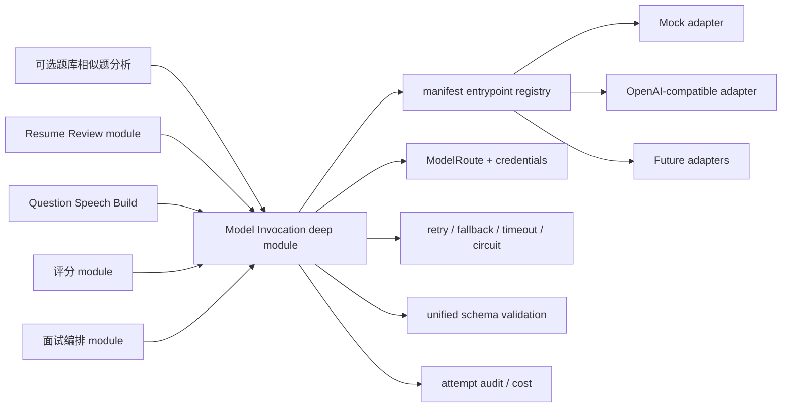

# 模型供应商插件化设计

## 准备失败的阶段诊断（024）

未更改供应商/模型路由或Prompt版本。网关成功表示原始统一JSON Schema通过，不代表后续引用、canonical、领域或追问审批成功；日志按安全stage/reason及静态schema_path区分这些位置，禁止输出完整AI响应/候选转写/异常正文。可选追问审批失败不触发整份模型重试；同服务端文字的失败预算不能由声音清零。真实模型尾部时延与业务重复调用分别统计，不将所有等待混为单个模型耗时。

## 未作答意图合同（023）

统一理解Prompt升级至interview_turn_understanding.v6/v7，组合决策至interview_turn_decision.v5/v6；高版本表示已独立确认完成。新增answer_declined枚举，统一Schema和业务内容校验要求next、理解置信度至少0.75、非空客观摘要与真实证据、空claims/covered/ambiguities/contradictions、完整missing；低语音置信度仍不得授权结束。补充答复Prompt为supplement_reply.v2，区分实际技术补充与未解决识别投诉；返回结构不变，逐字证据校验保持。各历史Prompt版本继续可读。Mock参考编号处理和网关安全版本白名单同步；未新增供应商、厂商参数或路由。全组明确未作答采用服务端declined_answer.v1评分规则，来源记录与AI评分来源分开，不新增散落Prompt。

023回归同时修复取消关闭导致的供应商流遗留：ContinuousSTT持有唯一的有界清理任务，调用者取消不撤销清理，重复关闭共享等待；每条流保留2秒关闭期限。服务端原录音、识别与提交语义不变。

## STT 正常无文字完成（022）

统一 StreamingSTTEvent新增内部 `transcript.empty`：is_final=true、text/segments空、provider非空，且只允许finish阶段返回；同流完成唯一，先前非空partial或stable preview禁止空完成。DashScope仅在发送排空并收到task-finished、从未见文字且无未决hypothesis时产生。遵循[官方Fun-ASR服务端事件](https://help.aliyun.com/en/model-studio/fun-asr-server-events)的正常结束语义；它不声明候选人没有说话。未接ACK、超时、丢字等仍恢复，不以扩大RMS门槛替代转写证据。连续采集finish统一10秒预算、PCM恢复接收60秒；网关可选文字观察事实只能阻止抹字，不能授权提交。

## DashScope 实际补送容量与即时术语（019）

DashScope 保持默认5秒音频队列上限，新增可选 wait_audio_capacity：按发送完成、失败及 abort 通知唤醒，单次无进展最多5秒；不以增大队列或 sleep(0) 代替流控。仅 qwen-audio-3.0-asr-flash-streaming 将统一 recognition_terms 映射为 vocabulary（保守权重2），中文技术场景提供 zh/en 提示；其他模型不发送未支持参数。不添加 context/Prompt/标准答案正文，不改写返回的字幕。依据[官方客户端参数](https://help.aliyun.com/zh/model-studio/fun-asr-client-events)与[识别准确率文档](https://help.aliyun.com/zh/model-studio/improve-asr-accuracy)。新增 stt.sentence_source 只记录原句 SHA-256、字符数、流身份和相对时间；stt.audio_origin 记录流对应原录音起始字节，支持后续核对来源，不记录转写正文、音频或凭据。原厂商未提供的 confidence 不可视为实测正确率。

## 018：本地语音活动与权威final复用

新增本地适配器ServerSpeechActivity，依赖固定版本webrtcvad-wheels==2.0.14，不调用外部模型、不下载运行时模型；依据[上游PCM接口](https://github.com/daanzu/py-webrtcvad-wheels)按20ms单声道PCM16处理。部署安装项目依赖即可获得库，缺库不静默当作静音。声学分类不能替代ASR；ASR新增假设及最终证据守卫仍保留。口头结束回复取得final后不为同一内容反复重开识别；上层失败/续说才恢复。未修改厂商协议、模型路由、凭据、Prompt或响应Schema；真实合成TTS→流式ASR→语义finish→连续采集收口验收与日志见018。

## 实时理解请求拒绝的兼容与诊断（016）

本次事故已确认正式STT正常开流、后续Qwen理解连续provider_bad_request，历史原始400正文未保存，不能断言某个Schema关键字是唯一原因。当前短/长合成理解与合并决策合同均可通过真实路由。DashScope在interview_turn_understanding的原生json_schema收到HTTP400时，只转换一次为json_object+集中Schema强化指令；调用目的、模型和原始完整Schema不变，网关仍严格校验全部字段/引用/uniqueItems，不接受宽松结果。401/403/422/429/5xx及已经json_object的请求不执行此兼容分支，不重复相同坏请求。原生拒绝记固定类别日志；失败调用记录白名单http_status/rejection_category及实时Prompt版本，不存原始请求/响应/凭据。新增supplement_reply.v1使用已有理解路由，最长10秒上层意图预算，完整理解准备预算45秒容纳既有两次20秒合同纠正。

## 非关闭稳定预览（015，仓库verified）

可选 `preview()` 与原 `send_audio/finish/abort` 分离，返回非final的 `StableTranscriptPreview`。网关验证来源/流ID/revision、有限置信度、单调时标、text与segments一致及稳定前缀不可修订；不消耗事件sequence或放宽唯一final。DashScope优先按sentence_id识别句末，旧无ID协议用保守时间标识；句末重复幂等，冲突不能悄悄替换已稳定证据。中间尾句仍可修订，未知稳定时标不伪造为0；Mock仅显式开发fixture提供预览。has_unstable_tail/暂无预览不是断流，不启动恢复。未支持Adapter保留原兼容收口；没有新增厂商绑定到业务层，也不改变模型路由。

## 正式识别恢复与连接回收（CONTINUOUS-CAPTURE-RECOVERY-014）

正式STT的Provider句段final不是整题完成。连续采集记录接受的PCM一次，失败保留未确认段，按序补送至新流；022起最多60秒新积压，达到上限形成明确缺口而不提交旧前缀。自动恢复白名单与最多3次/每次15秒预算集中在AnswerEndpoint，不散落到业务/Provider；鉴权配置故障及重试耗尽转候选同题重答，完整性/owner/未知提交错误不自动重放。安全分类保存stage/cause_code/cause_type/attempt，未知异常统一类别，日志不含供应商响应/转写/凭据。

DashScope正常finish在拿到有效final后复用独立共享清理任务，优雅关闭至多0.5秒，之后强制回收transport；finish取消或多个关闭等待者不跳过连接清理，也不把已取得final无限拖在close上。此项扩展013原先仅abort/探针的有界回收，不更改ASR协议或路由目标。Provider重开前后验证当前会话/题目/owner；过期/取消的新连接必须回收。无新Prompt、模型配置或实验TTS启用。

## 路由健康刷新（ROUTE-READINESS-REFRESH-013）

邀请、企业显式 readiness refresh 和已通过前置准入的候选人 readiness/start 复用统一路由探测模块：健康且未过期复用；未测/过期按需探测；失败有 30 秒冷却。每批至多 3 条并行、每条探测至多 15 秒、自动刷新总预算 30 秒，同租户同路由通过持久化租约去重；配置变化或旧探针完成不得覆盖新配置证据。手动 route test 使用同一所有权和配置检查，不以模型 test 冒充路由健康。

探针继续只使用 `app/core/prompt/` 的既有版本化合成输入；流式 STT/实时语音只验证 ready 握手并关闭，不拿静音要求 final，也不评价 WER。TTS 检测既有完整合成能力，不启用 012 的实验流式输出。错误仅持久化安全分类，不写原始异常/响应/凭据；取消或超时须回收已经打开的流连接。成功仍不等于正式业务质量/端到端验收。

手动路由测试可显式重试冷却中的失败，但仍与自动刷新共享租约和配置检查。STT 探针独立回收预算2秒，仍受每条15秒总预算约束，不能确认回收时返回安全分类 `provider_probe_cleanup_failed`。DashScope abort 以共享独立任务保证重复调用能等到同一次清理，优雅关闭至多0.5秒，取消/超时先强制回收底层 transport 再取消等待；不能仅凭 closed 标志跳过未完成清理。正常正式 finish 与尾音 final 不变。批次网络等待预算30秒，取消任务另有最多0.1秒收尾等待；前端邀请/候选检查和开场40秒、手动路由测试35秒局部超时与此预算匹配。

## 本地 EOT 与合并理解（INTERRUPTIBLE-AUTOMATIC-TURNS-012）

`LocalAudioTurnDetector.predict(PCM, sample_rate_hz, language)` 是可替换音频检测 adapter，只返回 ready/unsupported/unavailable 和有限的 0–1 概率；`AnswerEndpoint` 不依赖厂商协议或关键词词库。默认绑定隔离 Python 3.12 worker 的 `livekit-local-inference==0.2.7`/`numpy==2.2.6`，按 `requirements-turn-detector.txt` 预先安装，不升级 API Python3.9。worker 只接收最后 1.2 秒授权 PCM，单进程/单飞/零排队、超时回收；不继承业务凭据、不读候选存储、不联网下载或发送音频。代码 Apache-2.0，模型权重受 LicenseRef-LiveKit-Model 约束，部署须独立审查许可和平台支持。

默认路径 `.runtime/turn-detector/bin/python`，可通过 `INTERVIEWER_TURN_DETECTOR_PYTHON` 覆盖；EOT 阈值 0.6、活动 RMS 0.006、最低静音 0.7 秒均为待真实中文场景校准的初值，不是准确率承诺。不可用/未知时仍收音而不按静音超时提交；长时间不确定只提示，按钮是可选兜底。当前本机合成 PCM 原生 smoke：冷启动约 1.9 秒、预热约 11–13ms、进程约 249MiB；只证明本机运行开销，不能证明真实 EOT/WER/多会话尾延迟。

正式理解＋追问使用集中版本 `interview_turn_decision.v1` 与既有 `interview_turn_understanding` route，统一严格校验后才还原引用/审批。未改真实模型配置/健康路由；readiness 对原 controlled_followup 等能力仍保持严格检查，不以本次代码修复绕过 `configured_route_unhealthy`。

### 已批准文本的 TTS streaming transport

默认关闭，开关 `INTERVIEWER_STREAMING_TTS_ENABLED=false`；网关/供应商 PCM 合同已验证，但 Chrome 接收端时钟尚不具备可靠内容样本映射，
不得把已实现供应商 SSE 等同于正式链路已启用边生成边播放。自动轮次、合并理解和原完整私有 TTS 路径正常运行。

`ModelGateway.open_tts_stream(TTSSynthesizeRequest, route=...)` 是已有 `tts.synthesize` 能力的可选传输，非新业务能力。
统一 `ValidatedTTSStream` 严格校验 ready→顺序 PCM16 mono chunks→唯一 final，provider/model/请求身份、采样率和字节水位不可换代，
单块≤256KiB、音频≤180秒、总墙钟≤300秒、单次读取受原 route timeout；原健康/凭据/熔断/open-only 重试与脱敏 invocation 保持。
已返回首 PCM 后不允许网关重试/整段回退。实时发布 adapter 每次≤64KiB、内部≤20ms 帧和 200ms queue，并持续检查批准 fence。
默认真实路径固定24kHz mono，Mock 必须显式 development fixture且拒绝正式播放。

DashScope 的 Qwen HTTP 使用 [官方 SSE 协议](https://help.aliyun.com/zh/model-studio/qwen-tts-api)：
`X-DashScope-SSE=enable`，音频解码为 base64 PCM16LE/24kHz/mono，不读取末尾供应商下载 URL。
当前 Qwen3 输入≤600字符，语速参数不支持时明确失败；未适配的 transport 在首 PCM 前返回 provider_streaming_not_supported，
业务沿用原私有完整音频路径。终态费用仍按已有 token pricing 校验；供应商 characters 不伪装 token，字符计费和真实账单对齐另待实现。
前后端流式播放与私有完整归档已接入，真实 Provider/浏览器抖动、精确口型和有效首音 p50/p95 仍须独立验收。

## 理解引用与百炼 Schema 子集（TURN-COMPLETION-UNDERSTANDING-011）

当前理解 Prompt/Schema 为 `interview_turn_understanding.v2`：模型仅返回冻结原文片段/能力点引用编号，不重新抄写证据字符串。统一 schema、精确解析和领域规则检查后才形成 canonical TurnUnderstanding；合同拒绝只按固定原因重新生成一次，每次逻辑调用最长 20 秒，原始失败响应不保存、不注入纠正 Prompt。Mock adapter 的 v2 fixture 同样输出编号并接受网关校验，不另设宽松评分路径。

本地真实 qwen3.7-plus 合成验证确认：strict json_schema 对 array.uniqueItems 返回 HTTP 400/invalid_parameter_error。DashScope Adapter 现在仅对厂商 wire schema 副本剔除此关键字，保留完整原始 request schema 供 ModelGateway 检验重复项和其余约束，json_object/prompt 模式不剔除。枚举、字面值与 schema 原对象不被改写；不更改模型/连接/route 配置。参考[百炼结构化输出文档](https://www.alibabacloud.com/help/en/model-studio/qwen-structured-output) 的两种输出模式，具体关键字限制以本次真实 400 及适配回归为证。适配后同一合成材料在 5,268ms 返回合法结果、两条证据均为原文；这不是用户历史转写/麦克风或生产验收证明。

本系统不能把 LLM、Embedding、语音识别、语音合成或数字人 SDK 直接写进业务 module。所有外部 AI 能力必须先接入“模型网关”，再由题库构建、简历审阅、评分和实时面试等业务 module 调用统一能力。Embedding 是已支持的可选能力，不是正式抽题或答案评分依赖。

## 目标

1. 管理员可以在后台配置多个默认厂商、模型、API Key、base URL 和启用状态。
2. 业务服务只依赖系统能识别的统一输入/输出格式，不感知具体厂商。
3. 后续新增厂商时，只要按插件规范实现能力接口和 manifest，就能被系统发现、校验、配置和调用。
4. 支持按组织、场景、能力、成本、延迟和可用性选择模型。
5. 支持 mock provider，方便本地开发、测试和无外网演示。
6. 正式预约把服务端 `stt.streaming`、题目语音生成和评分 route 的真实健康检查作为 readiness gate；生产环境不能静默使用 mock 或浏览器识别。

## 架构位置



Model Invocation deep module 职责：

- 读取组织级模型配置。
- 根据能力选择 provider 和模型。
- 注入凭证、超时、重试和熔断策略。
- 从 manifest `entrypoint` 加载声明能力的 adapter。
- 强制统一请求/响应 schema，拒绝 provider 返回的错误形状。
- 记录调用日志、延迟、token、费用、错误码和模型版本。
- 接受 Question Speech Build 提供的显式单模型 route，使题库选择的 TTS ModelConfiguration 可复现；未显式选择时才按组织 capability/purpose route 解析。

Provider adapter 负责把统一请求转换成厂商协议、注入厂商鉴权、映射厂商错误并归一化响应。Model Invocation 不负责业务评分逻辑、题目选择策略或报告文案，这些仍属于业务 module。

## 能力类型

系统内置以下能力枚举：

| capability | 用途 | 典型调用方 |
| --- | --- | --- |
| `llm.chat_json` | 结构化 JSON 生成 | 岗位解析、简历审阅、经历问题、单题评分、报告总结 |
| `llm.chat_text` | 普通文本生成 | 追问建议、提示语生成 |
| `embedding.text` | 文本向量 | 可选的相似题发现、超大题库自然语言搜索；不用于实时抽题或评分 |
| `stt.streaming` | 流式语音识别 | 实时面试 |
| `stt.batch` | 批量音频转写 | 流式失败修复、历史音频补转写 |
| `speech.dialogue_realtime` | 实时语音到语音对话 | 低延迟受控追问播报；不作为评分真相源 |
| `tts.synthesize` | 文本转音频 | 岗位题/经历问题语音预生成、数字人降级读题 |
| `avatar.speak` | 数字人读题 | 实时面试 |
| `moderation.text` | 内容安全检查 | 可选，候选人输入和报告输出 |

后续新增能力必须先扩展枚举和统一 schema，再写 provider 插件。

## 内置默认供应商

以下是候选 provider 目录，不代表已经实现或生产可用。真实能力只有在统一 schema、adapter、健康检查和集成测试全部完成后才能声明。

| provider_id | 能力 | 说明 |
| --- | --- | --- |
| `mock` | `llm.chat_json`、`llm.chat_text`、`embedding.text`、`speech.dialogue_realtime`、`stt.streaming`、`stt.batch`、`tts.synthesize`、`avatar.speak` | 本地测试 adapter；语音结果明确不具备生产 readiness |
| `openai` | `llm.chat_json`、`llm.chat_text`、`embedding.text`、`speech.dialogue_realtime`、`stt.batch`、`tts.synthesize` | OpenAI 官方 HTTP + Realtime adapter；Realtime 输入/输出统一为 PCM 事件 |
| `openai_compatible` | `llm.chat_json`、`llm.chat_text`、`embedding.text`、`tts.synthesize` | 兼容 OpenAI Chat/Embedding/Speech API 风格的模型服务，通过 `base_url` 配置切换 |
| `deepseek` | `llm.chat_json`、`llm.chat_text` | DeepSeek 官方 OpenAI-compatible Chat API；模型由 manifest 目录约束 |
| `zhipuai` | `llm.chat_json`、`llm.chat_text`、`tts.synthesize` | 智谱 BigModel OpenAI-compatible Chat 与官方 GLM-TTS `/audio/speech`；模型由 manifest 按能力约束 |
| `azure_openai` | `llm.chat_json`、`llm.chat_text`、`embedding.text` | 企业 Azure 部署场景 |
| `anthropic` | `llm.chat_json`、`llm.chat_text` | 可作为评分和总结模型 |
| `gemini` | `llm.chat_json`、`llm.chat_text`、`embedding.text` | 可作为通用 LLM 和 embedding |
| `dashscope` | `llm.chat_json`、`llm.chat_text`、`embedding.text`、`speech.dialogue_realtime`、`stt.streaming`、`stt.batch`、`tts.synthesize` | 阿里云百炼 Qwen LLM/Embedding/TTS、Qwen Realtime、实时 ASR 与 batch ASR |
| `media_http` | `stt.streaming`、`stt.batch`、`avatar.speak` | 通用 HTTPS 媒体网关；multipart 音频转写和 JSON 音频/视频数字人响应，模型 ID 可配置 |
| `tencent_cloud_avatar` | `avatar.speak` | 腾讯云智能数智人云渲染；HTTPS create/stat/start/close + WSS SEND_TEXT，媒体面为腾讯云 WebRTC/SFU |
| `volcengine` | `llm.chat_json`、`llm.chat_text`、`embedding.text`、`speech.dialogue_realtime`、`stt.streaming`、`stt.batch`、`tts.synthesize` | 火山方舟与豆包语音；本地 VRM 复用 TTS/实时表达，不冒充云数字人能力 |
| `azure_speech` | `stt.streaming`、`stt.batch`、`tts.synthesize` | 语音识别和合成 |
| `tencent_cloud_speech` | `stt.streaming`、`stt.batch`、`tts.synthesize` | 国内语音识别和合成 |

默认供应商清单只是内置插件目录，不代表默认启用。生产环境必须由管理员显式配置凭证和路由。

当前实现状态：

- `provider.json` 同时驱动 catalog、管理员配置校验、默认配置、模型选择和运行时 adapter 加载；`entrypoint` 不再是展示字段。该分层参考 Dify 的“声明式 Provider/Model schema + runtime adapter”思路，但仍保持本仓库单一 `ModelGateway` deep module，不引入第二套路由或插件管理器。
- 业务 module 统一调用 `ModelGateway.invoke(capability, request)`，不再为 chat、embedding、avatar 复制路由与日志分支。
- `mock` adapter 已实现 `llm.chat_json`、`llm.chat_text`、`embedding.text`、`stt.streaming`、`stt.batch`、`tts.synthesize` 和 `avatar.speak`。streaming adapter 产出有序 ready/partial/final/closed 事件；mock STT 只接受显式开发元数据，mock TTS 返回不可作为生产媒体的确定性 `mock-tts://` 资产。
- `mock-tts://` 只证明异步工作流和 revision guard，不代表存在音频字节。题目投影必须标记试听不可用，试听接口返回 `QUESTION_SPEECH_PREVIEW_UNAVAILABLE` 并引导配置真实模型；不得用通用“非私有生产资产”错误让普通用户自行推断。
- 题库 `speech-options` 同时投影可保存的 `ready` TTS 与已添加但 `untested/failed/disabled` 的候选模型。后者只用于解释不可选原因和触发管理员显式测试；只有测试成功、启用且具有声音目录的模型才能写入 KnowledgeBaseSpeechProfile。
- 管理员模型探针沿用 Model Invocation pipeline，对 Provider 明确标记为 retryable 的错误执行最多 2 次退避重试（总尝试最多 3 次），并保留统一错误码与 invocation ID；`provider_rate_limited` 对 HTTP 调用方返回 429。重试耗尽仍不得把模型标记为 ready。
- `stt.streaming` 与 `speech.dialogue_realtime` 的模型/路由探针只验证真实 WebSocket 鉴权、模型访问和 session 初始化，成功返回 `probe_mode=handshake` 后主动关闭。静音没有 final transcript 是合法结果，不能把它误判为模型故障；WER、final 延迟、首音、音质与打断属于带真实脱敏录音的环境验收。
- `mock` provider 已实现 `avatar.speak` 的浏览器语音驱动响应，用于本地数字人演示；它不生成真人视频，也不应标记为生产数字人能力。
- `openai_compatible` provider 已支持真实 HTTP 调用：`llm.chat_json`、`llm.chat_text`、`embedding.text` 和 `tts.synthesize`。TTS 使用 `/audio/speech`，支持 `wav/mp3/opus/aac/flac/pcm`，二进制响应会转为 data URI 后交给私有资产复制层校验和落盘。
- 官方 `openai` provider 复用 HTTP Chat/Embedding/TTS runtime，并独立实现 multipart `/audio/transcriptions` 与 Realtime WebSocket。`gpt-realtime-*` 会话关闭 vendor turn detection，由面试状态机提交回合；24 kHz PCM delta、输入/输出 transcript 和中断事件统一映射到 `RealtimeSpeechDialogueEvent`。业务层在 Provider final 与冻结 ApprovedConversationAct 逐字一致前隔离所有输出音频，adapter 的 delta 事件本身不构成可播放授权。
- `deepseek` 与 `zhipuai` provider 复用 `OpenAICompatibleProvider` 的 HTTP、Bearer 鉴权、用量解析、错误映射和响应归一化；两者的 `llm.chat_json` 使用厂商支持的 `json_object` 并在 system message 注入目标 JSON Schema，避免假定支持 OpenAI `json_schema` 扩展。智谱 adapter 另在 TTS seam 校验 `glm-tts`、官方 WAV/PCM 格式、1024 字符上限和默认音色 `tongtong`，再复用共享二进制响应归一化。
- `dashscope` provider 已支持 OpenAI-compatible Qwen Chat/Embedding、Qwen3-ASR batch、Qwen-Audio-3.0-ASR-Flash-Streaming duplex WebSocket，并按模型路由 Qwen3-TTS 的 multimodal-generation HTTP 接口或 CosyVoice/Qwen-Audio 的 `SpeechSynthesizer` HTTP 接口。LLM 目录保留阿里云官方模型 ID `qwen-plus`，并提供 `qwen3.8-max`、`qwen3.8-flash`、`qwen3.7-plus`、`qwen3.7-flash`、`qwen-flash`、`qwen-turbo`、`qwen-long` 和 `qwen3-coder-plus` 作为千问官方候选建议；同一百炼连接还可选托管的 `deepseek-v4-pro`、`deepseek-v4-flash`、`glm-5.2`、`kimi-k2.7-code`、`MiniMax-M3` 和 `mimo-v2.5-pro`。这些第三方模型的结构化业务调用默认使用集中 Prompt 约束，再由模型网关执行统一 Schema 校验，不虚假声明它们支持 OpenAI JSON Schema 协议。模型类型仍是 customizable，管理员可填写已授权的快照或后续新模型 ID，但必须通过独立探针才能进入活动路由；托管模型还需要匹配的地域、业务空间 endpoint 和授权。实时轮次理解/受控追问对 Qwen 默认发送 `enable_thinking=false`，避免短 JSON 合同被混合思考耗尽 30 秒轮转时限；模型配置中可用中文开关显式覆盖，离线评分等其他 purpose 不受影响。实时 ASR 使用 workspace 地域域名、Bearer 握手、run-task/task-started、二进制 PCM、result-generated 和 finish-task/task-finished；LiveKit 20ms PCM 在后台 sender 中默认合并为约 100ms 的供应商包，finish 刷出剩余字节。`stream_send_backpressure_seconds` 默认 5、范围 0.25–30 秒，预算同时覆盖合并缓冲、队列和在途包；它只增加对短抖动的有界容忍度，超过预算仍返回 retryable `provider_backpressure_exceeded`，不会静默丢帧。vendor event 由独立 reader 接收，业务收帧不逐帧等待网络；同一 transcript projection 同时生成实时 partial 和最终 final，`task-finished` 前最后一个有效但尚未 `sentence_end` 的片段必须与此前 committed 分句一起进入唯一 authoritative final 及其 segments，不能因已有 committed 而被丢弃。连接时必须遵循 `use_environment_proxy`：`false` 对支持的 WebSocket runtime 显式传 `proxy=None`，不得因进程继承 `HTTP_PROXY/ALL_PROXY` 而静默改路；仅显式 `true` 才允许环境代理，旧 runtime 的 header 参数差异由 adapter 兼容。Batch 只接收服务端解析的私有音频字节并以 Base64 data URL 调用，不把对象存储凭据交给厂商。供应商返回的临时 TTS URL 会复制到 PrivateFileStorage。
- 同一 `dashscope` adapter 还把 Qwen 3.5 Omni/Audio Realtime 映射到 `speech.dialogue_realtime`：连接由 workspace/region 解析，输入固定 16 kHz PCM、输出 24 kHz PCM；Qwen 3.5 使用当前嵌套 `audio.input/output.format` session 结构、`qwen3-asr-flash-realtime` 输入转写和默认音色 `Tina`，历史 `qwen3-asr-flash`/`Cherry` 配置在 adapter 边界兼容归一化。每个已批准追问先通过 `session.update` 固定指令，再提交音频并创建 response，避免依赖不受支持的 response 级 instructions。S2S 出错只关闭表达轨，权威 STT 和级联播报继续工作。
- `volcengine` provider 已从占位清单升级为可执行 adapter。Ark 域复用 OpenAI-compatible Chat/Embedding HTTP 合同，默认目录包含 Doubao Seed 2.1/2.0 与文本向量模型；Speech 域独立使用新版 `X-Api-Key`，不能把 Ark Key 混用为语音凭据。Seed ASR 2.0 通过官方二进制 Gzip WebSocket 帧映射 `stt.streaming`，极速版大模型录音文件识别以服务端私有音频 Base64 映射 `stt.batch`，两者只投影一个 authoritative final；Seed-TTS 2.0 单向流响应会拼接音频块、校验 Base64/错误码并交给既有私有表达音频边界。Seeduplex 使用当前 API v3 JSON event 会话映射 `speech.dialogue_realtime`，候选人 PCM 与批准后的 `speech_text_buffer.replacement` 分离；adapter 只让供应商朗读 `ApprovedConversationAct.spoken_text`，网关上层仍以逐字 final gate 决定音频是否可落盘。`response.cancel`、`session.close`、错误和握手超时均归一化，厂商帧与事件类型不进入 InterviewAgentRuntime。
- `tencent_cloud_avatar` provider 使用 AppKey/AccessToken HMAC-SHA256 query 签名，按官方会话管理接口执行 HTTPS create-by-asset/stat/start/close，并在 start 后用携带 `requestid=SessionId` 的 WSS command channel 发送 `SEND_TEXT`、等待对应 ReqId 的播报状态确认。响应 `mode=webrtc`，包含 `webrtc://` 拉流地址、不透明 session ID 与 `tencent_web_player` 类型；候选人页用同源 TCPlayerLite 页面拉流，换流/离场调用关闭接口释放并发。供应商云渲染/SFU 承担视频媒体面，业务 WebSocket 不传视频帧。
- `media_http` provider 已实现真实 HTTP 媒体调用：健康探针使用 Bearer API Key；`stt.batch` 把服务端读取的私有音频作为 multipart 上传并归一化 text/confidence/segments；`stt.streaming` 在统一流接口内安全缓存分片并在 finish 时调用同一真实转写端点，产出唯一 authoritative final；`avatar.speak` 发送 JSON 并接受 HTTPS `audio/video` 媒体。它是可部署的协议 adapter，不代表任何具体厂商账号已经验收，也不宣称提供低延迟 partial。
- `stt.streaming` 已有 `StreamingSTTRequest/Event`、`ModelGateway.open_stream()`、有序 chunk/final 校验、建立前 fallback、硬超时、断流 batch 修复和独立 WebSocket 端到端测试；`stt.batch` 与 `tts.synthesize` 也有统一 schema、网关校验和调用审计。浏览器 SpeechRecognition 只用于本地展示/开发输入，不满足正式面试 readiness。
- 路由的 retry、fallback_on、硬超时、数据库共享断路器、输出 schema 校验和成本上限在统一管线执行；每个 attempt 形成追加日志。多实例进程通过 Persistence 共用 `ModelCircuitState`，不再依赖进程内全局状态。
- 除 `mock`、`openai`、`openai_compatible`、`deepseek`、`zhipuai`、`dashscope`、`volcengine`、`media_http` 和 `tencent_cloud_avatar` 外，其它 provider 目前只有 `implemented=false` 的 manifest 和配置 schema，可展示和保存配置，但不能创建活动路由，也不应视为已接入真实厂商 API。
- Provider credentials 通过 `ProviderSecretVault` 在 repository seam 使用 Fernet 密封；API 只返回 `credential_ref`。生产未配置 `INTERVIEWER_PROVIDER_SECRET_ENCRYPTION_KEY` 或遇到旧未密封值时失败关闭。

仓库内 OpenAI/DashScope/Volcengine Realtime、DashScope/Volcengine ASR/TTS 与腾讯云数智人 WebRTC 的鉴权、请求、事件归一化、会话关闭、React PCM 播放和离线合同均已验证；真实外部调用仍需要对应账号、workspace/区域、模型授权、API Key、语音 Resource ID、腾讯数智人形象资产/并发和目标浏览器网络后才能标记健康。`azure_speech` 与 `tencent_cloud_speech` 仍为 `implemented=false`。当前国内选型不阻止继续在同一 provider seam 增加讯飞或自建 WHEP/SFU。

## 目录建议

```text
app/
  model_gateway/
    capabilities.py       # 能力枚举和统一请求/响应模型
    registry.py           # manifest 发现与 entrypoint adapter 加载
    gateway.py            # Model Invocation deep module
    errors.py             # 统一错误类型
  providers/
    mock/
      provider.py
      provider.json
    openai_compatible/
      provider.py
      provider.json
    deepseek/
      provider.py
      provider.json
    zhipuai/
      provider.py
      provider.json
    dashscope/
      provider.py
      provider.json
    azure_openai/
      provider.py
      provider.json
```

业务服务只依赖 `app.model_gateway.gateway.ModelGateway`，不直接 import `app.providers.*`。

## 实时语音的空转写与真实补偿边界

`provider_final_transcript_missing` 不代表一个可提交的空答案：实时 Evidence 保留录音并返回 `STT_TRANSCRIPT_UNAVAILABLE`，继续当前题，不把空值交给理解或评分。其他流式故障仍可使用 `stt.batch/candidate_answer_repair` 补偿；网关在调用 mock adapter 前检查必须是开发环境且提供显式非空字符串 `development_transcript`，否则以 `provider_real_stt_required` 拒绝（包含 mock fallback）。Mock adapter 同时拒绝 None、非字符串与空白 fixture，禁止 `str(None)` 伪造转写。此约束适用于真实本地面试，而非仅生产环境；开发测试 fixture 通道保留，生产禁止 fixture。当前本机只有真实流式 STT，尚无真实批量识别路由，不能宣称已具备真实断流批量补偿。

## 插件 Manifest

每个 provider 必须提供 `provider.json`，用于系统识别、后台展示和配置校验。

```json
{
  "provider_id": "openai_compatible",
  "display_name": "OpenAI Compatible",
  "version": "1.0.0",
  "capabilities": ["llm.chat_json", "embedding.text", "tts.synthesize"],
  "schema_version": "2",
  "connection_form": {"fields": [{"name": "base_url", "label": "Base URL", "control": "text", "required": true}]},
  "credential_form": {"fields": [{"name": "api_key", "label": "API Key", "control": "secret", "required": true, "write_only": true}]},
  "model_types": {
    "llm": {"selection_mode": "customizable", "capabilities": ["llm.chat_json"], "configuration_form": {"fields": [{"name": "structured_output_mode", "control": "select", "options": [{"label": "JSON Object", "value": "json_object"}]}]}},
    "embedding": {"selection_mode": "customizable", "capabilities": ["embedding.text"], "configuration_form": {"fields": []}},
    "tts": {"selection_mode": "customizable", "capabilities": ["tts.synthesize"], "configuration_form": {"fields": [{"name": "default_voice", "control": "text", "required": true}]}}
  },
  "models": [
    {
      "model_id": "chat-model-default",
      "label": "Default Chat Model",
      "model_type": "llm",
      "capabilities": ["llm.chat_json"],
      "default": true,
      "context_window": 128000,
      "supports_json_schema": true
    },
    {
      "model_id": "embedding-model-default",
      "model_type": "embedding",
      "capabilities": ["embedding.text"],
      "embedding_dimensions": 3072
    }
  ],
  "entrypoint": "app.providers.openai_compatible.provider:OpenAICompatibleProvider"
}
```

Manifest 规则：

- `provider_id` 全局唯一，只允许小写字母、数字和下划线。
- `capabilities` 必须来自系统能力枚举。
- `credential_form` 的秘密字段必须 `write_only`，不得明文写入普通日志或 API 响应。
- `connection_form` 只声明连接级字段；模型、音色、维度和结构化输出策略放在对应 `model_types[].configuration_form`。
- 每个模型类型独立声明 `predefined/customizable`；`predefined` 要求 ModelConfiguration 的模型存在于该类型目录，`customizable` 允许目录外模型 ID。
- `models` 条目必须提供 `model_id/model_type/capabilities`，能力必须属于对应模型类型；每项能力至多有一个默认模型。
- `entrypoint` 指向实现通用 Provider adapter interface 的类；`implemented=true` 时必须可在运行时加载。
- 所有表单 schema 在创建和更新时由服务端执行严格校验，不能只用于页面展示；v1 JSON schema 只用于加载尚未升级的未实现插件 manifest。
- `capabilities` 只声明当前 adapter 和统一 schema 真正可执行的能力；未来能力可保留在 `implemented=false` 的占位 manifest 中。
- TTS 模型应声明静态 `voices`，或由 adapter 实现只读 `list_voices`；自定义网关也可以从 ModelConfiguration 的受校验 `voice_map` 形成目录。所有来源必须归一化为稳定 `voice_profile_id/label/languages`，前端不能硬编码厂商音色。

## Provider 接口

所有已实现 Provider 插件满足同一个 adapter interface；能力差异由 manifest 声明，adapter 内部只做协议转换。

```python
from typing import Protocol


class ProviderContext:
    organization_id: str
    invocation_id: str
    route_id: str
    provider_connection_id: str
    model_configuration_id: str
    model_type: str
    capability: str
    purpose: str
    model: str
    timeout_s: float
    attempt: int
    fallback_index: int
    connection_config: dict
    model_settings: dict
    default_parameters: dict
    credentials: dict
    metadata: dict


class ProviderAdapter(Protocol):
    provider_id: str

    async def invoke(
        self,
        capability: str,
        request: "InvocationRequest",
        context: ProviderContext,
    ) -> "InvocationResponse": ...

    async def open_stream(
        self,
        capability: str,
        request: "StreamingInvocationRequest",
        context: ProviderContext,
    ) -> "ProviderStream": ...

    async def list_voices(
        self,
        context: ProviderContext,
    ) -> "list[VoiceProfile]": ...
```

`invoke` 用于请求/响应式能力，包括 `llm.*`、`embedding.text`、`tts.synthesize`、`stt.batch` 和非流式 `avatar.speak`。`open_stream` 只用于系统已定义流协议的能力，当前首先是 `stt.streaming`；返回对象接收音频 chunk、结束输入并异步产出统一 STT 事件。没有声明流式能力的 adapter 不需要实现可调用的 stream。`list_voices` 是 TTS adapter 的可选只读目录 seam；Model Administration 优先合并 manifest 静态目录和管理员 `voice_map`，需要远程查询时才调用 adapter，并以短 TTL 缓存不含凭据的结果。

Provider 实现要求：

- 只做协议转换、鉴权注入、异常映射和响应归一化。
- 不写业务 prompt、不判断面试分数、不访问题库。
- 所有外部异常转换为统一 `ProviderError`。
- 所有响应都必须填充 `provider_id`、`model`、`latency_ms` 和原始调用 ID。
- 不允许把密钥输出到日志、异常 message 或 WebSocket 事件。
- 流式 adapter 不能在不同 provider 之间拼接 transcript；事件必须携带同一 `stream_id` 和单调递增 `sequence`。

## 系统统一格式

### Chat JSON 请求/响应

请求：

```json
{
  "messages": [
    {"role": "system", "content": "你是严格的面试评分助手。"},
    {"role": "user", "content": "请按 schema 输出评分。"}
  ],
  "json_schema": {
    "type": "object",
    "required": ["score", "summary"],
    "properties": {
      "score": {"type": "integer", "minimum": 0, "maximum": 100},
      "summary": {"type": "string"}
    }
  },
  "temperature": 0.1,
  "max_output_tokens": 1200,
  "purpose": "answer_evaluation"
}
```

响应：

```json
{
  "data": {
    "score": 88,
    "summary": "回答覆盖核心概念，但替代方案不足"
  },
  "usage": {
    "input_tokens": 1200,
    "output_tokens": 180,
    "total_tokens": 1380
  },
  "provider": {
    "provider_id": "openai_compatible",
    "model": "chat-model-default",
    "request_id": "vendor_req_123",
    "latency_ms": 1320
  }
}
```

### Embedding 请求/响应

该能力保留用于未来题库治理实验。MVP 不在题库上传时强制调用，也不把 embedding route 纳入计划、预约或正式面试 readiness。

```json
{
  "texts": ["Python GIL 与多线程性能", "数据库 B+ 树索引"],
  "purpose": "question_similarity_analysis"
}
```

```json
{
  "vectors": [[0.01, 0.02], [0.03, 0.04]],
  "dimensions": 3072,
  "provider": {
    "provider_id": "openai_compatible",
    "model": "embedding-model-default",
    "request_id": "vendor_req_456",
    "latency_ms": 420
  }
}
```

### Streaming STT 请求与事件

打开流请求：

```json
{
  "organization_id": "org_01J...",
  "interview_id": "iv_01J...",
  "turn_id": "turn_01J...",
  "audio": {
    "content_type": "audio/webm;codecs=opus",
    "sample_rate_hz": 48000,
    "channels": 1
  },
  "language": "zh-CN",
  "enable_partial": true,
  "enable_word_timestamps": true,
  "purpose": "candidate_answer_transcription"
}
```

打开后每个二进制音频 chunk 由 stream interface 发送，不嵌入 JSON 或普通 invocation 日志。统一事件包络：

```json
{
  "stream_id": "stt_stream_01J...",
  "sequence": 14,
  "type": "transcript.final",
  "text": "我认为 GIL 会限制 CPU 密集型多线程并行执行。",
  "language": "zh-CN",
  "confidence": 0.86,
  "segments": [
    {
      "text": "GIL 会限制 CPU 密集型多线程并行执行",
      "start_ms": 1200,
      "end_ms": 7600,
      "confidence": 0.86
    }
  ],
  "is_final": true,
  "provider": {
    "provider_id": "azure_speech",
    "model": "default",
    "request_id": "vendor_req_789",
    "latency_ms": 180
  }
}
```

`type` 只允许 `stream.ready`、`transcript.partial`、`transcript.final`、`stream.error` 和 `stream.closed`。partial 可以重复修订但不得进入评分；每轮只接受一个成功关闭流的 final。final 必须带完整 text、语言、整体置信度、片段时间戳和 Provider 元数据。Provider 正常结束时，其结束事件前最后交付的非空 partial 仍属于该流的最终候选文本；adapter 必须通过与实时投影相同的聚合 seam 把 committed 分句和该尾部合并，不能以二选一语义截断 final。

流式执行策略：

- Provider 在接受首个音频 chunk 前失败，可以按 route 切换 fallback 并重新开流。
- 接受音频后失败，不能把另一个 Provider 的 partial 接到原流；保存完整录音并使用 `stt.batch` 修复。
- 每个流有连接超时、无音频超时、最大时长和 final 等待超时；断路器与 attempt 日志以整条流为单位。
- 日志保存音频秒数和哈希，不保存音频或 transcript 正文。

### Batch STT 请求/响应

请求：

```json
{
  "audio_uri": "s3://private-media/interviews/iv_01J/turn_01J.webm",
  "content_type": "audio/webm;codecs=opus",
  "language": "zh-CN",
  "enable_word_timestamps": true,
  "purpose": "candidate_answer_repair"
}
```

响应与 `transcript.final` 使用相同的 `text + language + confidence + segments + provider` 字段，并增加 `source=server_batch_repair`。只有媒体 adapter 生成的受控私有 URI 能进入请求，Provider 不得任意读取对象存储。

`media_http` 不把 `private-file://` 或 OSS 凭据发送给厂商。Interview Service 先校验 FileObject 的组织、用途、面试和轮次，再从 PrivateFileStorage 读取原始字节；网关 request 中的 `audio_bytes` 被 Pydantic dump、调用哈希和日志显式排除。默认转写合同是 `POST {base_url}/audio/transcriptions`，字段为 `file/model/language/response_format` 的 multipart；路径与音频字段名可由 manifest 配置。

### TTS 请求/响应

请求：

```json
{
  "text": "请解释 Python GIL 对多线程性能的影响。",
  "language": "zh-CN",
  "voice_profile_id": "voice_cn_01",
  "format": "audio/wav",
  "speaking_rate": 1.0,
  "purpose": "question_speech_generation"
}
```

响应：

```json
{
  "audio_uri": "s3://bucket/question-speech/tts_01J.wav",
  "content_type": "audio/wav",
  "duration_ms": 4200,
  "content_hash": "sha256:...",
  "provider": {
    "provider_id": "azure_speech",
    "model": "default",
    "request_id": "vendor_req_101",
    "latency_ms": 900
  }
}
```

Model Invocation 校验 content type、最大大小、非空音频和 duration。Question Speech Build 把响应复制到系统私有对象存储并形成不可变 `QuestionSpeechAsset`；不能长期依赖供应商临时 URL。

题库语音配置不保存一个模糊的“默认 TTS 路由”，而是保存经过校验的 `model_configuration_id + model_configuration_version + voice_profile_id`。Question Speech Build 调用网关时构造只含该模型的内部 route、默认不跨模型 fallback，保证整库音色一致和可审计；单题失败进入该 build 的重试队列。组织级 `tts.synthesize/question_speech_generation` ModelRoute 仍作为创建题库时的默认候选和其它未显式选择调用的路由，但不能覆盖题库已选择的模型。

### Avatar 响应

```json
{
  "speech_id": "avatar_speech_01J",
  "status": "ready",
  "mode": "webrtc",
  "text": "请解释 Python GIL 对多线程性能的影响。",
  "stream_url": "webrtc://liveplay.ivh.qq.com/live/session_01J",
  "audio_uri": null,
  "session_id": "session_01J",
  "player_kind": "tencent_web_player",
  "avatar_mode": "cloud",
  "fallback_reason": null,
  "visemes": [],
  "provider": {
    "provider_id": "tencent_cloud_avatar",
    "model": "tencent-cloud-avatar-webrtc",
    "request_id": "vendor_req_102",
    "latency_ms": 1100
  }
}
```

`mode` 是媒体交付形态，`avatar_mode` 是预约选择后实际执行的策略，两者不能混用。约定：

- `browser_speech`：本地 Mock 或最终降级模式，前端用系统语音合成朗读，并只展示明确的模拟说话状态。
- `audio`：Provider 返回 `audio_uri`。通用云 Avatar 预览可消费它的 `visemes`；仅按音量开合嘴只能标记为显式无障碍预览，不能通过正式自研 3D Avatar readiness。
- `video`：Provider 返回可直接播放的数字人视频流地址。
- `webrtc`：Provider 返回实时会话或信令入口；实际媒体使用 WebRTC，不能把视频帧塞入业务 WebSocket。

所有模式必须返回实际朗读的 `text` 和 Provider 元数据。Avatar Delivery 位于 Model Gateway 上方：`avatar_mode=local` 不调用 avatar Provider，而是复用计划冻结且已私有化的 QuestionSpeechAsset，签发短期 URL 并在浏览器本地渲染；没有真实音频的开发夹具才使用 `browser_speech`。`avatar_mode=cloud` 保留现有 `avatar.speak/interview_question_delivery` route；route 缺失或 Provider 失败时复用 LocalAvatarDelivery，响应改为实际的 `avatar_mode=local` 并标记 `fallback_reason=cloud_unavailable`。

`media_http` 默认调用 `POST {base_url}/avatar/speak`，JSON 包含 `model/text/avatar_id/voice/language/request_id`。响应至少提供 `mode` 与对应的 `audio_uri` 或 `stream_url`；公网 HTTP 媒体默认强制 HTTPS。腾讯实现返回 `webrtc://` 并由专属 TCPlayerLite 播放页处理，候选人业务组件不解析厂商信令。任何 WebRTC 会话都要提供关闭路径；若 create/stat/start/drive 中途失败，adapter 也会 best-effort close。

自研模式不是伪造一个新的外部 Provider，也不复制腾讯 adapter。后端 `AvatarDelivery.speak` 和前端 Avatar Delivery Runtime 的 `play/stop` 是两个稳定 interface；`LocalAvatarDelivery` 与 `CloudAvatarDelivery` 是真实的两种实现。腾讯云路径、WSS 命令通道、TCPlayerLite 和 close 合同继续保留，并以 `TODO(cloud-avatar-expansion)` 标识后续多云形象、WHEP 或自建 SFU 的扩展 seam。

## 配置模型

### Provider 插件声明与连接

`ProviderPluginDefinition` 的 `provider.json` 由后端插件拥有，使用 `connection_form`、`credential_form`、`model_types[].configuration_form` 描述动态表单。字段控件限定为 `text/secret/number/select/switch/textarea/tags/key_value`；服务端负责默认值、必填、类型、范围、选项、可见条件和未知字段校验，前端只负责通用渲染。

`ProviderConnection` 保存某个组织到厂商或兼容网关的连接。连接级参数和凭证不能混入具体模型配置。

ProviderConnection 拥有其凭证和 ModelConfiguration 生命周期。删除连接必须事务性删除凭证、所有子模型、引用这些模型的 ModelRoute 和对应断路器状态；单独删除某个 ModelConfiguration 只删除该模型及其依赖路由，不影响同连接的其他模型。调用日志保留为脱敏审计事实。

```json
{
  "id": "provider_conn_01J...",
  "organization_id": "org_01J...",
  "provider_id": "openai_compatible",
  "display_name": "公司统一模型网关",
  "enabled": true,
  "connection_config": {
    "base_url": "https://models.example.com/v1"
  },
  "credential_ref": "secret://model-providers/provider_conn_01J",
  "configuration_revision": 1,
  "created_at": "2026-07-01T18:30:00Z"
}
```

### 模型配置

`ModelConfiguration` 绑定一个连接并代表一个可调用的具体模型。`settings` 只包含插件声明的厂商专属字段；`default_parameters` 只包含网关统一字段，调用请求显式值优先于默认值。

```json
{
  "id": "model_cfg_01J...",
  "provider_connection_id": "provider_conn_01J...",
  "model_type": "llm",
  "provider_model_id": "chat-model-default",
  "display_name": "面试评分模型",
  "settings": {"structured_output_mode": "json_object"},
  "default_parameters": {"temperature": 0.2},
  "supported_capabilities": ["llm.chat_json"],
  "configuration_revision": 1,
  "status": "ready"
}
```

### 模型路由

`ModelRoute` 决定某个能力、场景默认走哪个 ModelConfiguration。

同一组织内 `(capability, purpose)` 是应用层唯一键；重复创建返回 `409 MODEL_ROUTE_CONFLICT`。创建请求使用强类型 target/policy schema，未知字段返回 `422`。target 只接受 `model_configuration_id`、`timeout_s`、`pricing`；policy 只接受 `retry_count`、`retry_backoff_ms`、`fallback_on`、`max_cost_usd_per_call`、`circuit_failure_threshold`、`circuit_recovery_seconds` 和 `readiness_ttl_seconds`。

本业务至少使用以下精确 purpose，不能用一个 `default` 路由混合不同敏感数据：

| capability | purpose | 数据边界 |
| --- | --- | --- |
| `tts.synthesize` | `question_speech_generation` | 岗位题或已批准经历问题文本 |
| `llm.chat_json` | `resume_review` | 脱敏简历和岗位要求；只返回可解释初筛与项目/技能证据，不接收受保护属性或生成问题 |
| `llm.chat_json` | `resume_experience_question_generation` | 仅在生效结论符合后接收项目/技能证据；每题必须精确回引并点名输入证据标签 |
| `stt.streaming` | `candidate_answer_transcription` | 候选人实时回答音频 |
| `stt.streaming` | `warmup_calibration` | 入场试音；不评分且确认后删除试音证据 |
| `stt.batch` | `candidate_answer_repair` | 失败轮次的完整私有音频 |
| `llm.chat_json` | `answer_evaluation` | 冻结题目和最终转写 |
| `llm.chat_json` | `interview_turn_understanding` | 最终转写与冻结能力点，用于结构化轮次理解 |
| `llm.chat_json` | `controlled_followup` | 已验证理解、逐字证据和冻结能力点，用于受控追问 |
| `llm.chat_json` | `interview_report` | 当前评分 revision 摘要 |
| `tts.synthesize` | `interview_agent_expression` | 开场、追问与缺少可播放预生成资产时的主问题文本 |

可选 `embedding.text/question_similarity_analysis` route 只服务后台题库治理。未配置、失败或删除向量数据都不能阻止题库 ready、计划批准、预约邀请、随机抽题、答案评分或报告生成。

```json
{
  "id": "route_01J...",
  "organization_id": "org_01J...",
  "capability": "llm.chat_json",
  "purpose": "answer_evaluation",
  "primary": {
    "model_configuration_id": "model_cfg_01J...",
    "timeout_s": 20
  },
  "fallbacks": [
    {
      "model_configuration_id": "model_cfg_02J...",
      "timeout_s": 25
    },
    {
      "model_configuration_id": "model_cfg_mock_llm",
      "timeout_s": 2
    }
  ],
  "policy": {
    "retry_count": 1,
    "fallback_on": ["timeout", "rate_limited", "server_error"],
    "max_cost_usd_per_call": 0.05
  }
}
```

路由匹配与执行顺序：

1. 组织 + 能力 + purpose 精确匹配。
2. 仅在 development/test 环境完全未找到组织路由时使用显式 mock fallback，保证离线闭环；一旦管理员创建了精确 route，该 route 必须通过近期健康探测，配置错误或过期不能再静默回落 mock。

生产部署必须显式配置组织、能力和 purpose 路由；缺失时返回 `provider_route_missing` 并失败关闭，不能静默以 mock、浏览器 STT 或浏览器 TTS 参与真实邀请、面试或评分。

每个 route 依次执行 primary 与 fallbacks。每个 target 最多执行 `1 + retry_count` 次，当前 `retry_count` 限制为 0-3；每次都由管线施加硬 `timeout_s`。只有 `ProviderError.retryable=true` 且错误命中 `fallback_on`（未配置时为任意可重试错误）才进入下一个 target。`fallback_on` 同时接受完整错误码（如 `provider_timeout`）和去掉 `provider_` 前缀的别名（如 `timeout`）。鉴权、坏请求、能力缺失等非可重试错误立即失败。

`circuit_failure_threshold` 次 target 失败后写入租户级 `ModelCircuitState`，`circuit_recovery_seconds` 后允许探测恢复；所有应用实例通过 Persistence 共享状态。`llm.chat_json` 在返回业务 module 前按请求携带的 JSON schema 校验；embedding 数量/维度、streaming STT 事件序号/唯一 final 和 avatar 模式也由同一管线校验。

### 正式面试 readiness

预约邀请和候选人 start 之前，Model Invocation 必须给出结构化 readiness 结果：

- `stt.streaming/candidate_answer_transcription` 有已启用、`implemented=true`、能力匹配且最近健康测试成功的非 mock route。
- `stt.batch/candidate_answer_repair` 已配置，或预约策略明确说明流式失败将暂停并人工处理。
- `tts.synthesize/question_speech_generation` 已能按计划冻结的 ModelConfiguration ID/version、音色、语言、格式和语速生成并持久化语音。岗位题资产在邀请前 ready；简历题在 Candidate Intake 成功后按预约生成，并在 start 前要求全部 ready。
- `llm.chat_json/answer_evaluation` 与 `interview_report` 通过 schema 测试。
- route 引用的凭证未过期，成本上限、数据区域和留存配置满足组织策略。

readiness 是带检查时间和有效期的事实，不是永久布尔值；超过有效期或 Provider 熔断后候选人 start 必须重新检查。`can_invite` 与 `can_start` 是两个不同门禁：前者不能等待尚未由候选人同意触发的简历题 TTS，后者必须校验预约级资产与冻结 profile 完全一致。业务服务只提交冻结 profile，Provider adapter 仍只负责厂商协议，不得自行回退到组织默认声音。

完整实时智能体新增三个固定 purpose：`warmup_calibration`（临时 STT，结束即删除）、`interview_turn_understanding`（`llm.chat_json` + `interview_turn_understanding.v2`）和 `controlled_followup`（`llm.chat_json` + `controlled_followup.v1`），以及 `interview_agent_expression`（TTS 音频与时间戳）。所有 Prompt/Schema 只存在 `app/core/prompt/`；Provider adapter 只做厂商协议和原始 JSON 解析，统一校验失败映射为结构化 ProviderError。中英文确定性元意图在 LLM 前抑制重读、未说完、暂停和澄清；understanding Provider 不可用或 schema/证据校验失败时，只形成去敏 `UnderstandingProblem` 并进入澄清/暂停，原始响应不入领域对象，不自由聊天。

`AvatarPerformance` 优先使用 TTS route 返回的词/音素/viseme 时间戳；统一 schema 强制 cue 单调、shape 为 15 个冻结值、结束不超过音频时长，通过后标记 `alignment_source=provider_timestamp`。缺失时进入服务端词组感知普通话＋英文技术实体 G2P seam，标记 `g2p_estimate`；它不冒充 Provider cue。静态图、CSS/音量假口型和 Provider 自由生成回复均不是正式自研 3D 表达。`<80ms` 同步与 30 FPS 仍必须使用真实音频/资产/目标设备验收。

LiveKit 是非模型 media-plane adapter，不进入 ModelGateway；候选人音轨进入 `InterviewEvidenceChain` 后，STT 仍完全通过 `ModelGateway.open_stream(stt.streaming)` 和现有 Provider route 选择。receive-only subscriber 关闭自动订阅，只接受服务端冻结 candidate identity 的 microphone publication，并以 16 kHz/mono/20 ms PCM 顺序驱动私有持久 segment 和唯一 StreamingSTTSession；控制 WebSocket 重连不重建这条链。正式配置是 `database_fenced`：数据库时钟 lease/epoch/CandidateAnswer commit fence 控制权威效果，持久 command journal 由连接无关 owner executor 通过 DB polling＋Redis wake hint 执行，remote controller 只代理 terminal receipt。新 owner 可用已 seal/checksum 校验的 media checkpoint 重建 batch repair；服务端授权 gap 时，浏览器可在 30 秒/2 MiB/32 KiB 限额内以 JSON backfill 帧先落私有 FileObject，再由 owner 按 epoch/sequence/hash 注入同一证据链。Agent WebSocket 不接受二进制 PCM，旧候选人 STT/录音/Avatar 路由已删除。

生产 readiness 除房间/TURN/Egress/私有存储、LiveKit RTC SDK 和 receive-only 探针外，还要求实时语音与 cascade TTS 两条显式健康的非 mock route，以及鲜活 HMAC 签名的 `realtime-interview-agent.acceptance.v2` 报告。报告绑定精确 deployment/release，以固定、无标签的指标词汇验证延迟、STT/理解/追问质量、Avatar、恢复、视频隐私、Chrome/Edge/Safari 和试点评分；Appointment Admission 与候选人签票还复核组织灰度名单。S2S Provider 原始音频在 final 与 ApprovedConversationAct 逐字一致前只缓冲，批准后复制到私有 AgentExpressionAudio；偏离即丢弃并走 cascade。仓库合同已实现，但目标媒体、商用 VRM、真实 Provider、金标数据和试点仍是 environment/data pending。

## 后台配置 API

模型配置 API 属于管理员接口，应纳入 `/api/v1/admin`。

| 方法 | 路径 | 说明 |
| --- | --- | --- |
| `GET` | `/api/v1/admin/model-providers/catalog` | 查看系统已安装 provider 插件和能力 |
| `POST/GET/PATCH/DELETE` | `/api/v1/admin/model-provider-connections[/{id}]` | 厂商连接 CRUD，凭证字段脱敏；删除级联其模型 |
| `POST` | `/api/v1/admin/model-provider-connections/{id}/validate` | 通过 Provider adapter 执行真实凭证鉴权探针 |
| `GET` | `/api/v1/admin/model-provider-connections/{id}/model-catalog` | 获取模型类型、目录和动态表单 |
| `POST/GET/PATCH/DELETE` | `/api/v1/admin/model-configurations[/{id}]` | 具体模型 CRUD；单模型删除不影响兄弟模型 |
| `POST` | `/api/v1/admin/model-configurations/{id}/test` | 对具体模型执行能力探针；流式能力返回 session 握手结果，不以静音 final 代替质量测试 |
| `GET` | `/api/v1/admin/model-configurations/{id}/voices` | 获取归一化 TTS 声音目录，不返回凭据 |
| `POST` | `/api/v1/admin/model-routes` | 配置能力路由 |
| `GET` | `/api/v1/admin/model-routes` | 查看路由 |
| `POST` | `/api/v1/admin/model-routes/{id}/test` | 测试路由和 fallback |

两个 `PATCH` 和两个 `DELETE` 都必须携带 `expected_version`（删除使用查询参数）。连接文档和凭证引用使用同一租户事务更新；并发版本不匹配时拒绝写入。连接与模型另有 `configuration_revision`：只有表单配置、凭据、settings、统一参数、显示名或启停变化才递增；凭据校验和 `llm/embedding/stt/tts/realtime_speech/avatar` 任一健康探针只更新运行健康事实和通用 version。通用管理 UI 提交前读取最新资源，configuration revision 未变时吸收探针 version，变化时要求重新确认。连接编辑时空密码不能清除现有密钥。模型测试只使用 ModelConfiguration 已保存的模型标识与参数，不允许客户端在测试时临时替换模型。`llm.chat_json` 连通性探针必须携带最小 JSON Schema；对仅支持 `json_object` 的厂商，adapter 同时下发 schema、合法 JSON 示例和 `response_format` JSON Object 约束，避免把普通文本响应误判为结构化输出。

ProviderConnection 凭证校验也属于 Provider adapter seam：管理服务只调用 `validate_credentials(connection_config, credentials)` 并保存状态，具体鉴权方式由插件吸收。OpenAI-compatible、DeepSeek 与 DashScope 优先使用 Bearer 认证的模型列表接口，不产生文本生成费用；没有独立凭证接口的厂商可由插件使用最小、固定模型探针，或显式返回 `model_required`。鉴权成功只证明 API Key 与连接端点有效，不代表所有具体模型均已授权、可调用或符合业务 schema；每个 ModelConfiguration 仍必须单独测试。

TTS ModelConfiguration 若被任一 KnowledgeBaseSpeechProfile 当前引用，删除返回 `409 MODEL_CONFIGURATION_IN_USE` 并列出不含题目正文的题库 ID；管理员先在这些题库切换模型并触发重建。修改 TTS 模型中影响音频输出的 settings 会使引用题库显示 `rebuild_required`，但不会在没有题库级确认的情况下静默产生整库费用。

`question_speech_generation` 精确 route 同时是新题库的组织默认选择：只在创建题库时解析 enabled/ready primary
ModelConfiguration、连接和模型 `default_voice`，并冻结成带 `source=model_route_default` 的 profile。已存在题库不
跟随 route 自动变化；题库内显式保存配置改为 `source=knowledge_base_explicit`。

新增供应商插件后，`catalog` 必须能读出 manifest，不需要改业务服务。

## 调用日志和成本

每次 Provider attempt 都写一条 `ModelInvocationLog`；同一逻辑 ModelInvocation 的重试和 fallback 共享 `invocation_id`：

| 字段 | 说明 |
| --- | --- |
| `id` | 调用日志 ID |
| `invocation_id` | 逻辑调用 ID |
| `organization_id` | 组织 |
| `capability` | 能力 |
| `purpose` | 场景 |
| `route_id` | 路由 ID |
| `provider_connection_id` | 使用的连接 |
| `model_configuration_id` | 使用的模型配置 |
| `provider_id` | provider 类型 |
| `model` | 模型名 |
| `status` | `success`、`failed`、`fallback_success` |
| `attempt` | 当前 target 尝试序号 |
| `fallback_index` | primary 为 0，fallback 依次递增 |
| `latency_ms` | 本 attempt 耗时 |
| `input_tokens` | 输入 token，可为空 |
| `output_tokens` | 输出 token，可为空 |
| `total_tokens` | 本 attempt 总 token；失败响应有 usage 时也记录 |
| `finish_reason/requested_max_output_tokens/reasoning_tokens` | 失败时可选的脱敏终止与预算诊断，不含响应正文 |
| `audio_seconds` | 音频秒数，可为空 |
| `estimated_cost_usd` | 预估费用 |
| `error_code` | 统一错误码 |
| `redacted_request_hash` | 统一请求的 SHA-256，用于关联重复调用 |

日志默认不保存完整 prompt、候选人音频或标准答案。需要调试时必须通过受控开关开启短期脱敏采样。

## 错误码

Provider 插件把厂商错误映射为统一错误码：

| 错误码 | 含义 | 是否可 fallback |
| --- | --- | --- |
| `provider_auth_failed` | 凭证错误 | 否 |
| `provider_rate_limited` | 限流 | 是 |
| `provider_timeout` | 超时 | 是 |
| `provider_server_error` | 供应商服务端错误 | 是 |
| `provider_bad_request` | 请求格式错误 | 否 |
| `provider_schema_invalid` | 返回不符合系统 schema | 是 |
| `provider_output_truncated` | 输出达到 token 上限，结构化对象未完成 | 否；由业务工作流缩小请求或显式重试 |
| `provider_capability_missing` | 插件不支持该能力 | 否 |
| `provider_not_installed` / `provider_not_implemented` | manifest 或 runtime adapter 不可用 | 否 |
| `provider_entrypoint_invalid` | manifest entrypoint 无法加载或不满足 interface | 否 |
| `provider_config_missing` | route 引用不存在的配置 | 否 |
| `provider_route_missing` | 生产环境未配置精确能力/purpose 路由 | 否 |
| `provider_config_disabled` | route 引用已停用配置 | 是 |
| `provider_circuit_open` | 断路器阻止调用该 target | 是 |
| `provider_cost_limit_exceeded` | 返回用量超过单次成本上限 | 否 |
| `provider_route_invalid` | route 与组织或能力不一致 | 否 |
| `provider_stream_open_failed` | 流在接受音频前无法建立 | 是，可重新开流 |
| `provider_stream_interrupted` | 流在接受音频后中断 | 否，转 `stt.batch` 修复 |
| `provider_audio_format_unsupported` | 音频编码、采样率或声道不支持 | 否 |
| `provider_transport_unavailable` | HTTP transport 或显式代理依赖不可用 | 否 |
| `provider_final_transcript_missing` | 输入结束后未得到 final | 否，转 `stt.batch` 修复 |

## 新增厂商流程

1. 在 `app/providers/{provider_id}/` 下新增 `provider.json` 和 `provider.py`。
2. 在 manifest 中声明能力、配置 schema、凭证 schema 和模型列表。
3. 实现通用 `ProviderAdapter.invoke`，在 adapter 内将声明能力转换为厂商协议并输出系统统一格式。
4. 设置 `implemented=true`，确保 manifest entrypoint 可加载且 adapter 的 `provider_id` 一致。
5. 增加单元测试：manifest/entrypoint、凭证脱敏、成功调用、错误映射、schema 失败；语音 adapter 还要覆盖流打开、chunk、final、超时、断流和 batch 修复。
6. 增加 mock 或 fixture，保证 CI 不依赖真实外网。
7. 在后台 `catalog` 能看到新 provider。
8. 管理员新增配置并测试通过后配置路由；STT/TTS 还必须通过端到端 readiness 才可用于正式邀请。

新增厂商不应修改评分、Question Selection 或面试编排 module。若必须修改业务 module，说明能力抽象不完整，应先扩展模型网关 schema。

## Prompt Contract 与响应校验

所有 LLM Prompt 及其响应规则都由 `app/core/prompt/` 管理。`PromptContract` 同时返回版本号、ChatMessage
列表和响应 Schema；智能生题、答案评分、简历审阅、模型探针及 Provider credential probe 均通过同一个
`prompt_contract(name, context)` seam 获取，不允许在业务 module、worker 或 Provider 中复制 Prompt 文本。
OpenAI-compatible 的 JSON Object fallback 强化指令也由该目录提供，adapter 只负责附加它和转换厂商协议。

所有 `ChatJSONRequest` 的解析结果在 Model Gateway 返回前执行 `validate_structured_response`。统一校验覆盖对象/
数组/标量类型、required、enum、min/max items、min/max length、数值边界、unique items、additionalProperties
和仅空白字符串；失败转换为不包含完整响应内容的 `provider_schema_invalid`，按 route policy 决定重试或 fallback，
且失败结果不能写入领域模型。业务 module 可在此之后继续执行去重、权重归一化、证据归属等领域规则。

Resume Review 统一复用 `llm.chat_json + purpose=resume_review` 的同一模型路由，`metadata.resume_review_phase` 只用于区分内部阶段，不要求管理员配置四条路由：`resume_review.v6` 处理预算内简历；`resume_evidence_map.v1` 只抽证据；`resume_evidence_compaction.v1` 合并证据并强制保留 `source_pages`；`resume_review_reduce.v4` 基于全部证据输出最终结构。最终 Schema 的推荐枚举仅允许 `qualified/unqualified/manual_review`，分数限定 0–100，并限制证据/要求的数量和文本长度，不再耦合问题输出；Prompt 要求 0–59/60–74/75–100 分别对应三个枚举，CandidateScreening 领域边界会再次强制归一化。生效结论符合后，Talent module 通过独立 `resume_experience_question_generation.v1` 合同生成问题，Schema 强制 1–3 题、1–4 个核验点和 1–3 个精确证据标签，领域校验再要求题干点名标签并冻结证据快照。所有阶段都经 Model Gateway 严格校验；Provider adapter 不实现资格、分块或证据归属策略，也不得决定录用/淘汰。

短简历单次阶段如果收到 `provider_output_truncated`，Resume Review module 不保存半截 JSON，也不把相同请求交给 Gateway 嵌套重试；它会改用页感知 evidence Map 和 final Reduce，成功后把 `processing.strategy=map_reduce_after_output_truncation` 与 `fallback_reason=provider_output_truncated` 保存为脱敏运行事实。Map 或最终 Reduce 本身截断时仍结构化失败，避免无界成本与不完整结论。

## 智能生题模型调用

智能生题分成两个 `llm.chat_json` purpose：`question_blueprint_planning` 一次返回目标数量的互斥蓝图，
`question_blueprint_generation` 每次只按 1–2 个蓝图槽位返回完整题目。调用方必须选择一个已 ready 的具体
ModelConfiguration，并以内联 route 冻结该模型，不依赖全局默认路由。规划 Schema 固定蓝图数量并要求
`slot_id/topic/scenario/focus/difficulty/question_type`；`question_blueprint_generation.v2` 固定槽位数量并要求
`questions[]` 保留 slot_id，同时对标题、题干、标准答案、关键点、别名和技能设置显式长度/数量上限。单槽位输出
预算为 4000 tokens、双槽位为 8000 tokens。Provider adapter 仍只负责厂商协议转换。
网关记录 request hash、模型、attempt、用量和结构化错误，不记录凭据；批次按 planning/chunk 保存 Provider 与
token 摘要。Mock provider 对两个 purpose 返回确定性结果，CI 不访问外网。旧 `question_generation` 合同仅供历史
兼容，新批次不再用一个大响应生成整批题目。

部分 OpenAI-compatible 推理模型即使收到 JSON Object 约束，仍可能先输出推理说明或 Markdown 围栏。共享 adapter
先按严格 JSON 解析；失败时只接受“说明文本之后恰好一个完整 JSON 对象，且对象之后仅允许空白或结束围栏”的
受限兼容格式，不能从任意文本中猜测或拼接多个对象。若厂商返回 `finish_reason=length`，adapter 在解析前转换为
不可同参数重试的 `provider_output_truncated`，并只附带 finish reason、请求预算、content length 与 usage/reasoning
token；ModelInvocationLog 在失败 attempt 也保存这些诊断，不记录完整题目或凭据。QuestionGenerationService 对双
槽位截断执行单槽位拆分，Model Gateway 和 Provider adapter 不承担业务 fan-out。

## 本轮实现依据

- Dify `ProviderManager` 与官方模型插件仓库：借鉴 schema/runtime 分工，不复制其插件市场和租户配置编排层。
  - <https://github.com/langgenius/dify/blob/main/api/core/provider_manager.py>
  - <https://github.com/langgenius/dify-official-plugins>
  - <https://github.com/langgenius/dify-official-plugins/blob/main/models/openai_api_compatible/provider/openai_api_compatible.yaml>
- DeepSeek 官方 OpenAI-compatible API：<https://api-docs.deepseek.com/>
- 智谱 BigModel OpenAI SDK 兼容说明：<https://docs.bigmodel.cn/cn/guide/develop/openai/introduction>
- 阿里云百炼千问文本生成说明：<https://help.aliyun.com/zh/model-studio/text-generation>
- OpenAI Realtime API 与 `gpt-realtime` 模型：<https://developers.openai.com/api/docs/models/gpt-realtime>
- OpenAI Realtime client events：<https://platform.openai.com/docs/api-reference/realtime-client-events/session>
- 阿里云百炼千问 Realtime API：<https://help.aliyun.com/zh/model-studio/realtime>
- 阿里云 Qwen Audio Realtime：<https://help.aliyun.com/zh/model-studio/qwen-audio-realtime-user-guides>
- 火山方舟官方 Python runtime（Chat/Embedding）：<https://github.com/volcengine/ark-runtime-python>
- 豆包大模型流式语音识别 API：<https://www.volcengine.com/docs/6561/1354869?lang=zh>
- 豆包极速版大模型录音文件识别 API：<https://www.volcengine.com/docs/6561/1631584?lang=zh>
- 豆包语音合成大模型 2.0 单向流式 API：<https://www.volcengine.com/docs/6561/2528925?lang=zh>
- 豆包端到端实时语音（Seeduplex）API：<https://docs.volcengine.com/docs/DoubaoVoice/endtoend-realtime-voice-full-duplex-version?lang=zh>

外部文档只决定 adapter 的厂商协议转换；领域能力、route、日志、隐私和 readiness 仍以本仓库统一 schema 为准。
